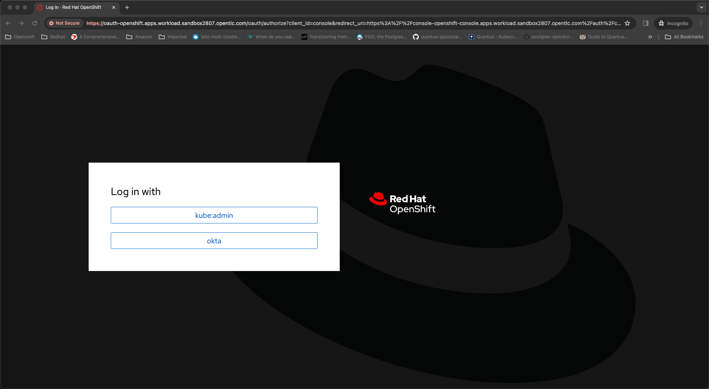
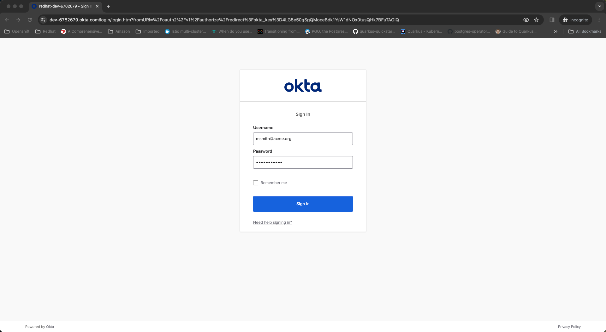
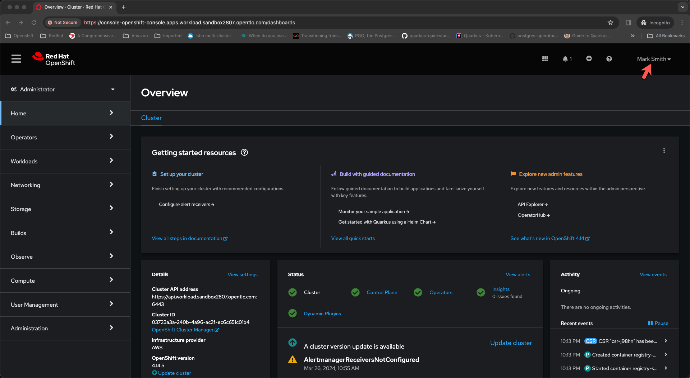
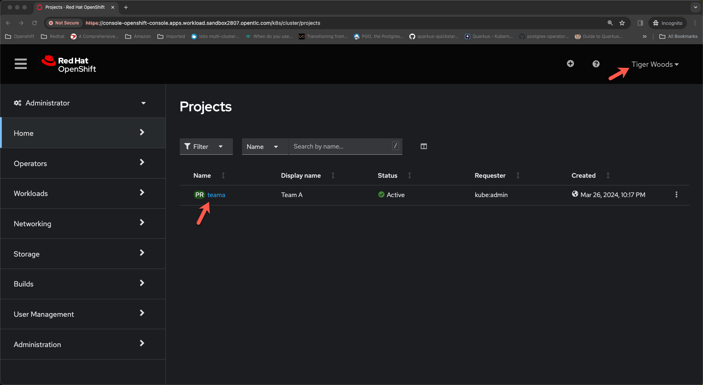
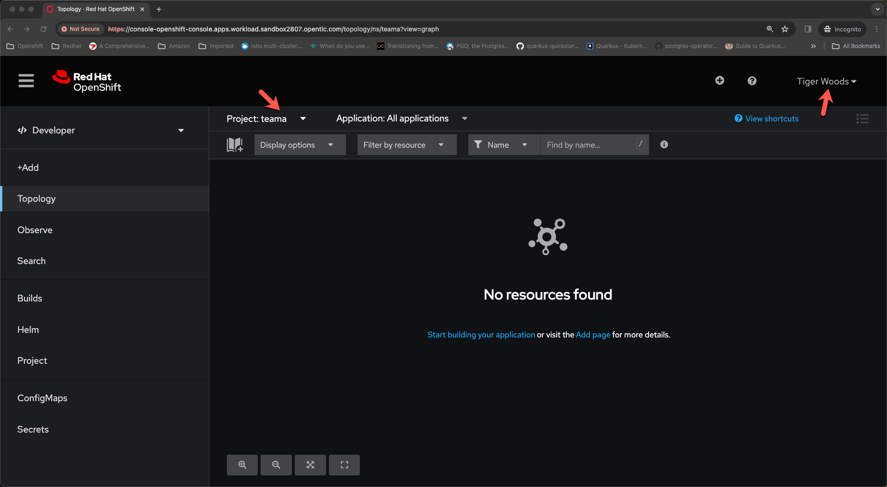

Most customers use an external system for storing user identities and groups that control level of access on applications and resources deployed within the corporate network. Openshift container platform ships with a builtin OAuth server that can be configured to integrate with external identity provider systems to authenticate users accessing the cluster and control level of access they have on the cluster with clusterroles and rolebindings.

For demonstration I have provisioned an OpenShift cluster on AWS and also have a OKTA developer tenant at `https://dev-6782679.okta.com` where I have created following users and groups:

| User Name                      | Member Of      |
| -----------------------------  | -------------- | 
| Mark Smith  (msmith@acme.org)  | cluster-admins |
| Tiger Woods (twoods@acme.org)  | teama          |
| Ram G (rprakashg@acme.org)     | teamb          |

Mark smith role is cluster administrator and Tiger Woods and Ram G are developers working on teama and teamb respectively. When tiger woods logs into cluster we want to restrict access to teama project/namespace and when Ram G logs into cluster we want to restrict access to teamb namespace.

First thing we need to do is to configure identity provider to be able to login to OpenShift cluster with okta. I have created a new application in my OKTA tenant and have saved the `clientID` and `clientSecret` to a local file. I've also automated steps to configure identity provider using ansible. You can find the ansible script [here](https://github.com/rprakashg-redhat/rbac-demos/blob/main/configure-oauth.yaml)

In my ansible automation scripts I'm using a static vars yaml file to load some configuration related to identity provider 

```yaml
customRoles:
  contributor:
    name: "contributor"
    assignTo:
      - claim: teama
        namespace: teama
      - claim: teamb
        namespace: teamb
providers:
  okta:
    name: okta
    claims:
      email:
      - email
      name:
      - name
      preferredUsername:
      - preferred_username
      groups:
      - groups
    extraScopes:
    - email
    - profile
    - groups
    issuer:  https://dev-6782679.okta.com
    secretName: okta-secret
    adminClaim: cluster-admins
```

I'm also using another vars file loaded from directory called `dynamic` which stores okta `clientId` and `clientSecret`. we are splitting this into seperate file because we don't want to checkin this to git. I'm using a .gitignore file to tell git to ignore everything in the dynamic directory except the .gitignore file.

First thing that happens when ansible playbook executes is that I load the dynamic vars and merge them as shown in the snippet below.

```yaml
 tasks:
 - name: include variables
   include_vars:
     file: "{{ item }}"
     hash_behaviour: merge
   loop:
   - vars/dynamic/vars.yaml
```
Next we are going to create a kubernetes secret in the `openshift-config` namespace to store the `clientSecret`

Lastly we update the OAuth configuration to add the OKTA identity provider using the [`kubernetes.core.k8s`](https://docs.ansible.com/ansible/latest/collections/kubernetes/core/k8s_module.html) module as shown in the snippet below

```yaml
- name: configure oauth 
  kubernetes.core.k8s:
    state: present
    apply: false
    resource_definition: "{{ lookup('template', 'templates/oauth.yaml.j2') | from_yaml }}"
```

I've gone ahead and run the ansible playbook using command below and it completed successfully.

```
ansible-playbook -v configure-oauth.yaml
```

## Configure RBAC
When Mark logs in we want him to have cluster admin privileges. Since Openshift already ships with a cluster-admin role we just need to make sure any user with a group claim `cluster-admins` will have cluster admin privileges on the cluster. We can achieve that by creating a `ClusterRoleBinding`. I wrote a simple ansible script to automate the RBAC configurations covered in this demo. You can check out the ansible script [here](https://github.com/rprakashg-redhat/rbac-demos/blob/main/configure-rbac.yaml). Snippet below shows cluster role binding creation to allow users with `cluster-admins` group claim cluster admin privileges.

```yaml
kubectl create clusterrolebinding okta-cluster-admin-crb --dry-run=client --clusterrole=cluster-admin --group {{ providers.okta.adminClaim }} -o yaml | kubectl apply -f -
```

For developers Tiger Woods and Ram G I created a custom `ClusterRole` and named it `Contributor`. You can see the entire definition [here](https://github.com/rprakashg-redhat/rbac-demos/blob/main/templates/contributor.yaml)

Once the **contributor** `ClusterRole` is created we can use a `RoleBinding` resource to lock down permissions for developers to their respective namespaces `teama` and `teamb`

I've defined a [jinja2 template](https://github.com/rprakashg-redhat/rbac-demos/blob/main/templates/rb.yaml.j2) that loops through a list and grants any user with group claim `teama` contributor permissions on namespace `teama` and users with group claim `teamb` gets contributor rights on namespace `teamb`. Ansible playbook reads this configuration from the static vars yaml configuration file.

I've run the ansible playbook using the command below and it completed successfully.

```
ansible-playbook -v configure-rbac.yaml
```

Lets login to cluster as Mark Smith. Open a browser and navigate to openshift webconsole URL for the cluster. Screen capture below shows authentication page



Select `okta` for login and we will be redirected to `Okta` signin page as shown in screen capture below



Type in credentials for Mark Smith and click `Sign In`. After successful authentication we are going to get redirected back to OpenShift web console and will be logged into console successfully as shown in screen capture below. We can also see that Mark has full cluster admin privileges.



Next we are going to login to the cluster as Tiger Woods. We are going to logout and clear browser cache and open a new browser session and navigate to openshift web console and like earlier we are going to select `okta` signin option and from the okta signin page we are going to enter credentials for Tiger Woods and sign in.

We can see from the screen captures for administrator and developer perspectives that tiger woods can only see resources within the namespace `teama` because he is a member of group `teama` in okta 





Now lets clear browser cache and log back into the cluster as Ram G and examine what the experience looks like for Ram G who is a developer working with `Team B`

We can see from the screen captures for administrator and developer perspectives that Ram G can only see resources within the namespace `teamb` because he is a member of group `teamb` in okta

## Resources
If you want to learn more about oauth and identity providers in openshift check out this [article](https://docs.openshift.com/container-platform/4.15/authentication/understanding-identity-provider.html)

Hope this helps. Please feel free to reach out if you have any questions about this post.

Thanks,
Ram


