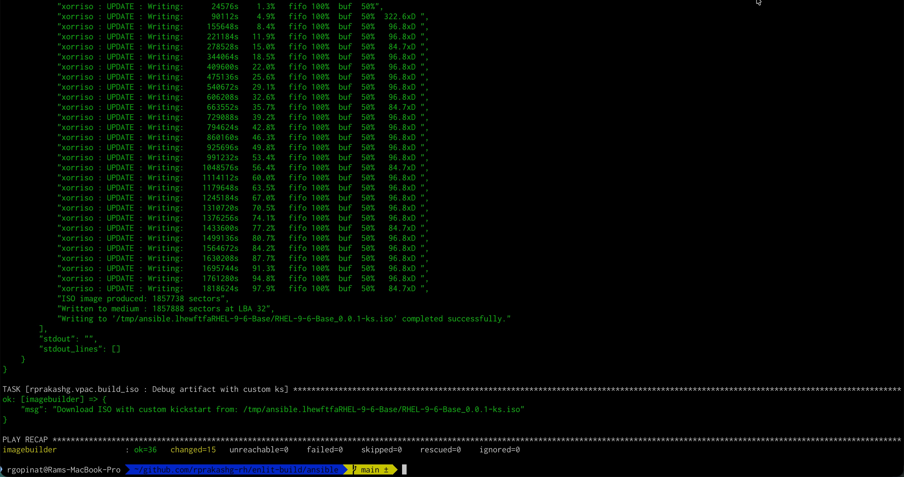

In my last [post](https://rprakashg.github.io/installing-rhel-using-ipmi/) I covered how to perform an IPMI install using a custom ISO but did not go into too much details on how to build a customized ISO for provisioning systems that run virtualized protection automation and control applications. In this post I will walk through how to use Ansible and Imagebuilder to achieve just that

## Provisioning a Host Machine as Image Builder
First thing we will need to do is provision imagebuilder host machine. I'm going to use a demo AWS environment and provision an EC2 instance using the RHEL 9 AMI provided by Red Hat. I've SSH'd into the host and connected it to Red Hat subscription and have ensure the system is up to date with all the packages. I've also updated my ansible inventory file like below

```yaml
---
all:
  hosts:
    imagebuilder:
      ansible_host: "<redacted>"
      ansible_port: 22
      ansible_user: "ec2-user"
      ansible_ssh_private_key_file: "<redacted>"
```

## Configuring the Image Builder host
To configure the RHEL host as imagebuilder we are going to use this [role](https://github.com/rprakashg/demos/tree/main/roles/setup_imagebuilder). Role leverages infra.osbuild to configure the host as imagebuilder, additionally it add kernel rt and nfv repos to imagebuilder sources so we can install those packages references in the image definition. For more detailed information please checkout ansible code in the role. We are going to run a simple ansible playbook that leverages the role. Playbook looks like below 

```yaml
- name: Configure RHEL host as image builder 
  hosts: imagebuilder
  gather_facts: yes

  tasks:
  - name: Import role
    ansible.builtin.import_role:
      name: rprakashg.vpac.setup_imagebuilder
```

Next we are going to install the ansible collection as shown in the snippet below

```sh
ansible-galaxy collection install git+https://github.com/rprakashg/vpac.git,main
```

Then we are going to run the playbook as shown in the command below

```sh
ansible-playbook -i inventory setup_imagebuilder.yml
```

If everything goes well we should see an output like below screen capture


## Building a standardized custom image for provisioning RHEL based systems that run virtualized protection and control applications
Now that the image builder server is configured and running we can now use it to build a standardized custom image with an anaconda kickstart file that automates provisioning RHEL based systems for deploying virtualization protection and control applications. Lets now look at how we are going to achieve that.

### Defining a standardized base image
First thing we will need to do is to define a standardized base image. We can achieve this by creating an ansible vars file. Image definition looks like the below yaml snippet. 

```yaml
---
retries: 100
delay: 20

# blueprint details
builder_blueprint_name: RHEL-9-6-Base
builder_blueprint_description: "Base RHEL 9.6 for virtualization host"
builder_blueprint_distro: "rhel-9"
builder_compose_pkgs:
- ansible-core
- wget
- firewalld
- rhel-system-roles
- cockpit
- cockpit-machines
- cockpit-podman
- cloud-init
- cloud-utils-growpart
- unzip
- bzip2
- zstd
- mkisofs
- qemu-kvm
- libvirt
- virt-install
- virt-viewer
- swtpm
- swtpm-tools
- dosfstools
- edk2-ovmf #uefi firmware for windows 11 install
- kernel-rt
- kernel-rt-kvm
- tuned-profiles-nfv-host
- realtime-tests
- dnf-plugins-core
- python3-dnf-plugin-versionlock #versionlock 
builder_compose_customizations:
  services:
    enabled: ["cockpit.socket", "firewalld"]
  firewall:
    services:
      enabled: ["http", "https", "ssh", "cockpit"]
      disabled: ["telnet"]
    ports: ["9090:tcp", "22:tcp"]

# Kickstart customizations
builder_kickstart_options:
- lang en_US.UTF-8
- keyboard us
- timezone America/Los_Angeles --utc
- text
- liveimg --url file:///run/install/repo/liveimg.tar.gz
- zerombr # Clear the MBR/GPT on all detected disks
- bootloader --location=mbr
- clearpart --all --initlabel # Clears all partitions on sda and initializes the disk label
- part /boot --fstype=ext4 --size=4096 # Creates a /boot partition with ext4 filesystem, 4GB size to accomodate multiple kernels
- part /boot/efi --fstype=efi --size=600
- part pv.01 --size=1 --grow # Create a physical volume for LVM
- # Setup LVM
- volgroup vg_system pv.01
- logvol / --vgname=vg_system --name=lv_root --fstype=xfs --size=150000
- logvol /home --vgname=vg_system --name=lv_home --fstype=xfs --size=200000
- logvol /vms --vgname=vg_system --name=lv_vms --fstype=xfs --size=500000
- logvol swap --vgname=vg_system --name=lv_swap --recommended
- network --bootproto=dhcp --activate #auto detect network
- reboot --eject

# cloudinit
hostname: "vpac-rhel"
```

Snippet above is pretty self explanatory so I won't go into too much details. Customize the above image definition to fit to your needs.

## Building a custom ISO using the standardized image definition above
Next we will build a custom ISO using the standardized image definition we created earlier. Steps to automate this is implemented in this ansible [role](https://github.com/rprakashg/vpac/tree/main/roles/build_iso) in [vpac](https://github.com/rprakashg/vpac) ansible collection.

Below you will find description of the settable variables for this role. 

| Variable Name | Purpose |
| ------------- | ------- |
| retries | Number of retries for compose job status |
| delay | delay between retries for compose job status |
| skip_blueprint_creation | Flag to turn off blueprint creation. Useful when you haven't made any changes |
| skip_compose | Skip starting a new compose job, useful when you want to leverage artifacts from an existing compose job. If this is set to true then compose_job_id variable is required. |
| compose_job_id | Compose job id, this is automatically set when compose job is triggered. If compose job is skipped then the compose job id must be passed as value |
| builder_blueprint_name | osbuild blueprint name |
| builder_blueprint_description | osbuild blueprint description |
| builder_blueprint_distro | RHEL distro to use |
| builder_compose_pkgs | additional packages that need to be included |
| builder_compose_customizations | Customizations |
| builder_kickstart_options | Anaconda kickstart options to include |


When the role is executed the first thing we do is create a image builder blueprint based on the image definition in ansible vars file. If you have not made any changes to blueprint you can skip this by setting `skip_blueprint_creation` to true. To create the image builder blueprint, the role leverages [create_blueprint](https://github.com/redhat-cop/infra.osbuild/blob/main/plugins/modules/create_blueprint.py) plugin from infra.osbuild collection.

Next step is to start an `image-installer` compose job using the blueprint to build a custom ISO and wait for the compose job to finish. When no changes have been made to blueprint and you have a pre-existing compose job that completed successfully you can skip the compose job by setting `skip_compose` to `true` and specify the job id of previously completed compose job you want to use in variable `compose_job_id`

Once the compose job is successfully completed, ISO artifact file is downloaded into a temp directory. Role then creates cloud-init files to perform first boot initialization steps like creating an admin user and setting the SSH key for the admin user. Additionally an anaconda kickstart file is generated using the kickstart options defined in the ansible vars file. Once the cloud init and kickstart files are generated we inject these into the ISO we downloaded earlier and create a customized ISO. For the purposes of this post I'm injecting the cloud init files also into ISO but ideally you'd want to create a seperate ISO and mount both ISO files while provisioning the system and you would just need to read the cloud init files from the mounted directory path for the cloud init iso. 

## Create an ansible vault to store sensive secrets
As mentioned earlier creating cloud init files require sensive information like admin password, ssh key to use etc which are read from an ansible vault. We are going to create the ansbile vault by running command below

```sh
ansible-vault create vars/secrets.yml
```

and include this snippet below

```yaml
root_password: <redacted>
rh_user: <redacted>
rh_user_password: <redacted>
admin_user: 'admin'
admin_user_password: <redacted>
admin_user_ssh_key: <redacted> 
```

## Create an ansible playbook that leverages the build_iso role
We can now create an ansible playbook that leverages the [build_iso](https://github.com/rprakashg/vpac/tree/main/roles/build_iso) role in the [collection](https://github.com/rprakashg/vpac) 

See ansible code in the yaml snippet below

```yaml
---
# This playbook builds ISO with kickstart for unattended 
# installation of RHEL on Baremetal host for virtualization
- name: Build ISO
  hosts: imagebuilder
  become: yes
  gather_facts: yes

  tasks:
  - name: Start
    ansible.builtin.debug:
      msg: "Starting ISO build"
  
  - name: Load secrets from ansible vault
    ansible.builtin.include_vars:
      file: "./vars/secrets.yml"

  - name: Build ISO
    ansible.builtin.import_role:
      name: rprakashg.vpac.build_iso
```

If everything goes well we should see the playbook completed successfully without errors and see an output like the screen capture below.



Since the custom ISO is in an Ansible temp directory we can ssh into the image builder host and move it to a directory under `/home` using command below

```sh
sudo mv <custom iso path printed by the ansible role> .
```

We can now download this file from the image builder host and perform IPMI based installation for provisioning virtualization hosts that run virtualized protection and control applications.

Hope this post was helpful, as always feel free to reach out to me if you have any questions about this post.

Thanks,

Ram