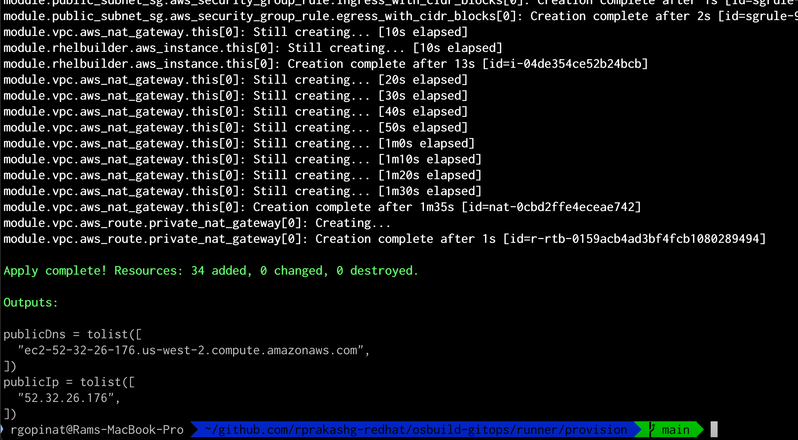
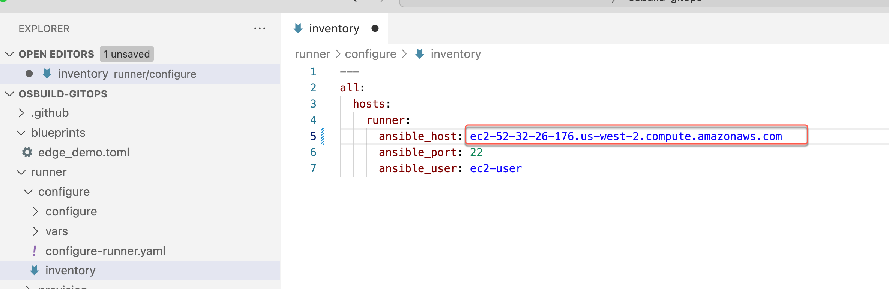
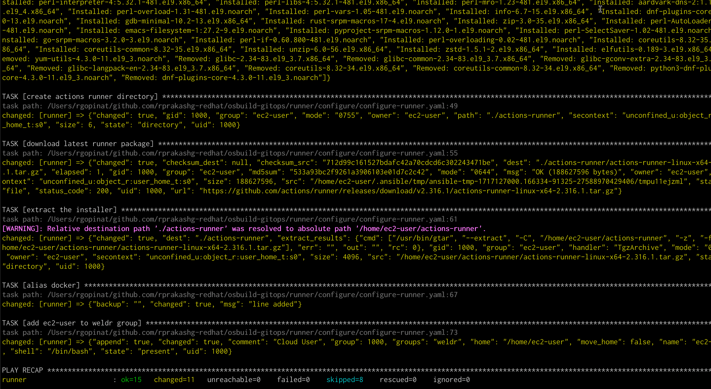
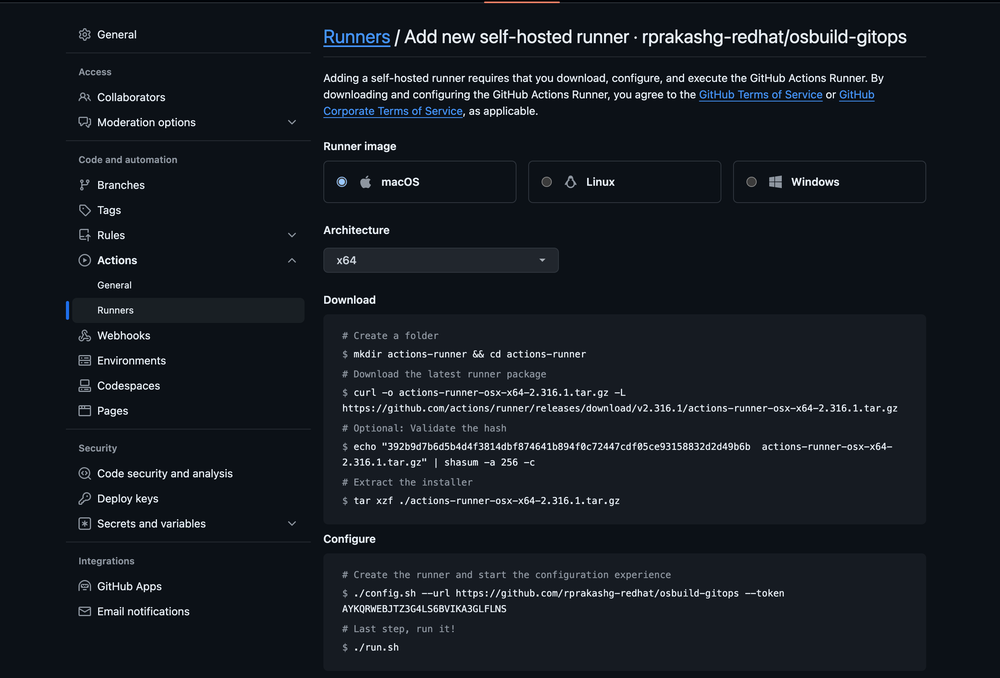
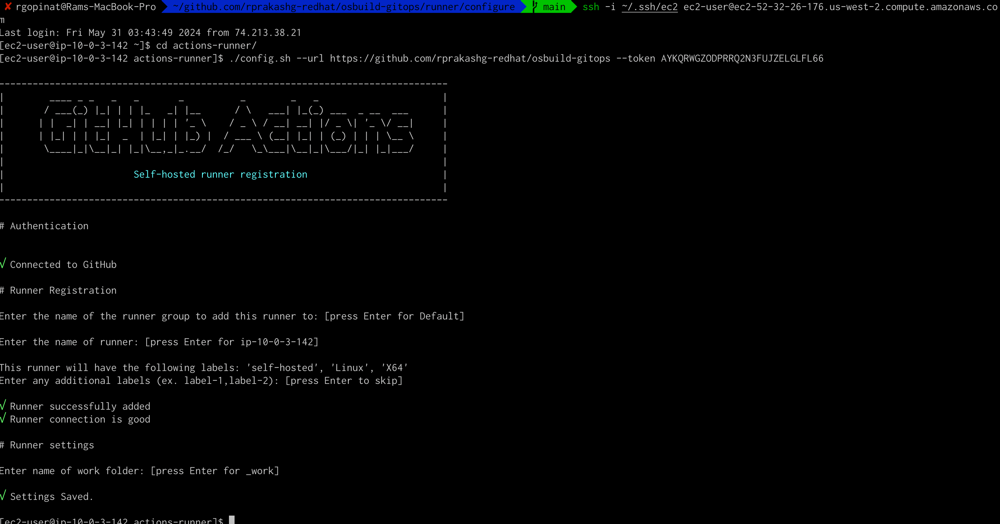
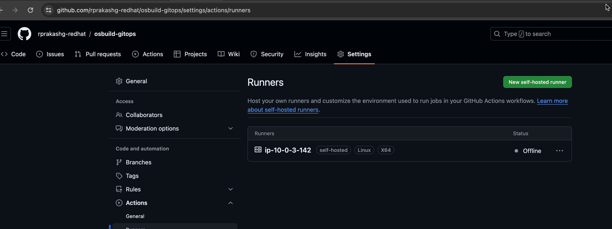
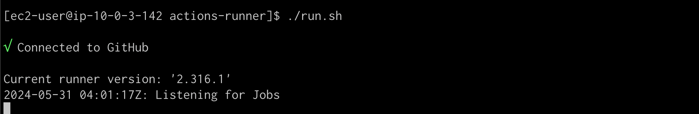
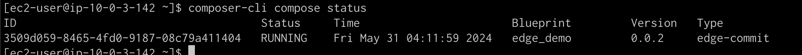
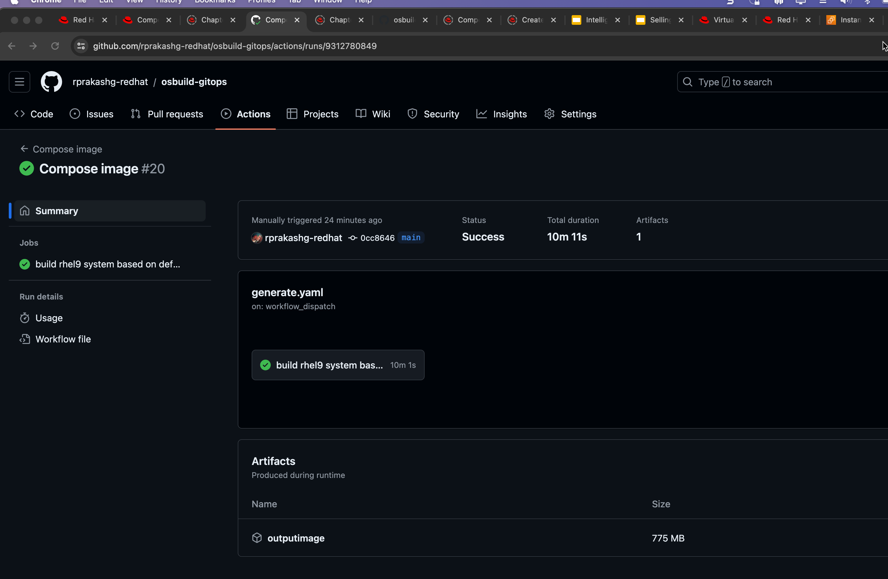

In this post I will walk through how you can setup a Gitops process for building golden images based on RHEL using RHEL image builder tool. If you are not familar with Image Builder I will recommend reading this [doc](https://access.redhat.com/documentation/en-us/red_hat_enterprise_linux/9/html/composing_a_customized_rhel_system_image/composer-description_composing-a-customized-rhel-system-image) 
Key goal here is to have a common consistent process to build system images that can be used for cloud, on-premises and edge deployments

At a high level we are going to first provision a RHEL 9 based EC2 instance on AWS and then install and configure image builder on it and lastly we are going to configure this system as a self hosted runner which will be used to run those Github CI jobs that runs image builder commands to compose images based on a blueprint. You can find everything I'm covering in this article here in this github [repo](https://github.com/rprakashg-redhat/osbuild-gitops). 

Lets get right into it

## Provisioning Required Infrastructure for self hosted runner on AWS cloud
I've included some terraform scripts to provision the required infrastructure components in AWS. I have already cloned the github repo to my local machine and we are going to switch to `runner/provision` directory and kick off the provisioning by running the terraform commands listed below

```bash
terraform init
terraform plan
terraform apply
```
Terraform scripts executed successfully and we can see the information about the EC2 instance in output as shown in screen capture below



## Configuring the self hosted runner
We are going to use Ansible to configure the self hosted runner. Switch to configure directory. Copy the public dns of EC2 instance from the terraform output and update the inventory file. See screen capture below



Next we need to create an encrypted secrets file by running command below

```
ansible-vault create vars/secrets.yml
```

Include following yaml snippet shown below

```yaml
rhUser: '<specify>'
rhPassword: '<specify>'
```
Store the VAULT password that was used in an environment variable.

```
export VAULT_SECRET="<replace>"
```
Run the ansible playbook as shown below. You can see the full ansible playbook [here](https://github.com/rprakashg-redhat/osbuild-gitops/blob/main/runner/configure/configure-runner.yaml) I'm using ansible certified content [rhcop-osbuilder](https://github.com/redhat-cop/infra.osbuild/tree/main/roles/setup_server) to setup the server with image builder


```
ansible-playbook -vvi inventory --vault-password-file <(echo "$VAULT_SECRET") configure-runner.yaml
```

Playbook completed successfully.  See screen capture below



Next thing we need to do is navigate to the settings for the GitHub repo and under actions/runner click on `new self hosted runner` option to add a new self hosted runner. See screen capture below



We can pretty much skip all the steps in the download section because the ansible script that configures the self hosted runner already does that. Copy the configure command and ssh into ec2 instance and run that command. See screen capture below.



Switching to Github repo we can see that the new self hosted runner was added to the repo. See screen capture below



We are going to ssh back into the ec2 instance and start the runner by running the run.sh script as shown in screen capture below



We are now ready to kick of a github CI job to build a RHEL system image. For demonstration purposes I'm using a sample blueprint from [osbuild](https://github.com/osbuild/rhel-for-edge-demo/tree/master/blueprint) community. The github actions workflow will use image builder to build rhel for edge image. Check out the [CI workflow](https://github.com/rprakashg-redhat/osbuild-gitops/blob/main/.github/workflows/generate.yaml) to see all the image builder commands we are running to build RHEL for edge system image using a sample blueprint 

We can ssh into EC2 instance and see that the compose job is running. See screen capture below



Job runs for about 10 mins and image out is saved as workflow artifact. See screen capture below



As mentioned earlier I used a blueprint for RHEL for edge but the same approach can be leveraged for building RHEL system images for use in Google, AWS, Azure as well as for onpremises use as well.


Hope that helps. If you have any questions about this post please comment or reach out and I'm happy to help.

Thanks,
Ram

