We see most customers deploying kubernetes clusters in multiple on-premises sites, multiple clouds and even on the edge with that comes a set of challenges such as
* Deploy common configurations across all the clusters
* Easily identify and fix configuration drifts across all clusters
In this post I will cover how you can implement a solution using Red Hat Advanced Cluster Management for Kubernetes, ArgoCD, GitOps and Kustomize to deploy common configurations as policies to Kubernetes clusters running workloads. Source files referenced in this blog post can be found [here](https://github.com/rprakashg-redhat/rhacm-demos/tree/main/governance)

The governance feature in Red Hat Advanced Cluster Management for Kubernetes allows you to define/externalize common configurations as policies and provides a framework to propagate and enforce those policies to clusters and visualize the results from a single pane of glass view. If you are new to Red Hat Advanced Cluster management for Kubernetes I recommend checking [this](https://access.redhat.com/documentation/en-us/red_hat_advanced_cluster_management_for_kubernetes/2.9/html/governance/governance#governance-architecture) documentation to get familiar specifically with the governance feature also to clarify further by common configurations I'm referring to internal standards that must be met for software engineering, resiliency, security, and regulatory compliance for workloads hosted on-premises, multi-cloud, and edge. 

In addition to the tools mentioned earlier we are also going to leverage a Kustomize plugin called PolicyGenerator. For more info on the plugin head over to [this](https://github.com/open-cluster-management-io/policy-generator-plugin) github repository. This plugin allows us to dynamically generate policy resources based on a manifest file.

For the purposes of this article I have provisioned two clusters in AWS. You can see this in the screen shot of clusters section of advanced cluster management for kubernetes (ACM) hub cluster 
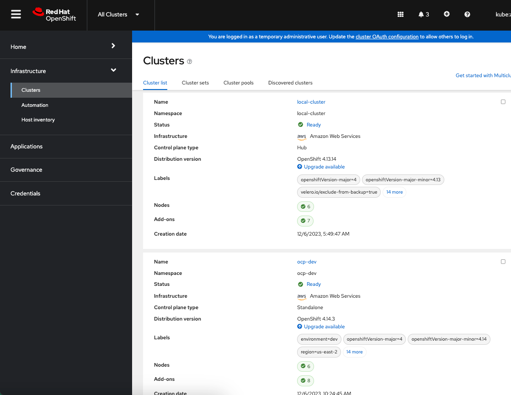
First cluster is the management cluster cluster running Red Hat Advanced Cluster Management for Kubernetes. Second cluster "ocp-dev" is provisioned in AWS east region and is meant to be used for running workloads.

For demonstration purposes we are going to use a gatekeeper policy to deny container latest tag in DaemonSet, Deployment as well as StatefulSet and two RHACM policies, one to install and configure Red Hat supported version of Gatekeeper and the other to install and configure Crunchy Postgresql database. All the policies are grouped into policysets namely acm-policyset and gatekeeper-policyset to better organize the policies. Since in this demo we only have 3 policies we didn't really need to use policysets but in real world you might have lots of policies and hopefully this helps as a reference,

Lets examine the Policy Generator manifests for both ACM and gatekeeper policysets. Screen capture below shows the manifest file for ACM policies used in this demo
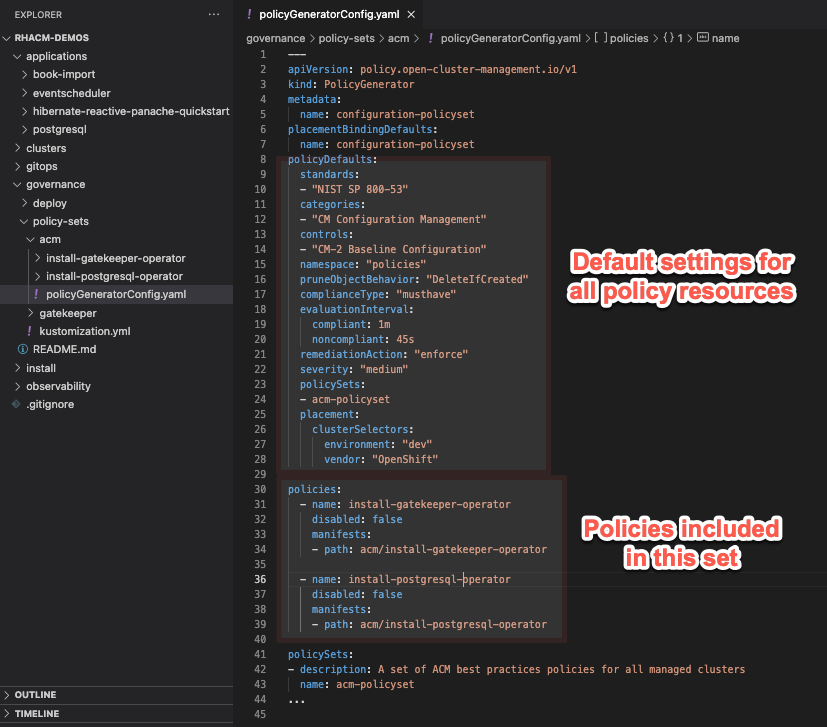
You can see the section for default settings for all policies included in the set as well as two policies for installing gatekeeper and postgresql operator.

Screen capture below shows the manifest file for gatekeeper policies used in this demo
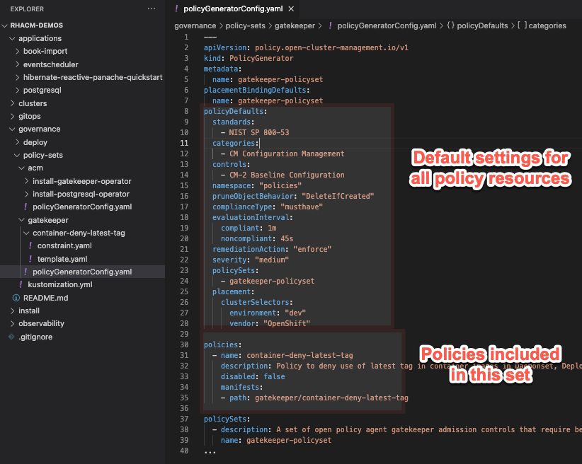

In the Kustomization file we are going to reference both manifest files under generators section as shown below 
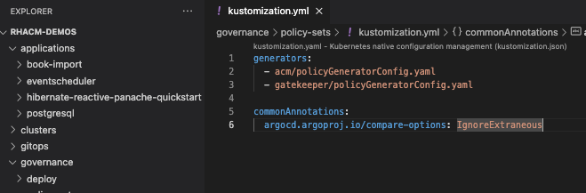

Next thing we need to do is to use the Application life cycle management feature of Red Hat Advanced Cluster Management for Kubernetes to run kustomize and dynamically generate policy resources and deploy them to hub cluster. We are using ArgoCD and GitOps so when changes are made in git repo ACM can automatically sync those changes to hub cluster. Once the policy resources are created in hub cluster, ACM will propagate them to target cluster based on the placement rule.

In the ArgoCD application resource shown in screen capture below you can see that under source I'm referencing the github repo as well as path where policy manifests are defined and the target revision to use. I'm also specifying under destination namespace where I want the policy resources to be created.
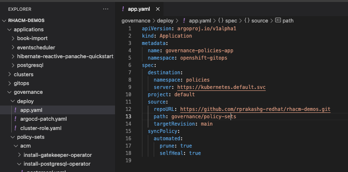

Before we can create this ArgoCD application we need to perform couple of tasks. 
* Step 1: Since we are using a policy generator Kustomize plugin we need to ensure that the plugin is installed on openshift gitops container that runs kustomize. Run the command below to ensure policy generator plugin is installed
```
oc -n openshift-gitops patch argocd openshift-gitops --type merge --patch "$(curl https://raw.githubusercontent.com/rprakashg-redhat/rhacm-demos/main/governance/deploy/argocd-patch.yaml)"
```  
* Step 2: We need to grant the OpenShift Gitops permission to create policy resources in "policies" namespace on the RHACM hub cluster. We can achieve this by creating a ClusterRole and ClusterRoleBinding to assign required permissions to service account used by OpenShift GitOps. Run command below to do just that
```
oc apply -f https://raw.githubusercontent.com/rprakashg-redhat/rhacm-demos/main/governance/deploy/cluster-role.yaml
```

At this point we are ready to create the ArgoCD application on the hub cluster. Assuming you are logged into hub cluster run the command below
```
oc apply -f https://raw.githubusercontent.com/rprakashg-redhat/rhacm-demos/main/governance/deploy/app.yaml
```

Screen capture of the ArgoCD console below shows that ArgoCD app was successfully created and synced. 

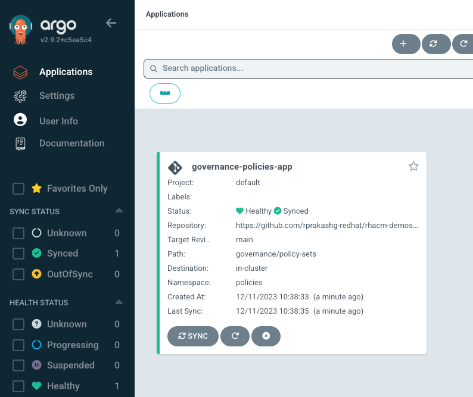

Clicking on the application tile you can see all the policy resources are dynamically generated by Kustomize + Policy Generator plugin

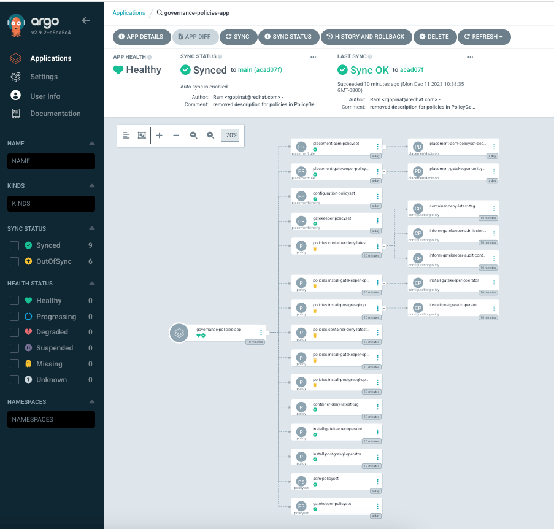

We can also see that the application resources are successfully created. 
Additionally we can switch to applications section in ACM hub and search for the Argo app that we created in earlier step. Screen capture below shows the general overview of the application 

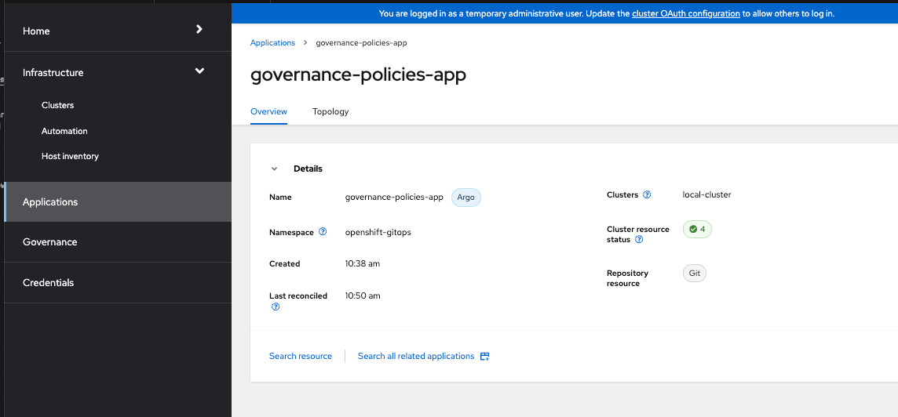

and also the topology view that shows all the resources created and the cluster details

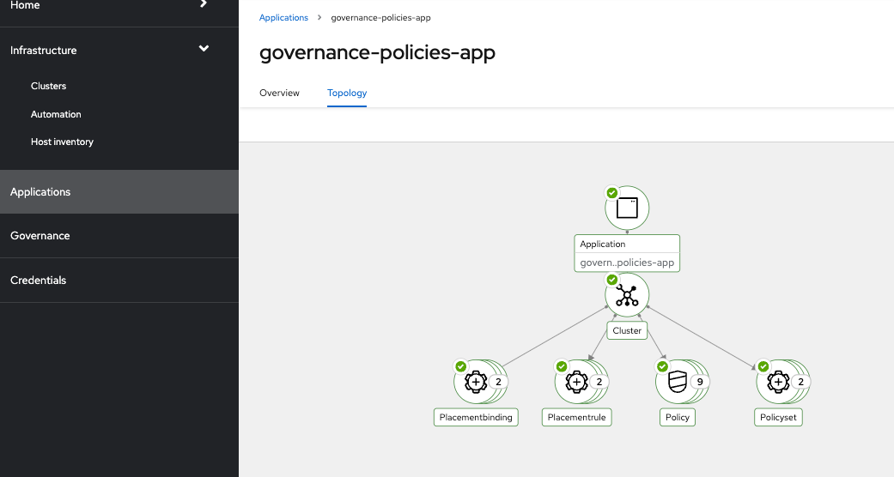

Switching to the governance tab on hub cluster you can see that policies are propagated and enforced on target clusters in this case the local cluster where ACM is running and ocp-dev cluster with zero violations shown in screen capture below

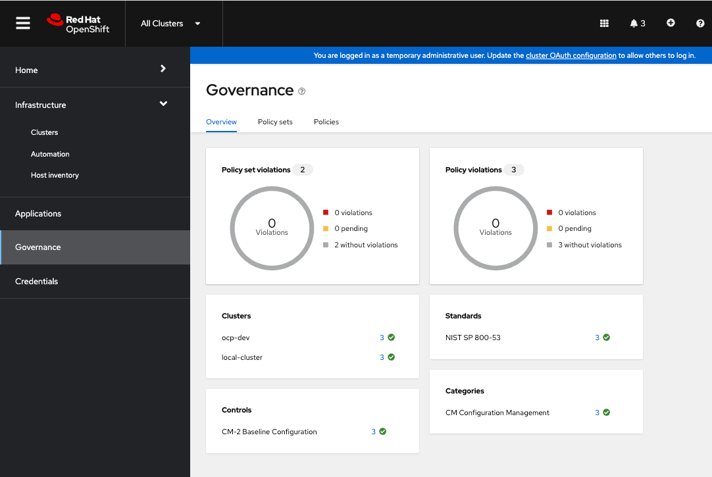

We can verify that both Gatekeeper and Crunchy Postgresql operators got installed successfully by logging into ocp-dev cluster. Screen capture below shows both operators are installed successfully on ocp-dev cluster

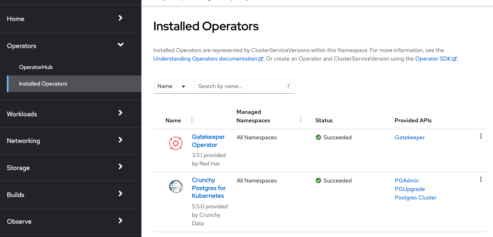

Additionally we can verify that both controller manager and audit controller pods of gatekeeper system are running. Screen capture below shows both running

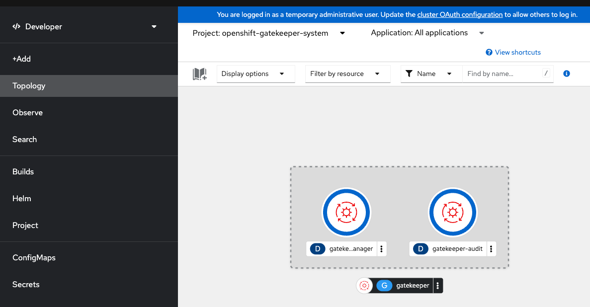 

Since the gatekeeper was installed and configured via an ACM policy if there was any issues we would have seen them in the governance dashboard as violation but just good to confirm they are indeed running.

We can now test if the container deny latest tag gatekeeper policy is working as expected by creating a sample deployment that references latest tag in container image. As you can see from the screen capture below the gatekeeper system now blocks creation of deployment since I'm referencing latest tag in the container image

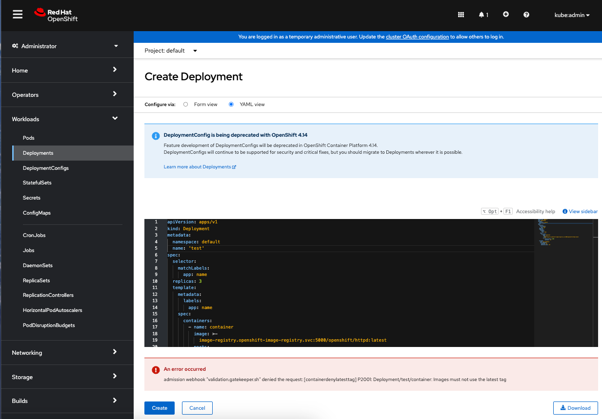

Since we are using ArgoCD and gitops we can go back and make changes to manifests in git repo to add new policy or make changes to existing ones and openshift gitops will synchronize those changes to hub cluster which will then propagate to target clusters based on the placement rule.

Hope you found this useful. Please check out this [github repo](https://github.com/open-cluster-management-io/policy-collection) for a collection of useful policies. The two policies install gatekeeper and the container deny latest tag used in this post are from this repository. Just made small changes to work with the policy generator plugin. As usual feel free to reach out to me if you want to learn more about Red Hat Advanced Cluster Management for Kubernetes or if you have any questions about this post.

Thanks,
Ram
