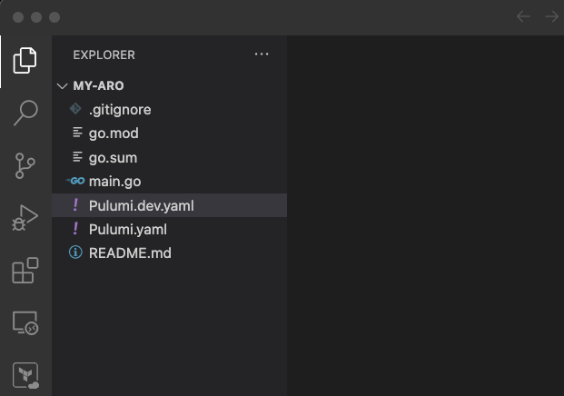

## Introduction
In this post I'm going to walk through deploying Azure RedHat OpenShift clusters with Pulumi and Infrastructure as code. I'm going to assume that you are familiar with Pulumi. If you are new to pulumi I recommend you check out this getting started [guide](https://www.pulumi.com/docs/get-started/)  

Pulumi templates are the fastest way to deploy infrastructure to your cloud environments in a consistent and repeatable fashion. Check out this template [repo](https://github.com/pulumi/templates) to see a list of available templates. Since there is nothing available for Azure RedHat Openshift I decided to create one. I still haven't contributed this to the template repo yet but for now you can find this in my github [here](https://github.com/rprakashg-redhat/pulumi-aro)

Before you can get started with this you will need to login to azure portal and request quota increase for compute in EastUS region where we will be deploying the Azure RedHat OpenShift cluster
* Standard DSv3 Family vCPUs = 150
* Total Regional vCPUs = 200
Increasing limits by VM series for Azure Red Hat OpenShift installation is necessary to ensure that your Azure Red Hat OpenShift cluster has the resources it needs to operate efficiently and reliably.

Login to Azure from CLI 

Create a directory and cd into it as shown below

```
mkdir my-aro && cd my-aro
```

Create a new pulumi project by running command below

```
pulumi new https://github.com/rprakashg-redhat/pulumi-aro/tree/main -s rprakashg-redhat/my-aro/dev
```
Above command will prompt to enter configuration values, you can keep the default except the pullSecret which you will need to obtain from console.redhat.com/openshift/downloads
See screen capture below 


You can open the current folder in visual studio code to see that the project was bootstrapped using the template. You can also see the stack file (dev) that is generated. See screen capture below



Run command below to set the Location on azure-native pulumi provider

```
pulumi config set azure-native:location EastUS
```

To deploy the Azure RedHat OpenShift cluster with pulumi we can simply run `pulumi up`. Cluster provisioning takes about . You can see output from my environment in the screen capture below


After the cluster provisioning is complete we login to the openshift cluster using the default kubeadmin credentials created. Run the command below to retrieve the default kubeadmin credentials

```
export CLUSTER=arodemo
export RESOURCEGROUP=aro-rg

az aro list-credentials \
  --name $CLUSTER \
  --resource-group $RESOURCEGROUP
```

Above command will return a JSON payload just like what's shown below

```
{
  "kubeadminPassword": "<generated password>",
  "kubeadminUsername": "kubeadmin"
}
```

Next we can get the OpenShift console URL by running command below

```
az aro show \
    --name $CLUSTER \
    --resource-group $RESOURCEGROUP \
    --query "consoleProfile.url"
```

Launch the console in a new web browser and login with default kubeadmin credentials. Screen capture below shows OpenShift console after successfully logging into it


Logging into azure portal we can see aro cluster and vnet in `aro-rg` resource group as shown in screen capture below


and all the cluster infrastructure resources provisioned in `aro-infra-rg` as shown in screen capture below


Hope this was helpful and helps you start getting hands on with Azure RedHat OpenShift. If you have any questions about this post or OpenShift please reach out to me via any of the contact methods listed in my blog

Thanks,
Ram


## Resources that helped me creating this template
* [https://www.pulumi.com/blog/how-to-create-and-share-a-pulumi-template](https://www.pulumi.com/blog/how-to-create-and-share-a-pulumi-template/)
* [https://github.com/pulumi/templates](https://github.com/pulumi/templates)

