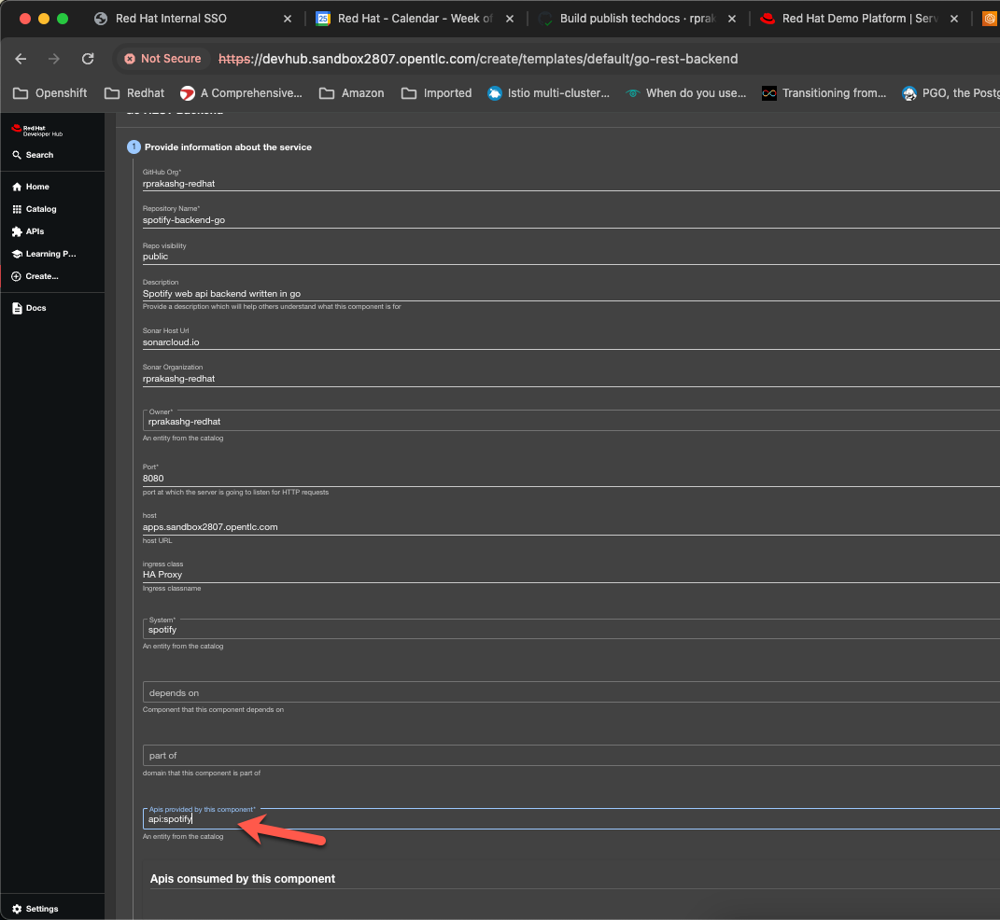

There are lots of benefits to design first approach to API development in a large organization with many development teams compared to code first which is more suited for developers. With design first you first create the API definition, review it with potential stakeholders and ensure there is a strong alignment and understanding between all before you write a single line of code. 

In this post I will cover how Red Hat developer hub can be used to practice design first API development. For the purposes of this article I have deployed an instance of Red Hat Developer hub on an EKS cluster. There are three main parts to this solution

* Golden path template to add a new API definition. API designers can create the API definition file using swagger editor then use the template to add the newly created API definition to git repo. For demonstration purposes I've created a repository called [apis](https://github.com/rprakashg-redhat/apis). Currently this repository contains a sample petstore api definition. We are using this Golden path template to capture required metadata for the newly created api definition and use that to generate a backstage catalog entity kind = API. Additionally both openapi specification and the backstage entity definition is added to the git repository and a PR is opened with specified reviewers. Check out the full template [here](https://github.com/rprakashg-redhat/rhdh-templates/blob/main/templates/new-api-definition/template.yaml). All the golden path templates used in this post can be found in this [repo](https://github.com/rprakashg-redhat/rhdh-templates)  

* We are going to use a static location entity will tell backstage to automatically ingest all API kind entities into software catalog. You can check out this file [here](https://github.com/rprakashg-redhat/apis/blob/main/all-apis.yaml). When PR is merged into the repo, I'm using a github actions workflow to update the targets list to add the newly added api entity so it can be ingested into software catalog in backstage.

* Once the newly added API definition is ingested into the software catalog in backstage development teams can create a service using any of the golden path templates available and code the implementation for the newly definied API. I've added a template to build RESTFul backend services in Golang and we are going to use that for this demo. 

Lets look at some of the app configurations for red hat developer hub instance. For catalog I've sepecified two locations 1) For golden path templates and 2) API definitions as shown in the snippet below

```
catalog:
    import:
    entityFileName: catalog-info.yaml
    rules:
    - allow: [Component, System, API, Resource, Location, Domain, Template]
    locations:
    - type: url
        target: https://github.com/rprakashg-redhat/rhdh-templates/blob/main/all-templates.yaml
    - type: url
        target: https://github.com/rprakashg-redhat/apis/blob/main/all-apis.yaml
```

We are going to open up a browser and navigate to URL of red hat developer hub instance I have running on EKS. My instance is already configured for Github auth and I have logged in with my Github credentials. Lets navigate to catalog and we can see that the petstore api entity is already ingested into software catalog as shown in screen capture below.


I've downloaded another sample api definition file for spotify apis. We will now use the software template to add the spotify API definition. We can do that by clicking `Create` sidebar navigation option which will bring up a list of golden path templates. See screen capture below


Select the `New API definition` template from the list and fill in name for the API, description and for specification paste the swagger from the api definition file. Specify owner and click next. See screen capture below


Next provide information about the git repository where all api definitions files are stored. I'm going to select the apis repo and enter reviewers and PR branch name. See screen capture below


Click Next to review everything and click create. See screen capture below


Scaffolder will now execute all the actions defined in the template and you can see link to newly opened PR shown as outputs. **Ignore errors because I put myself as reviewer which is why github was complaining because author cannot also be a reviewer. See screen capture below


For demonstration purposes I'm going to click on the PR link to view the PR. We can see that our github actions workflow kicked off and it updated the location entity and added the new api to the list of targets. Workflow also updates the PR with a comment to let users know that this change was made to the PR. See screen capture below


We can also check out the files changed in the PR. See screen capture below. Cool thing here is now all the parties, developers, consumers, designers etc. involved in this API can collaborate on the PR together.


I'm going to go ahead and merge the PR and delete the branch and in few minutes we should see this newly added API ingested into software catalog in backstage. See screen capture below


We can also click on the `spotify` API and see overview and definition. You can see swagger UI rendered for the spotify web api.


Next we will use the software template for building backend services in go and provide an implementation for the newly created spotify web api. Click create and select the `Go Rest Backend` template. Fill in all the required information and create to scaffold new backend service in go which will provide implementation for the newly created API definition. We make sure for `provided APIs` select the newly added `spotify` API from the list as shown in screen capture below



Hope this was helpful. As always reach out to me if you have questions about this post or want to learn more about Red Hat developer hub and how it can improve developer productivity

Thanks,
Ram


