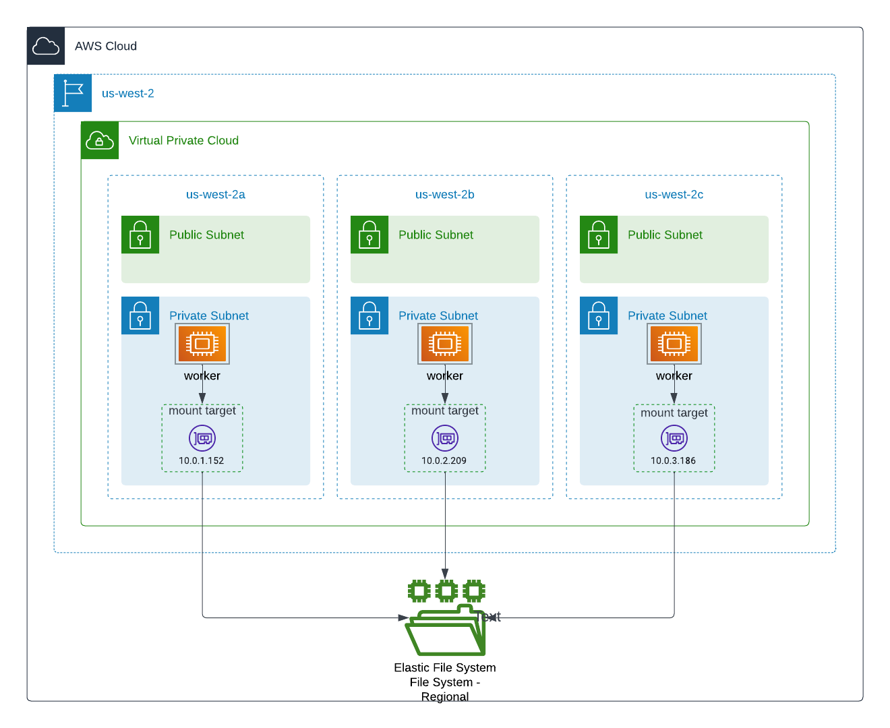
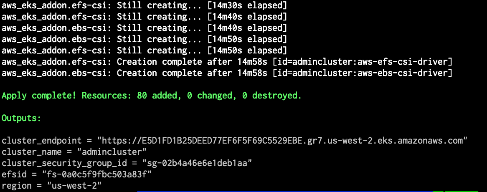
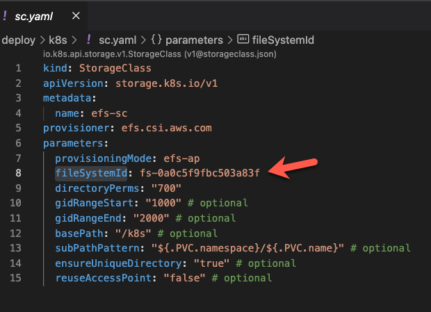
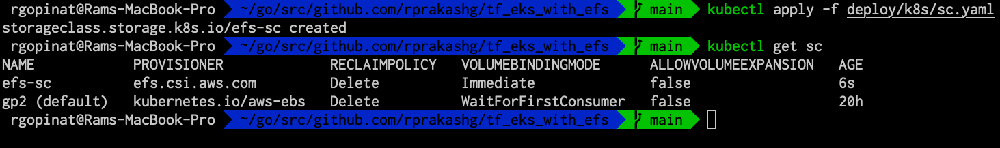
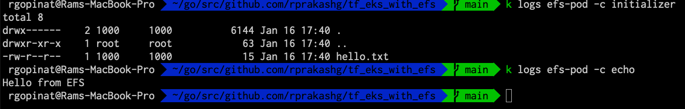
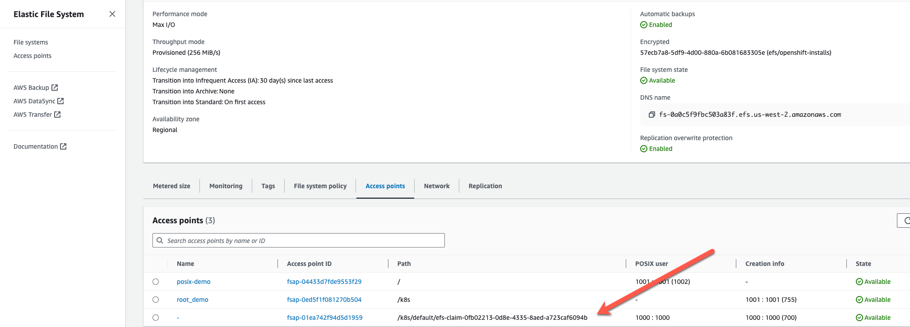

## Overview
I wanted to test mounting Amazon Elastic File System as persistent storage for containerized microservices running on kubernetes and realized there are lot of infrastructure pieces that most developers at customers I work with don't really understand. Additionally kubernetes clusters and underlying infrastructure components are usually managed by platform/cloud infra teams and often as a developer you are at the mercy of those teams to enable and support these capabilities at the infra level. Its important for developers to understand also what's required at infra structure layer and that's exactly what this post is intended for. Also I hope this helps developers who are tasked with app modernization and containerization to test these capabilities without much road blocks and helps them have appropriate conversations and tradeoff discussions with platform/cloud teams

You can find all of the content I'm covering in this post [here](https://github.com/rprakashg/tf_eks_with_efs) Github repo. I'm going to use EKS to demonstrate. What I realized as I was going through this journey like a developer would is that end to end information you need to have is scattered in multiple places and can be difficult for an enterprise developer to put all of that into perspective. I also figured I needed to have a repeatable process so I decided to just automate all aspects of infrastructure setup and configurations using Terraform.   

Summarizing below at a high level what you would need setup and configured at the infrastructure layer before you can use EFS as persistent storage in your containerzed applications running on Kubernetes:

* 1) Obviously you need a kubernetes cluster to run containerized application (For demonstration I'm using EKS here) and worker nodes in cluster are provisioned in private subnets and spread across multiple availability zones within a region
* 2) EFS csi driver installed and configured on cluster. Since I'm using EKS here this is accomplished using EKS addons
* 3) EFS file system provisioned. This [doc](https://docs.aws.amazon.com/efs/latest/ug/creating-using-create-fs.html) really gets into details about configuring EFS filesystem. I highly recommend reading it.

Diagram below will help visualize a regional deployment of EFS with EKS cluster. 



When EFS is provisioned we are creating 3 mount targets one for each AZ and use the private subnets in VPC where worker nodes are running for the elastic network interfaces (eni) that will be provisioned in our VPC. For cost and performance reasons this is recommended. Mount target provides an IP address for an NFSv4 endpoint at which you can mount an Amazon EFS file system. Additionally a security group is created to allow ingress traffic from private subnets where worker nodes in my EKS cluster are running. In addition to mount targets I'm also creating an access point to allow application access. Check out this [article](https://docs.aws.amazon.com/efs/latest/ug/efs-access-points.html) on Amazon EFS access points for more details. For more details on how EFS file system is provisioned checkout the [efs.tf](https://github.com/rprakashg/tf_eks_with_efs/blob/main/deploy/eks/efs.tf)

## Deploying EKS cluster with EFS csi addon and EFS filesystem
We install and configure EKS and the required and infrastructure components by running Terraform scripts. You can find the Terraform scripts [here](https://github.com/rprakashg/tf_eks_with_efs) These terraforms scripts are assembled from various examples available in terraform aws github modules. 

Clone this [github repo](https://github.com/rprakashg/tf_eks_with_efs) Run command below to install and configure EKS with EFS

```
cd tf_eks_with_efs/deploy/eks

terraform init
terraform plan
terraform apply
```

When `terraform apply` command successfully completes you should see an output like the one shown in screen capture below



We can update the local kubeconfig file by running the command `aws eks --region us-west-2 update-kubeconfig --name "admincluster"` If you used a different region and cluster name be sure to use values that matches your environment.

We can test connecting to the new cluster by running the command `kubectl get nodes`

## Deploy a Sample application to EKS cluster and mount EFS as persistent filesystem storage
Now that we have a k8s cluster with EFS all configured using terraform we can deploy a sample application pod and mount the newly created Amazon Elastic FileSystem storage as persistent storage

Grab the `efsid` output variable value that will be printed after the `terraform apply` is successfully completed and update the `StorageClass` resource defined in `sc.yaml` file under `deploy/k8s` directory and replace the value of 'fileSystemId' parameter as shown in screen capture below



Create the *`StorageClass`* resource by running `kubectl apply -f deploy/k8s/sc.yaml` and run `kubectl get sc` to ensure storage class was successfully created. You should see an output like what's shown in screen capture below



Create a `PersistentVolumeClaim` and an application `Pod` that mounts the EFS as persistent storage by running `kubectl apply -f deploy/k8s/pod.yaml` In the sample application I'm using an init container to create a file `hello.txt` in EFS storage that is mounted as persistent storage and in the main container I'm just simply displaying the contents of `hello.txt` file. You can see the full source for pod.yaml [here](https://github.com/rprakashg/tf_eks_with_efs/blob/main/deploy/k8s/pod.yaml)

Here is a screen capture below from my environment I was using for this post that demonstrates this 



If the pod dies and comes up in another node and since we are using a persistent storage all the data would still be available for the application pod when it comes up on another node or when additional pods are created when a horizontal scale out event occurs. 

Looking at the EFS file system in AWS web console we can see that an additional access point for the application that I just deployed was created. 



Hope this helps, as always reach out to me via any of the contact methods listed here if you have questions about this post.

Thanks,
Ram