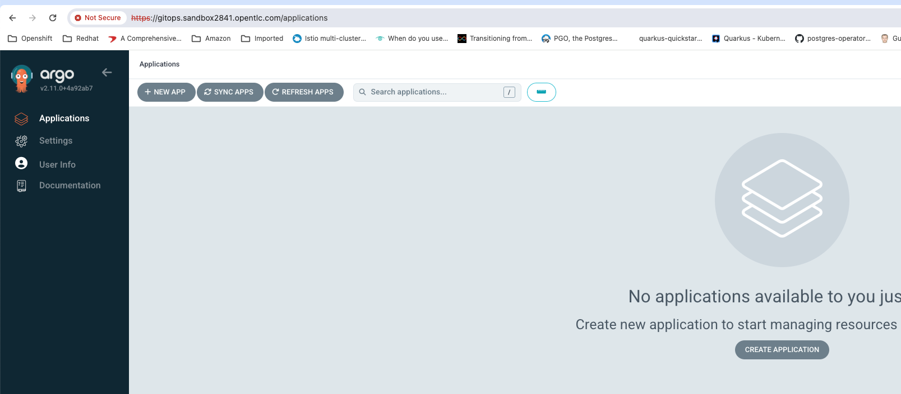

When you use HAProxy Ingress with ArgoCD on Kubernetes you are going to run into this error 'ERR_TOO_MANY_REDIRECTS' when you browse to the ArgoCD server URL. I lost of few hours trying to figure out what the cause is and wanted to write this up with the hope that it saves some one else time later and also a note for myself so I don't forget exactly what I did to solve the issue.

I installed ArgoCD server on my EKS cluster following the instructions in the ArgoCD docs using the command below
```
kubectcl create namespace gitops
kubectl apply -n gitops -f https://raw.githubusercontent.com/argoproj/argo-cd/master/manifests/install.yaml
```

After that I created an Ingress Resource by running the command below

```
cat <<EOF | kubectl apply -f -
apiVersion: networking.k8s.io/v1
kind: Ingress
metadata:
  name: argocd
  namespace: gitops
spec:
  ingressClassName: haproxy
  rules:
  - host: gitops.sandbox2841.opentlc.com
    http:
      paths:
      - backend:
          service:
            name: argocd-server
            port:
              name: https
        path: /
        pathType: Prefix
  tls:
  - hosts:
    - gitops.sandbox2841.opentlc.com
EOF
```

Browse to `https://gitops.sandbox2841.opentlc.com` and started noticing 'ERR_TOO_MANY_REDIRECTS'. reason why this was happening is because HAProxy by default terminates SSL and forwards HTTP to backend service and ArgoCD server when it sees an HTTP traffic it automatically redirects to HTTPS. This results in an infinite loop and eventually HAProxy gives up and you see that error in browser.
So to fix this problem I simply had to add an annotation `ingress.kubernetes.io/ssl-passthrough: "true"` to the ingress resource so HAProxy instead of terminating HTTPS traffic at the proxy will do an SNI passthrough.

Updated Ingress resource as shown below

```
apiVersion: networking.k8s.io/v1
kind: Ingress
metadata:
  name: argocd
  namespace: gitops
  annotations:
    ingress.kubernetes.io/ssl-passthrough: "true"
spec:
  ingressClassName: haproxy
  rules:
  - host: gitops.sandbox2841.opentlc.com
    http:
      paths:
      - backend:
          service:
            name: argocd-server
            port:
              name: https
        path: /
        pathType: Prefix
  tls:
  - hosts:
    - gitops.sandbox2841.opentlc.com
EOF
```

Grab the admin password from kubernetes secret by running command below

```
kubectl get secrets argocd-initial-admin-secret -n gitops -o jsonpath="{.data.password}" | base64 -d | pbcopy
```
Browse to `https://gitops.sandbox2841.opentlc.com` enter admin for username and paste the password obtained from previous step and you will be logged into ArgoCD server successfully as shown in screen capture below



Hope this helps,

Thanks,
Ram
