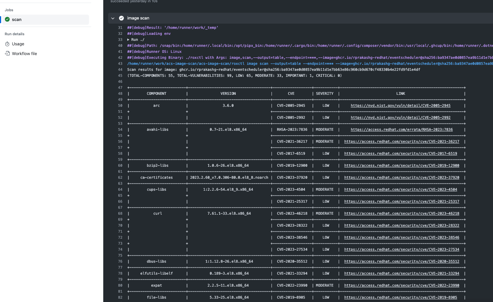
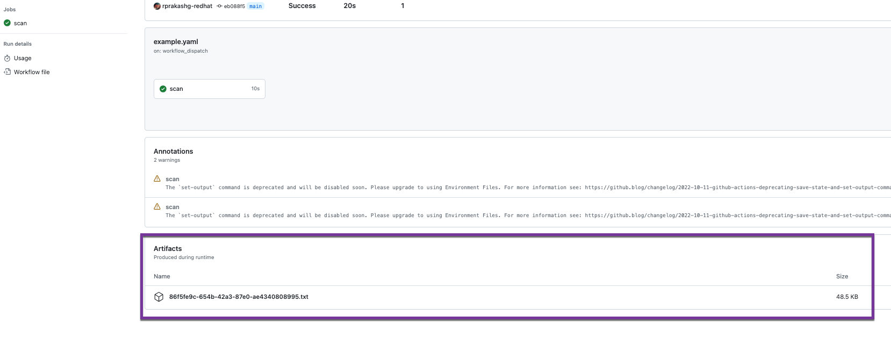
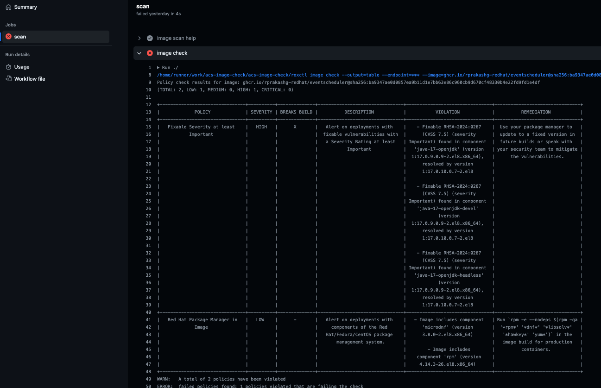

I recently posted about a custom github action that can be leveraged to install roxctl which is a command line utility that ships with Red Hat Advanced Cluster Security for Kubernetes. If you haven't read that post I'd recommend you [read](https://rprakashg.github.io/roxctl-with-github-actions-workflow/) that first before continuing here. As a follow up to that in this post I'm going to cover two new github actions that you can use from your Github actions workflow;

* [acs-image-scan](https://github.com/rprakashg-redhat/acs-image-scan)
* [acs-image-check](https://github.com/rprakashg-redhat/acs-image-check)

## acs-image-scan
This action will run a container vulnerability scan on a specified image. Action will save the scan output file and upload that as a workflow artifact. https://github.com/setup-roxctl). Workflow accepts bunch of input parameters which you can see in the [action.yaml](https://github.com/rprakashg-redhat/acs-image-scan/blob/main/action.yaml). 

### Usage

```yaml
- uses: rprakashg-redhat/acs-image-scanl@main
  with:
    # Central endpoint
    central: ""

    # ROX Api token
    api-token: ""

    # Container Image to run a vulnerability scan on
    image: ""

    # output format valid values (table|csv|json|sarif)
    output: ""

    # directory where the vulnerability scan output report should be created
    output-path: ""
```

### Example workflow

Example workflow below shows how to do a container vulnerability scan using this action on a container image. This example workflow can also be found in the action repository [here](https://github.com/rprakashg-redhat/acs-image-scan/blob/main/.github/workflows/example.yaml)

```
name: example
on:
  workflow_dispatch:
jobs:
  scan:
    runs-on: ubuntu-latest
    steps:
      - uses: actions/checkout@v4
      - id: setup-roxctl
        uses: rprakashg-redhat/setup-roxctl@main
      - name: image scan help
        run: ./roxctl image scan --help
      - name: image scan
        uses: ./
        with:
          image: "ghcr.io/rprakashg-redhat/eventscheduler@sha256:ba9347ae0d0857ea9b11d1e7bb63e86c960cb9d670cf48330b4e22fd9fd1e4df"
          api-token: ${{ secrets.ROX_API_TOKEN }}
          central: ${{ secrets.ROX_CENTRAL }}
          output: table
          output-path: ${{ runner.temp }}
```

### Scan output
Screen capture below shows output of a container vulnerability scan from github actions workflow



### Workflow artifact
You can also see that the action automatically saved the output to a file and uploaded the file as workflow artifact



## acs-image-check
This action can be used to check for build time security policy violations using roxctl to ensure the container image built is compliant with all internal/external security standards defined. If you are not familar with this capability in RHACS check out [this](https://docs.openshift.com/acs/4.3/operating/manage-security-policies.html) document.

### Usage
```yaml
- uses: rprakashg-redhat/acs-image-check@main
  with:
    # Central endpoint
    central: ""

    # ROX Api token
    api-token: ""

    # Container Image to check for build time policy violations
    image: ""

    # output format valid values (table|csv|json|sarif)
    output: ""

    # directory to create output from image check should be created
    output-path: ""
```

### Example workflow
Example workflow below shows how to run build time security policy checks on a container image using this action. Workflow can also be found in the action repo [here](https://github.com/rprakashg-redhat/acs-image-check/blob/main/.github/workflows/example.yaml)

### Image check output
Screen capture below shows output of build time security policy check on a container image. You can see the workflow failed because there was a high priority security issue in the image I used.




Both actions use roxctl CLI commands to run a container vulnerability scan on the image and well as checking for build time security policy violations so roxctl needs to be installed before you can use these actions. Use [setup-roxctl](https://github.com/rprakashg-redhat/setup-roxctl) action to install roxctl from your workflow before using `acs-image-scan` and `acs-image-check` actions 

Lastly if you do use these actions in your workflow be sure to define repository secrets for sensitive data such as api token, central endpoint etc...

Hope this helps,

As always reach out to me if you have any questions about this post or how Red Hat Advanced Cluster Security for Kubernetes can help your organization.

Thanks,
Ram

