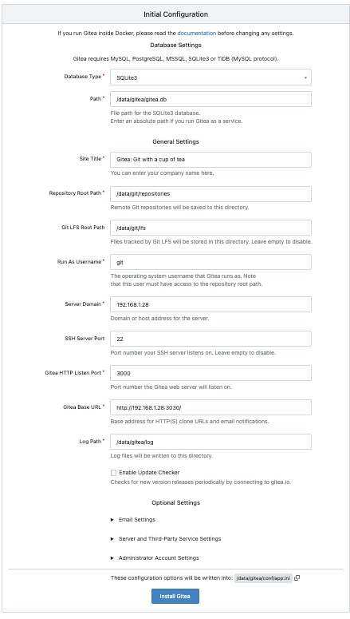
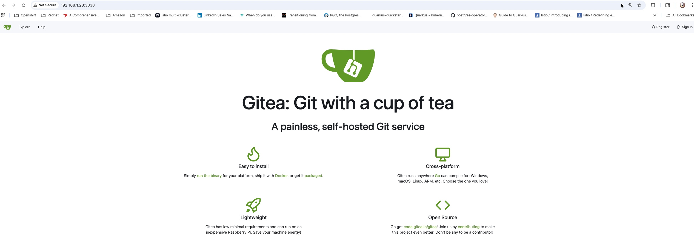

If you’ve worked with Kubernetes, you’re probably familiar with init containers—containers that run before the main application and are typically used for setup or initialization tasks. In this post, I’ll show how to apply the same concept to containerized applications running on Podman, even though Podman doesn’t natively support init containers in the Kubernetes sense.

Example scenario

For this article, I’ll use Gitea
 running as a container on Podman.

By default, when Gitea runs in a container, it expects an app.ini file to exist under the /data/gitea/conf directory. On first access via a web browser, Gitea presents an initialization screen where you can override default settings and click Install Gitea. This process generates the app.ini file and initializes the database.

Our goal is to move all of this initialization logic into an init container, so that when Gitea is accessed for the first time, it is already fully configured. In other words, users should land directly on a ready-to-use Gitea instance—without seeing the initial setup screen or manually completing the installation.

Running Gitea on Podman

To run the Gitea container on Podman, we’ll define a Podman Quadlet. If you’re not already familiar with Quadlets, I recommend reviewing the official documentation here
.

At a high level, Quadlets allow you to declaratively define containers, networks, and volumes using systemd unit files. One of the biggest advantages of this approach is that it hands off the entire lifecycle management of your containerized applications—startup, shutdown, restarts, and dependencies—to systemd.

In the screen capture below, you can see the default experience when accessing the Gitea web interface for the first time without any initialization. This is the behavior we’ll eliminate by introducing an init container.



Below you can find the quadlet file for running `gitea` container on podman. 

```yaml
# /etc/containers/systemd/gitea.container
[Unit]
Description=Gitea container
PartOf=gitea.target
After=gitea-init.service
Wants=gitea-init.service

[Container]
Image=docker.io/gitea/gitea:latest
ContainerName=gitea
PublishPort=3030:3000
PublishPort=222:22
Volume=gitea-data:/data:Z
Volume=/etc/localtime:/etc/localtime:ro
Environment=USER_UID=1000
Environment=USER_GID=1000


[Service]
TimeoutStartSec=120
Restart=on-failure

[Install]
WantedBy=gitea.target
```

```yaml
#/etc/containers/systemd/gitea.volume
[Volume]
VolumeName=gitea-data
```

The parts that are most relevant for this article are PartOf, After, and Wants. As you can see, this Quadlet is associated with a systemd target unit named gitea.target. Systemd target units are used to group related services and manage them as a single logical unit.

We also use the After and Wants directives to express a dependency on the init container service, gitea-init. This ensures that the initialization container is started before the main Gitea container and is treated as a required component of the overall application lifecycle.

Below is the Quadlet file for the Gitea init container.

```yaml
# /etc/containers/systemd/gitea-init.container
[Unit]
Description=Initialize Gitea
PartOf=gitea.target

[Container]
Image=registry.access.redhat.com/ubi9/ubi-minimal:9.7-1763362218
ContainerName=gitea-init
Pull=missing
Volume=gitea-data:/data:Z
Volume=/usr/share/gitea/config:/config-source:ro
Exec=/bin/sh /config-source/init.sh

[Service]
Type=oneshot
RemainAfterExit=true
Restart=on-failure
RestartSec=5s
StandardOutput=journal
StandardError=journal

[Install]
WantedBy=gitea.target
```

In the snippet above, we define the Gitea init container service as a oneshot systemd service. This service uses a minimal UBI image to run a script that encapsulates all the initialization logic for Gitea. Because it is a oneshot service, it runs to completion once and then exits.

The init container shares the same Podman volume as the main Gitea container, allowing it to generate and populate the required configuration files—such as app.ini—before the primary application starts.

Below is the Gitea initialization script.

```sh
#!/bin/sh
set -e

mkdir -p /data/gitea/conf
mkdir -p /data/gitea/repositories
mkdir -p /data/ssh

APPINI=/data/gitea/conf/app.ini

if [ -f "$APPINI" ]; then
  echo "[init] app.ini already exists, deleting..."
  rm "$APPINI"
fi

cat <<EOF > "$APPINI"
APP_NAME = Gitea: Git with a cup of tea
RUN_MODE = prod

[repository]
ROOT = /data/gitea/repositories

[repository.local]
LOCAL_COPY_PATH = /data/gitea/tmp/local-repo

[repository.upload]
TEMP_PATH = /data/gitea/uploads

[server]
APP_DATA_PATH = /data/gitea
DOMAIN           = 192.168.1.28
SSH_DOMAIN       = 192.168.1.28
HTTP_PORT        = 3000
ROOT_URL         = http://192.168.1.28:3030
DISABLE_SSH      = false
SSH_PORT         = 22
SSH_LISTEN_PORT  = 22
LFS_START_SERVER = false

[database]
PATH = /data/gitea/gitea.db
DB_TYPE = sqlite3
HOST    = localhost:3306
NAME    = gitea
USER    = admin
PASSWD  = r3dH4T1
LOG_SQL = false

[indexer]
ISSUE_INDEXER_PATH = /data/gitea/indexers/issues.bleve

[session]
PROVIDER_CONFIG = /data/gitea/sessions

[picture]
AVATAR_UPLOAD_PATH = /data/gitea/avatars
REPOSITORY_AVATAR_UPLOAD_PATH = /data/gitea/repo-avatars

[attachment]
PATH = /data/gitea/attachments

[log]
MODE = console
LEVEL = info
ROOT_PATH = /data/gitea/log

[security]
INSTALL_LOCK = true
SECRET_KEY   =
REVERSE_PROXY_LIMIT = 1
REVERSE_PROXY_TRUSTED_PROXIES = *

[service]
DISABLE_REGISTRATION = false
REQUIRE_SIGNIN_VIEW  = false

[lfs]
PATH = /data/git/lfs


EOF

echo "[init] app.ini generated"

chown -R 1000:1000 /data
echo "[init] Updated permissions"
```

Finally, we can look at the Quadlet file that defines the systemd target unit gitea.target. This target groups both the Gitea init container and the main Gitea container, allowing them to be managed together as a single application unit.

```yaml
#/etc/systemd/system/gitea.target
[Unit]
Description=Gitea services group

Wants=gitea-init.service
Wants=gitea.service

After=network-online.target
After=gitea-init.service
After=gitea.service

[Install]
WantedBy=multi-user.target
```

I'm using Ansible to automate deployment of quadlets to target host machines. To start the service we run command below.

```sh
sudo systemctl start gitea.target
```

Below is a screenshot showing the application experience after initialization. As you can see, the initial setup screen is no longer displayed.



You can run the command below to inspect the logs of the Gitea init container service, which is useful for troubleshooting the initialization logic.

```sh
journalctl -u gitea-init.service | tail -n 20
```

Hope this helps, as always if you have any questions about this article please feel free to reach out.

Thanks,
Ram
