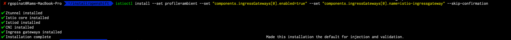

I recently got a chance to install Istio ambient mesh on OpenShift and ran into couple of issues.  In this post I will walk through steps to get through the installation issues. This is the [article](https://istio.io/latest/docs/ops/ambient/getting-started/) I followed to install Ambient Mesh on OpenShift Container Platform

First thing you are going to run into is ztunnel and istio cni installation failures. 

## Fixing z-tunnel errors
You will see an error like below, this is mainly because by default everything runs in openshift in least privilege mode. We can fix these errors by assigning additional SCC's to the service account associated with the ztunnel POD

```
Error creating: pods "ztunnel-" is forbidden: unable to validate against any security context constraint: [provider "anyuid": Forbidden: not usable by user or serviceaccount, provider restricted-v2: .containers[0].runAsUser: Invalid value: 0: must be in the ranges: [1000680000, 1000689999], provider restricted-v2: .containers[0].capabilities.add: Invalid value: "NET_ADMIN": capability may not be added, provider "restricted": Forbidden: not usable by user or serviceaccount, provider "nonroot-v2": Forbidden: not usable by user or serviceaccount, provider "nonroot": Forbidden: not usable by user or serviceaccount, provider "hostmount-anyuid": Forbidden: not usable by user or serviceaccount, provider "machine-api-termination-handler": Forbidden: not usable by user or serviceaccount, provider "hostnetwork-v2": Forbidden: not usable by user or serviceaccount, provider "hostnetwork": Forbidden: not usable by user or serviceaccount, provider "hostaccess": Forbidden: not usable by user or serviceaccount, provider "node-exporter": Forbidden: not usable by user or serviceaccount, provider "privileged": Forbidden: not usable by user or serviceaccount]
```


Assign additional security context constraints to `ztunnel` service account on `istio-system` namespace by running commands below

```
oc adm policy add-scc-to-user hostmount-anyuid --serviceaccount ztunnel --namespace istio-system
oc adm policy add-scc-to-user anyuid --serviceaccount ztunnel --namespace istio-system
oc adm policy add-scc-to-user nonroot-v2 --serviceaccount ztunnel --namespace istio-system
oc adm policy add-scc-to-user hostnetwork-v2 --serviceaccount ztunnel --namespace istio-system
oc adm policy add-scc-to-user restricted-v2 --serviceaccount ztunnel --namespace istio-system
oc adm policy add-scc-to-user machine-api-termination-handler --serviceaccount ztunnel --namespace istio-system
oc adm policy add-scc-to-user hostnetwork --serviceaccount ztunnel --namespace istio-system
oc adm policy add-scc-to-user hostaccess --serviceaccount ztunnel --namespace istio-system
oc adm policy add-scc-to-user node-exporter --serviceaccount ztunnel --namespace istio-system
oc adm policy add-scc-to-user privileged --serviceaccount ztunnel --namespace istio-system
```

## Fixing istio-cni-node errors
Similar to z-tunnel you will see these errors shown below. We can fix these errors by assigning additional SCC's to service account associated with istio-cni-node POD

```
Error creating: pods "istio-cni-node-" is forbidden: unable to validate against any security context constraint: [provider "anyuid": Forbidden: not usable by user or serviceaccount, provider restricted-v2: .spec.securityContext.hostNetwork: Invalid value: true: Host network is not allowed to be used, spec.volumes[0]: Invalid value: "hostPath": hostPath volumes are not allowed to be used, spec.volumes[1]: Invalid value: "hostPath": hostPath volumes are not allowed to be used, spec.volumes[2]: Invalid value: "hostPath": hostPath volumes are not allowed to be used, spec.volumes[3]: Invalid value: "hostPath": hostPath volumes are not allowed to be used, spec.volumes[4]: Invalid value: "hostPath": hostPath volumes are not allowed to be used, provider restricted-v2: .containers[0].runAsUser: Invalid value: 0: must be in the ranges: [1000680000, 1000689999], provider restricted-v2: .containers[0].privileged: Invalid value: true: Privileged containers are not allowed, provider restricted-v2: .containers[0].hostNetwork: Invalid value: true: Host network is not allowed to be used, provider "restricted": Forbidden: not usable by user or serviceaccount, provider "nonroot-v2": Forbidden: not usable by user or serviceaccount, provider "nonroot": Forbidden: not usable by user or serviceaccount, provider "hostmount-anyuid": Forbidden: not usable by user or serviceaccount, provider "machine-api-termination-handler": Forbidden: not usable by user or serviceaccount, provider "hostnetwork-v2": Forbidden: not usable by user or serviceaccount, provider "hostnetwork": Forbidden: not usable by user or serviceaccount, provider "hostaccess": Forbidden: not usable by user or serviceaccount, provider "node-exporter": Forbidden: not usable by user or serviceaccount, provider "privileged": Forbidden: not usable by user or serviceaccount]
```

Assign SCC's to `istio-cni` service account on `istio-system` namespace by running commands below

```
oc adm policy add-scc-to-user anyuid --serviceaccount istio-cni --namespace istio-system
oc adm policy add-scc-to-user restricted-v2 --serviceaccount istio-cni --namespace istio-system
oc adm policy add-scc-to-user restricted --serviceaccount istio-cni --namespace istio-system
oc adm policy add-scc-to-user nonroot-v2 --serviceaccount istio-cni --namespace istio-system 
oc adm policy add-scc-to-user nonroot --serviceaccount istio-cni --namespace istio-system
oc adm policy add-scc-to-user hostmount-anyuid --serviceaccount istio-cni --namespace istio-system 
oc adm policy add-scc-to-user machine-api-termination-handler --serviceaccount istio-cni --namespace istio-system
oc adm policy add-scc-to-user hostnetwork-v2 --serviceaccount istio-cni --namespace istio-system
oc adm policy add-scc-to-user hostnetwork --serviceaccount istio-cni --namespace istio-system
oc adm policy add-scc-to-user hostaccess --serviceaccount istio-cni --namespace istio-system
oc adm policy add-scc-to-user node-exporter --serviceaccount istio-cni --namespace istio-system

```

## Fixing Istio Ingress Gateway errors
Ingress gateway deployment is also going to get stuck due to errors below. We can fix them by assigning additional SCC's to service account associated with istio ingress gateway POD

```
Error creating: pods "istio-ingressgateway-75767568b7-" is forbidden: unable to validate against any security context constraint: [provider "anyuid": Forbidden: not usable by user or serviceaccount, provider restricted-v2: .containers[0].runAsUser: Invalid value: 1337: must be in the ranges: [1000680000, 1000689999], provider "restricted": Forbidden: not usable by user or serviceaccount, provider "nonroot-v2": Forbidden: not usable by user or serviceaccount, provider "nonroot": Forbidden: not usable by user or serviceaccount, provider "hostmount-anyuid": Forbidden: not usable by user or serviceaccount, provider "machine-api-termination-handler": Forbidden: not usable by user or serviceaccount, provider "hostnetwork-v2": Forbidden: not usable by user or serviceaccount, provider "hostnetwork": Forbidden: not usable by user or serviceaccount, provider "hostaccess": Forbidden: not usable by user or serviceaccount, provider "node-exporter": Forbidden: not usable by user or serviceaccount, provider "privileged": Forbidden: not usable by user or serviceaccount]
```

Assign SCC's to `istio-ingressgateway-service-account` service account on `istio-system` namespace

```
oc adm policy add-scc-to-user anyuid --serviceaccount istio-ingressgateway-service-account --namespace istio-system
oc adm policy add-scc-to-user restricted-v2 --serviceaccount istio-ingressgateway-service-account --namespace istio-system
oc adm policy add-scc-to-user restricted --serviceaccount istio-ingressgateway-service-account --namespace istio-system
oc adm policy add-scc-to-user nonroot-v2 --serviceaccount istio-ingressgateway-service-account --namespace istio-system
oc adm policy add-scc-to-user nonroot --serviceaccount istio-ingressgateway-service-account --namespace istio-system
oc adm policy add-scc-to-user hostmount-anyuid --serviceaccount istio-ingressgateway-service-account --namespace istio-system
oc adm policy add-scc-to-user machine-api-termination-handler --serviceaccount istio-ingressgateway-service-account --namespace istio-system
oc adm policy add-scc-to-user hostnetwork-v2 --serviceaccount istio-ingressgateway-service-account --namespace istio-system
oc adm policy add-scc-to-user hostnetwork --serviceaccount istio-ingressgateway-service-account --namespace istio-system
oc adm policy add-scc-to-user hostaccess --serviceaccount istio-ingressgateway-service-account --namespace istio-system
oc adm policy add-scc-to-user node-exporter --serviceaccount istio-ingressgateway-service-account --namespace istio-system
oc adm policy add-scc-to-user privileged --serviceaccount istio-ingressgateway-service-account --namespace istio-system

```

I re-ran the install command just to make sure everything completes

```
istioctl install --set profile=ambient --set "components.ingressGateways[0].enabled=true" --set "components.ingressGateways[0].name=istio-ingressgateway" --skip-confirmation
```



Now that we have ambient mesh installed we need to install prometheus and kiali before we install istio sample apps. 

## Installing Prometheus and Kiali on OpenShift
I installed Prometheus operator from the operator hub and used the sample prometheus installation provided by istio referenced here in this [doc](https://istio.io/latest/docs/ops/integrations/prometheus/#installation)

```
kubectl apply -f https://raw.githubusercontent.com/istio/istio/release-1.20/samples/addons/prometheus.yaml
```

After you run the above command you are going to see these errors below

```
pods "prometheus-5d5d6d6fc-" is forbidden: unable to validate against any security context constraint: [provider "anyuid": Forbidden: not usable by user or serviceaccount, provider restricted-v2: .spec.securityContext.fsGroup: Invalid value: []int64{65534}: 65534 is not an allowed group, provider restricted-v2: .containers[0].runAsUser: Invalid value: 65534: must be in the ranges: [1000680000, 1000689999], provider restricted-v2: .containers[1].runAsUser: Invalid value: 65534: must be in the ranges: [1000680000, 1000689999], provider "restricted": Forbidden: not usable by user or serviceaccount, provider "nonroot-v2": Forbidden: not usable by user or serviceaccount, provider "nonroot": Forbidden: not usable by user or serviceaccount, provider "hostmount-anyuid": Forbidden: not usable by user or serviceaccount, provider "machine-api-termination-handler": Forbidden: not usable by user or serviceaccount, provider "hostnetwork-v2": Forbidden: not usable by user or serviceaccount, provider "hostnetwork": Forbidden: not usable by user or serviceaccount, provider "hostaccess": Forbidden: not usable by user or serviceaccount, provider "node-exporter": Forbidden: not usable by user or serviceaccount, provider "privileged": Forbidden: not usable by user or serviceaccount]
```

We can grant additional SCC's to `promethues` service account by running commands below

```
oc adm policy add-scc-to-user anyuid --serviceaccount prometheus --namespace istio-system
oc adm policy add-scc-to-user restricted-v2 --serviceaccount prometheus --namespace istio-system
oc adm policy add-scc-to-user restricted --serviceaccount prometheus --namespace istio-system
oc adm policy add-scc-to-user nonroot-v2 --serviceaccount prometheus --namespace istio-system
oc adm policy add-scc-to-user nonroot --serviceaccount prometheus --namespace istio-system
oc adm policy add-scc-to-user hostmount-anyuid --serviceaccount prometheus --namespace istio-system
oc adm policy add-scc-to-user machine-api-termination-handler --serviceaccount prometheus --namespace istio-system
oc adm policy add-scc-to-user hostnetwork-v2 --serviceaccount prometheus --namespace istio-system
oc adm policy add-scc-to-user hostnetwork --serviceaccount prometheus --namespace istio-system
oc adm policy add-scc-to-user hostaccess --serviceaccount prometheus --namespace istio-system
oc adm policy add-scc-to-user node-exporter --serviceaccount prometheus --namespace istio-system
oc adm policy add-scc-to-user privileged --serviceaccount prometheus --namespace istio-system
```

Install Kiali Operator from the operator hub and create an instance of kiali.

## Deploy Istio sample apps
Deploy istio sample apps following the instructions [here](https://istio.io/latest/docs/ops/ambient/getting-started/#bookinfo) in this getting started with Ambient Mesh article

## Expose a route to istio ingress gateway
Follow steps below to expose a route to istio ingress gateway so we can test the sample bookinfo application.

* Login to OpenShift console and navigate to `Routes` under `Networking`
* Select `istio-system` in `Project` drop down and click `Create Route`
* Enter `istio-ingressgateway` for `Name`
* Select `istio-ingressgateway` for `Service`
* Select `80-8080` for `Target Port` and click on `Create`. 

See screen capture below


Grab the route URL and access the product page from a browser


