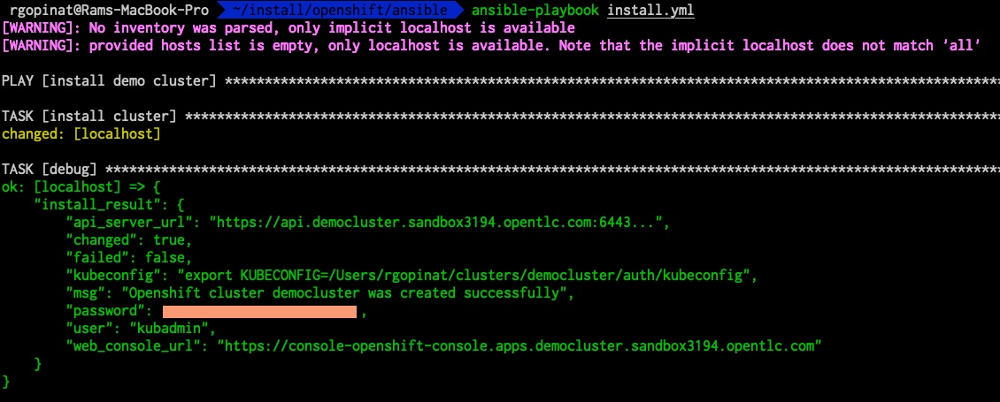

OpenShift is a big part of many of the demos and conversations I have with customers since joining Red Hat. We provide a CLI tool called openshift-install that automates the installation of OpenShift clusters. If you are new to OpenShift and not sure how to install it, I recommend checking out this article, which goes into the details. In this post, I'm going to walk through how I used to install OpenShift clusters on AWS and then introduce you to a new Ansible collection I'm building to consolidate all my demos. Even though we have a lot of pre-built demos on our demo platform, I prefer to build all my demos myself for a few reasons.

* It gives me hands-on experience with our products.
* I build my demos with the mindset that I'm building them for production deployment.
* I can clearly articulate the steps and explain why certain decisions were made to the customer.

With that lets get right into key reasons for writing this post.

## How I used to install OpenShift on AWS
Installing OpenShift clusters using the openshift-install CLI requires an install-config.yaml file as input. As soon as the openshift-install tool has read the install config file, it will remove the file. For this reason, what I used to do was to have a backup of this install config file in a separate directory so I don't have to create it every time I need a cluster for a demo with a customer. Whenever I need a new cluster, I would copy this template from the templates directory and then update the file in Visual Studio Code to reflect the new environment where I'm installing the cluster. Then, I run the openshift-install create cluster command to install the cluster.

### Some problems with this approach
The manual aspects of this approach were error-prone because sometimes I would make mistakes editing the install config file, which would result in me having to redo everything all over again.

Installing OpenShift requires a Red Hat pull secret, which you have to download from console.redhat.com/openshift/downloads. Since I didn't want to log in to console.redhat.com every time I needed a new cluster, I ended up keeping the pull secret in the template file. A pull secret should be securely stored and protected from unauthorized access.

The installer also requires an SSH public key in the config file. To avoid having to copy the SSH public key every time I needed a cluster, I left this in the install config template file as well.

Additionally, depending on a specific customer's situation, there were additional steps that needed to be done on the cluster for the demo. In some cases, I was doing this through the UI, and in others, I would run an Ansible script against the cluster. As you can already tell, the whole process wasn't smooth end-to-end. 

## Using ansible to automate installing Openshift clusters on AWS
I decided to use a custom Ansible module to automate installing OpenShift clusters on AWS and avoid all the manual steps I used to perform earlier, as well as roles to automate scenario-based customer demos. In this post, I'm only going to cover the Python module. The Python module is in a new Ansible collection that I'm creating. Check it out in this GitHub [repo](https://github.com/rprakashg/demos). I have not published this collection to galaxy.ansible.com yet, as I have more work to do, such as wiring up some unit and integration tests, creating a pipeline to release the collection, etc.

If you decide to check this out, you can install this collection from GitHub directly by running the command below:

```sh
ansible-galaxy collection install git+https://github.com/rprakashg/demos.git,main
```

Before you can use this module you will need to set your AWS credentials in environment variables as shown below

```sh
export AWS_ACCESS_KEY_ID=<redacted>
export AWS_SECRET_ACCESS_KEY=<redacted>
export AWS_DEFAULT_REGION=us-west-2
```

Inputs you can pass to the ansible module

| Name              | Description               |
| ----------------  | -----------------         |
| cluster_name      | Cluster name              |
| region            | AWS region to provision. If no region is passed the module will read the `AWS_DEFAULT_REGION` environment variable |
| base_domain       | Base domain for the cluster |
| worker_instance_type | AWS instance type to use for compute/worker nodes |
| worker_replicas | Number of compute/worker nodes |
| master_instance_type | AWS instance type to use for controlplane/master nodes |
| master_replicas | Number of control plane nodes |
| ssh_pubkey      | SSH public key to use for nodes. Optional if not specified module will read id_rsa.pub key value from `~/.ssh` directory |
| pull_secret     | Red Hat pull secret. Optional if not specified module will use the offline token to automatically download the pull secret from console.redhat.com/openshift/downloads |
| offline_token   | Offline token. This is used to obtain a temp token to download pull secret from console.redhat.com/openshift/downloads. If this is not specified the module will try to read `RH_OFFLINE_TOKEN` value from environment variable and use that to obtain a temp token |

### Options to specify sensitive inputs
There are couple of ways you can pass sensitive inputs into the module.

* Create an ansible vault using the command below.

```sh
ansible-vault create vars/secrets.yml
```

Input the vault password and include either a pull secret you have previously downloaded or the offline token in the `secrets.yml` file as shown below

```yaml 
pull_secret: '<redacted>'
``` 
or 

```yaml
rh_offline_token: `<redacted>` 
```

* Set the `RH_OFFLINE_TOKEN` environment variable and let the module automatically download the pull secret from console.redhat.com/openshift/downloads

Create an Ansible playbook and include snippet below. Be sure to setup a route 53 dns for the base domain you want to use. 

```yaml
---
- name: install demo cluster
  hosts: localhost
  gather_facts: no
  tasks:
  - name: install cluster
    rprakashg.demos.install_openshift_on_aws:
      cluster_name: democluster
      region: us-west-2
      base_domain: sandbox3194.opentlc.com
      worker_instance_type: m5.4xlarge
      worker_replicas: 3
      master_instance_type: c5.4xlarge
      master_replicas: 3
    register: install_result
  - name: debug        
    debug: 
      var: install_result

```
In the above example since I'm not using the secrets from ansible vault, when the play book is run, module will read the `RH_OFFLINE_TOKEN` environment variable value and automatically download the pull secret and use that. 

If you where to use ansible vault you would need to include additional inputs for the module shown below in the playbook and use the pull secret value from ansible vault

```yaml
pull_secret: '{{ pull_secret }}'
```

or if you want the module to download the pull secret include snippet below

```yaml
offline_token: '{{ rh_offline_token }}'
```

Run the playbook to install the cluster as shown below

```sh
ansible-playbook install.yml
```

If you are using ansible vault run the playbook as shown below. Be sure to set the vault password that was used in environment variable `VAULT_SECRET`

```sh
ansible-playbook --vault-password-file <(echo "$VAULT_SECRET") install.yml
```

Ansible module will generate the install config file from a jinja2 template and kick of the create cluster command to provision the cluster. Once the cluster is provisioned it parses the output and returns all required information in a formatted JSON which can be useful to kick off additional demo specific steps that are incorporated into Ansible roles.

Screen capture below shows output from a test installation I performed using this module.



Hope this helps. As always if you have any questions about this post feel free to comment.

Thanks for reading,

Cheers,
Ram

