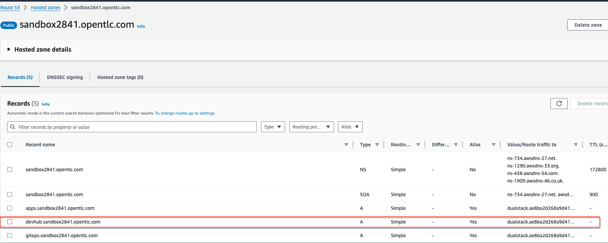
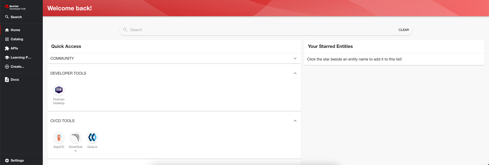
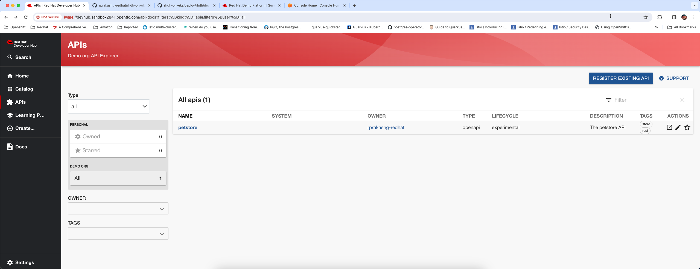
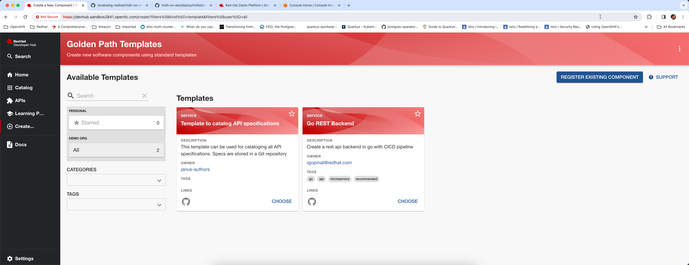

As many of you may already know Red Hat Developer hub which is based on backstage project created by Spotify hit GA. If you are not familiar with RedHat Developer hub or backstage check out this [article](https://developers.redhat.com/rhdh). You can deploy and run developer hub on all x-K8s (AKS, EKS, GKE). In this post I will cover how to install and configure RedHat developer hub on Amazon Elastic Kubernetes Service (EKS). If you are using AKS or GKE I would think these steps would work just fine although I haven't tested in AKS or GKE. Everything I'm covering in this post can be found in this Github [repo](https://github.com/rprakashg-redhat/rhdh-on-eks).

Lets get right into it.

As in many previous posts where I used EKS I'm going to use terraform to provision EKS cluster. You can find the terraform scripts [here](https://github.com/rprakashg-redhat/rhdh-on-eks/tree/main/deploy/infra).

```
terraform init
terraform plan
terraform apply --var "name=toolscluster"
```

Once the cluster is provisioned we need to install an Ingress controller. There are variety of options out there but for the purposes of this post I decided to use HAProxy. HAProxy also provides an EKS addon that makes it super easy to install on to cluster but I'm going to use helm to install HAProxy controller on the cluster.

You can download the kubeconfig file to authenticate with the cluster by running command below. 

note: *Be sure to make sure region value matches to one you specified when cluster was created.*

```
aws eks update-kubeconfig --region us-west-2 --name "toolscluster"
```

First we are going to add the HAProxy helm chart repo by running command below

```
helm repo add haproxytech https://haproxytech.github.io/helm-charts
```

Update helm charts by running `helm repo update` and install the HAProxy ingress controller by running command below

```
helm install haproxy-kubernetes-ingress haproxytech/kubernetes-ingress \
  --create-namespace \
  --namespace haproxy-controller \
  --set controller.service.type=LoadBalancer
```

Check if the ALB is provisioned successfully on AWS by running *`kubectl describe service haproxy-ingress -n haproxy-controller`*. You should see full DNS name of your ALB provisioned in Amazon for public IP. If it shows pending that means some issue which you should see in the status section. 

Next thing we are going to do is to update the route 53 hosted zone to create an A record so we can have a friendly URL like so *`devhub.sandbox2841.opentlc.com`*. Basically this is going to act as an alias for routing traffic to the ALB provisioned by HAProxy Ingress controller. See screenshopt below



Create a namespace `tools` on the cluster where we will install developer hub components by running *`kubectl create namespace tools`*

Next thing we are going to do is download redhat pull secret file from *cloud.redhat.com* and save it locally as pull-secret.txt file then create a kubernetes secret as shown below

```
kubectl create secret generic rhdh-pull-secret \
  -n tools \
  --from-file=.dockerconfigjson=pull-secret.txt \
  --type=kubernetes.io/dockerconfigjson
```

Path the default service account to be able to pull images from redhat registries using the kubernetes secret we created earlier by running command below

```
kubectl patch sa default -n tools -p '{"imagePullSecrets": [{"name": "rhdh-pull-secret"}]}'
```

Next thing we are going to do is create a kubernetes secret to store all sensitive configurations we want to use in the app config file for backstage. See below 

```
kubectl create secret generic rhdh-secrets \
  -n tools \
  --from-literal=AUTH_OKTA_CLIENT_ID=${AUTH_OKTA_CLIENT_ID} \
--from-literal=AUTH_OKTA_CLIENT_SECRET=${AUTH_OKTA_CLIENT_SECRET} \
--from-literal=AUTH_OKTA_DOMAIN=${AUTH_OKTA_DOMAIN} \
--from-literal=AUTH_OKTA_ADDITIONAL_SCOPES=${AUTH_OKTA_ADDITIONAL_SCOPES} \
--from-literal=GITLAB_TOKEN=${GITLAB_TOKEN} \
--from-literal=GITLAB_APP_APP_ID=${GITLAB_APP_APP_ID} \
--from-literal=GITLAB_APP_CLIENT_ID=${GITLAB_APP_CLIENT_ID} \
--from-literal=GITLAB_APP_CLIENT_SECRET=${GITLAB_APP_CLIENT_SECRET} \
--from-literal=GITHUB_APP_APP_ID=${GITHUB_APP_APP_ID} \
--from-literal=GITHUB_APP_CLIENT_ID=${GITHUB_APP_CLIENT_ID} \
--from-literal=GITHUB_APP_CLIENT_SECRET=${GITHUB_APP_CLIENT_SECRET} \
--from-literal=GITHUB_ORG=${GITHUB_ORG} \
--from-literal=GITHUB_APP_WEBHOOK_URL=${GITHUB_APP_WEBHOOK_URL} \
--from-literal=GITHUB_APP_WEBHOOK_SECRET=${GITHUB_APP_WEBHOOK_SECRET} \
--from-literal=GITHUB_TOKEN=${GITHUB_TOKEN} \
--from-literal=BACKSTAGE_AWS_ACCOUNT_ID=${BACKSTAGE_AWS_ACCOUNT_ID} \
--from-literal=AWS_ACCESS_KEY_ID=${BACKSTAGE_AWS_ACCESS_KEY_ID} \
--from-literal=AWS_SECRET_ACCESS_KEY=${BACKSTAGE_AWS_SECRET_ACCESS_KEY} \
--from-literal=TECHDOCS_AWSS3_BUCKET_NAME=${TECHDOCS_AWSS3_BUCKET_NAME} \
--from-literal=TECHDOCS_AWSS3_BUCKET_URL=${TECHDOCS_AWSS3_BUCKET_URL} \
--from-literal=AWS_REGION=${AWS_REGION} \
--from-literal=EKS_CLUSTER_URL=${EKS_CLUSTER_URL} \
--from-literal=EKS_CLUSTER_NAME=${EKS_CLUSTER_NAME} \
--from-literal=BACKSTAGE_ROLE_ARN_TO_ASSUME=${BACKSTAGE_ROLE_ARN_TO_ASSUME} \
--from-literal=AWS_EXTERNAL_ID=${AWS_EXTERNAL_ID} \
--from-literal=EKS_SA_TOKEN=${EKS_SA_TOKEN} \
--from-literal=ARGOCD_USER_ID=${ARGOCD_USER_ID} \
--from-literal=ARGOCD_USER_PWD=${ARGOCD_USER_PWD}
```

I was testing OKTA, GITHUB, GITLAB mine looks pretty large. Approach I took was to keep a local env file that contains all the values specific to my environment 
and I would run command *`export $(cat local.env | xargs)`*  before creating the secret.

Originally for Auth I used OKTA and eventually landed on using GitHub. Steps for creating app in github is pretty well documented so I'm not going to cover that. Once you create the app in github you will endup having to create a private key as well. Download the private key in to your local machine and create another kubernetes secret to store the private key for your app as you will need to specify that in the app config for backstage

```
kubectl create secret generic -n tools gh-app-key \
--from-file=GITHUB_APP_PRIVATE_KEY="/Users/rgopinat/keys/demo-rhdh.2024-02-26.private-key.pem"
```

For Kubernetes plugin I downloaded the EKS CA Certificate from aws console and saved locally to create another secret to store that EKC CA data as shown below

```
kubectl create secret generic -n tools eks-ca-data \
--from-file=EKS_CA_DATA=eks-ca.txt
```

Next I do have to tell backstage about all these secrets I've created so backstage can load them as environment variables and we can do that by updating a section in values file as shown below

```
 extraEnvVarsSecrets:
    - rhdh-secrets
    - gh-app-key
    - eks-ca-data
```

Next thing we are going to do is to go ahead and create the app config configmap. You can see a copy of mine [here](https://github.com/rprakashg-redhat/rhdh-on-eks/blob/main/deploy/rhdh/developer-hub-appconfig.yaml)

```
kubectl apply -f deploy/rhdh/developer-hub-appconfig.yaml
```

It is worth talking a little bit about this snippet of yaml below in the app config. Basically this is going to tell backstage to automatically ingest entities from github and the two static locations you see are one for golden path templates and the other one is for ingesting all APIs from repo where I'm storing all API specifications

```
catalog:
    import:
    entityFileName: catalog-info.yaml
    rules:
    - allow: [Component, System, API, Resource, Location, Domain, Template]
    locations:
    - type: url
        target: https://github.com/rprakashg-redhat/rhdh-templates/blob/main/all-templates.yaml
    - type: url
        target: https://github.com/rprakashg-redhat/apis/blob/main/all-apis.yaml
```

At this point we are ready to install redhat developer hub. We provide a Helm chart to do just that. We will add the helm chart repo with this command *`helm repo add openshift-helm-charts https://charts.openshift.io/`*. Next we need to download the values yaml so we can review and customize them to fit to this EKS installation. 

```
helm show values openshift-helm-charts/redhat-developer-hub > values.yaml
```

Customize the values yaml. You can see the version I used for my installation [here](https://github.com/rprakashg-redhat/rhdh-on-eks/blob/main/deploy/rhdh/values.yaml).
Few customizations that are worth calling out are below

1) Specified the custom hostname `devhub.sandbox2841.opentlc.com` under section global of values yaml
2) Since I was using HAProxy ingress under upstream section I had to enable ingress and specify className as shown in the snippet below

```
ingress:
    enabled: true
    host: "{{ .Values.global.host }}"
    className: haproxy
```

3) Tell developer hub about the app config by updating the extraAppConfig section under upstream->backstage section in values file as shown in snippet below

```
extraAppConfig:
- configMapRef: "developer-hub-appconfig"
  filename: "developer-hub-appconfig.yaml"
```

4) Update podSecurityContext section under upstream->backstage and include below config

```
podSecurityContext:
    runAsUser: 1001
    runAsGroup: 1001
    fsGroup: 1001
```

5) Update podSecurityContext section under upstream->postgresql->primary section in values file as shown in snippet below

```
podSecurityContext:
    enabled: true
    fsGroup: 26
    runAsUser: 26
```

and set volume permissions to enabled as shown in snippet below

```
volumePermissions:
    enabled: true
```

6) Lastly I had to set route enabled to false since I'm not running developer hub on Openshift.

At this point we can go ahead and install redhat developer hub by running command *`helm upgrade --namespace tools -i developer-hub -f values.yaml openshift-helm-charts/redhat-developer-hub`*

```
helm upgrade --namespace tools -i developer-hub -f values.yaml openshift-helm-charts/redhat-developer-hub
```

Browse to *`https://devhub.sandbox2841.opentlc.com`* from a browser and login and you will be in home page of developer hub as shown in screen capture below



Navigating to APIs you can see that petstore api was ingested into catalog automatically from the repo. Currently repo has only one API spec but as we add more API specs they would be automatically ingested into the catalog which is super cool.



To create new components we can click on create and you'll see all golden path templates ingested into the catalog as shown in screen capture below. I currently have just two.



Hope this was helpful. As always feel free to reach out to me if you have questions about this post or want to learn more about RedHat developer hub. I'm so excited about RedHat developer hub and backstage and the value it can add to development teams also what RedHat is doing in this space. 

Thanks,
Ram

