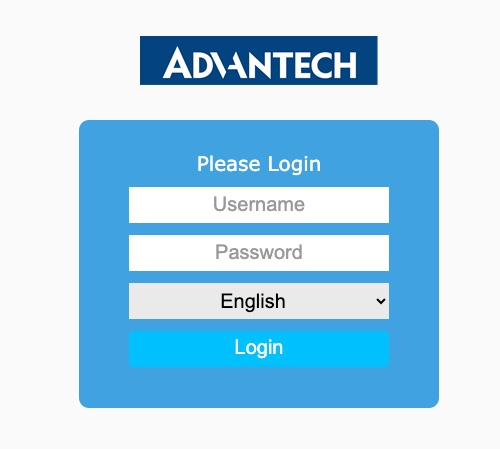
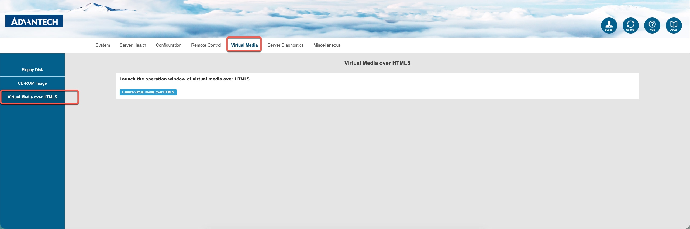
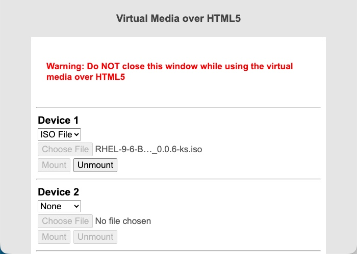
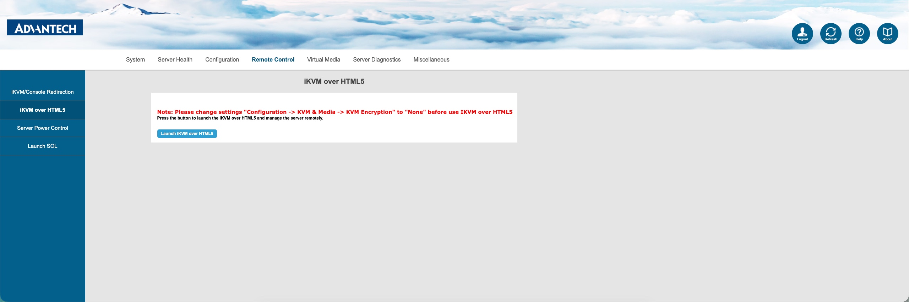
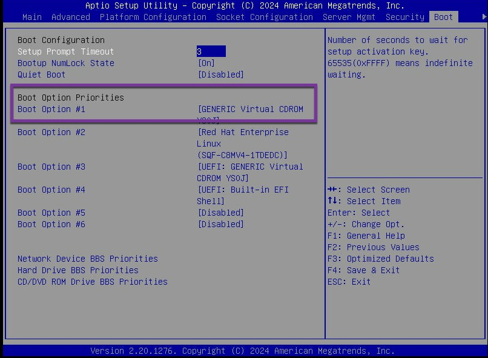
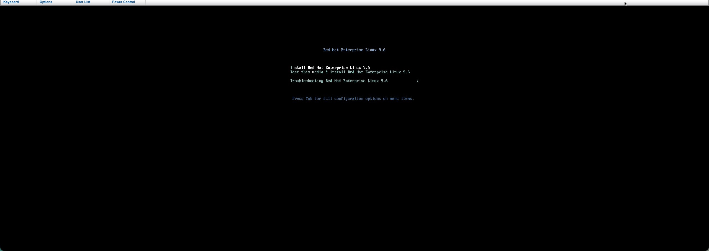
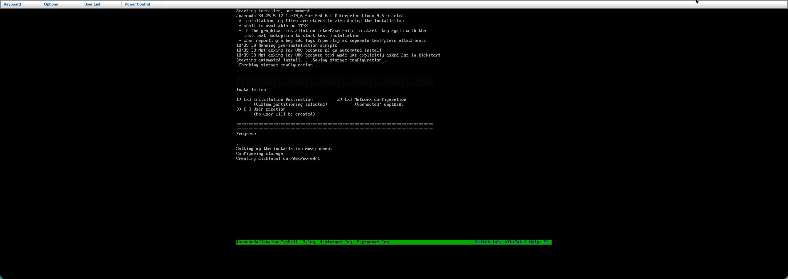
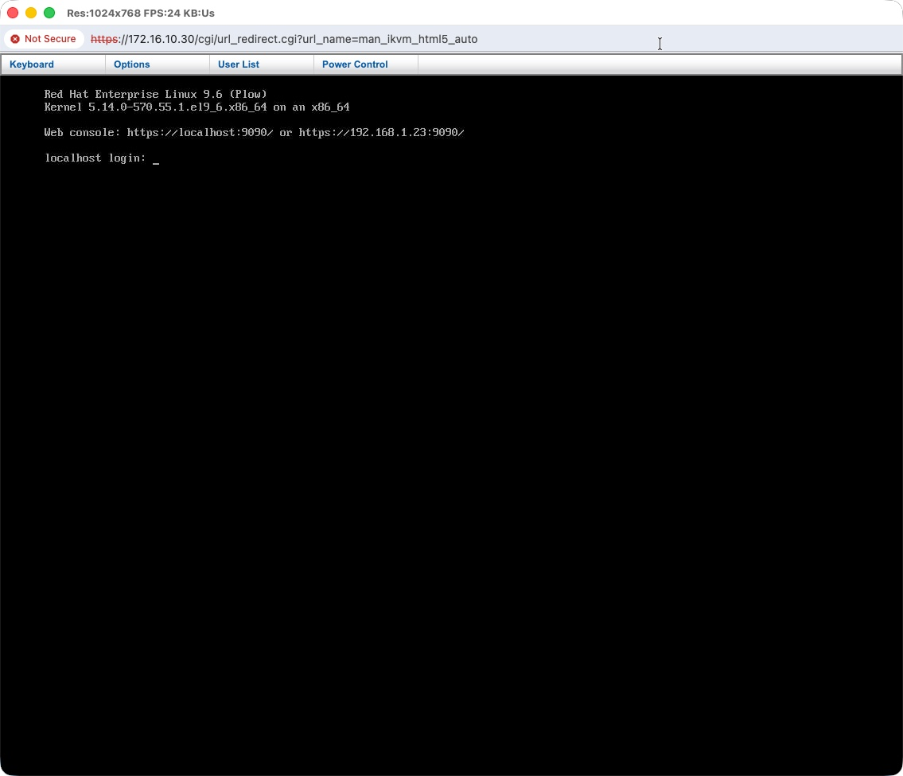

In this post, I’ll walk through how to perform a fully automated and unattended install of **Red Hat Enterprise Linux (RHEL)** on a bare-metal server **remotely using the IPMI web interface**. For readers who are not familiar with IPMI, IPMI stands for integrated platform management interface. Its an open standard for hardware management. I've long been wanting to write about this but finally getting to it now. 

For this demonstration, we’ll install RHEL on an **Advantech ECU579** server. This system is equipped with an **ASPEED 2500 BMC** chip and supports **IPMI 2.0** over the onboard LAN interface.

---

### Preparing IPMI Access

The Advantech ECU579 includes four onboard Ethernet ports. To enable remote IPMI access, connect your Ethernet cable to **LAN1**.

Before proceeding, ensure that **IPMI is enabled** and that it has a valid **IP address** configured in the **BIOS**.  
You can either assign a **static IP** or let it obtain one automatically via **DHCP**.

If you’ve configured a **static IP**, make sure your local system’s network settings are manually adjusted to be within the **same subnet**.  
For example, in my setup:

- IPMI IP address: `172.16.10.30`
- Local system IP address: `172.16.10.40`

---

You should now see the IPMI login page like this:

Go ahead and log in with your credentials.

---

### Mounting the RHEL ISO

After logging in, find the **Virtual Media** option in the menu.  Since we’ll be installing RHEL remotely, choose **Virtual Media over HTML5**.  

Here’s what it looks like:

A new popup window will open:

From the dropdown, choose **ISO File**, select your RHEL ISO from your local system, and click **Mount ISO**.

> **Heads up:** Don’t close this popup window — keep it open while the installation runs!

---

### Starting the Remote Console

Now head over to **Remote Control → iKVM over HTML5**, and click **Launch iKVM over HTML5**.  

Once the console opens, use the **Power Control** menu to power on the server.  If needed, hop into the BIOS and double-check the **boot order** — make sure it’s set to boot from **CDROM** so it picks up the mounted ISO.

---

### Installing RHEL

Once the system boots from the ISO, you’ll see the familiar RHEL boot menu:

Select **Install Red Hat Enterprise Linux 9.6** and hit **Enter**. At this point, your server will begin a **fully automated, unattended installation** of RHEL using your **custom kickstart file**.

After the installation is complete you should see a screen like below

---

### About the Kickstart File

To make the installation completely hands-free, your ISO needs a **custom kickstart configuration**. Without it, the installer will start a **VNC session**, and you’ll have to complete setup manually using a VNC client, this is because of the graphical installer. Who uses GUI installer right? :) 

I’ve automated all the steps for building ISO with custom kickstart along with cloud-init for initializating the provisioned system using **Ansible**, so the install runs start to finish without any manual steps.
If you’d like to try that out, check out my GitHub repo here:  
👉 [rprakashg-rh/enlit-build](http://github.com/rprakashg-rh/enlit-build)

---

That’s it! You’ve just installed RHEL remotely using IPMI. Hopefully this walkthrough saves you some time and helps you set up your own remote installs more easily.  

If you run into any issues or have questions, feel free to reach out — happy to help.  

Thanks for reading,  
**Ram**
