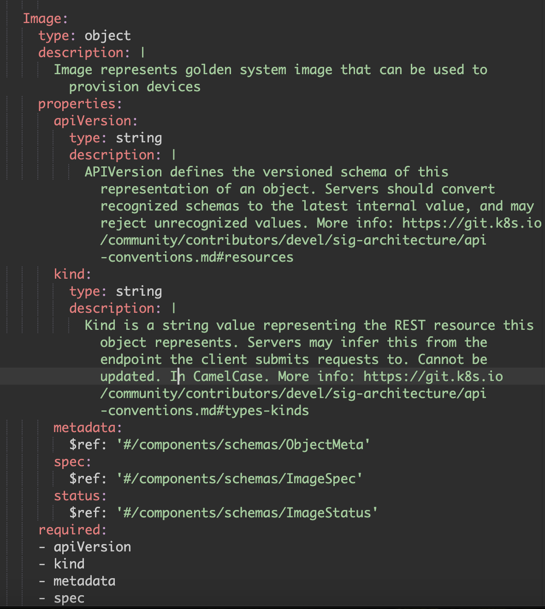

Kubernetes-style APIs provide a powerful, declarative approach to managing infrastructure and applications, enabling automation, scalability, and consistency. These APIs follow a resource-centric model with well-defined schemas, making them extensible and easy to integrate with custom controllers and operators. 
By leveraging reconciliation loops, they ensure that the system state remains aligned with the desired configuration, reducing manual intervention. Additionally, Kubernetes APIs promote interoperability across cloud and on-prem environments, fostering a standardized ecosystem for modern applications. Their self-healing nature, combined with role-based access control (RBAC) and auditability, enhances security and operational efficiency, making them a preferred choice for cloud-native development.

In this post I'm going to walkthrough how you can use these same patterns to build APIs that are rich in functionality and brings the benefits that we've come to love about K8s APIs. For this post I've come up with a sameple scenario to demonstrate. If you are a infrastructure/systems builder you might be familiar with the concept of golden images which are basically standardized operating system images that you want to use for deployment of systems across the private, public clouds and even at the edge. We are going to build a service that allows consumers to declaratively define a golden system image and the service will build the image. 

At a high level here are the steps.

* **Design the API:**
Start by designing the API first. For this post I'm using swagger/openapi.

* **Implement a custom API server:** API server handles all CRUD operations for API resources defined by the service. Since API servers store state we are going to use etcd to persist all the state. 

* **Implement a controller with a reconciliation loop:**
Controller watches the resources and ensures that the current state matches the desired state. This is done through a reconciliation loop

* **Implement a scheduler:**
Since building system images are long running tasks, we will need to implement a scheduler system that will scheduler image build tasks on workers.

* **Implement workers:**
Workers run the image build tasks and report the status  

Lastly we are not actually going to wireup the tasks to do the actual image build, instead we will just mock the behavior.Intend really is to break down the journey at a high level so you can apply these patterns to scenarios you all are working on. So lets get right into it.

As we begin with API design using OpenAPI, we'll leverage OpenAPI code generators to automatically generate types, specifications, client, and server packages. To get started, install the OpenAPI Swagger Codegen using the command below. Additionally, the service will be built in Golang. While the patterns apply universally, this post focuses on implementing the server in Golang.

```sh
go get github.com/deepmap/oapi-codegen@v1.15
```

I designed the API using Swagger Editor. The screenshot below shows the new Image resource which includes familiar Kubernetes properties such as apiVersion, kind, spec, and status, among others.



Next, I scaffolded a new Golang project and created an `api` directory at the root. Inside `api`, I added two subdirectories: `spec` and `v1alpha1`, with `v1alpha1` serving as the initial version for resource. We'll use the OpenAPI code generator installed earlier to generate the specification and types from Swagger, which will reside under `v1alpha1`.


