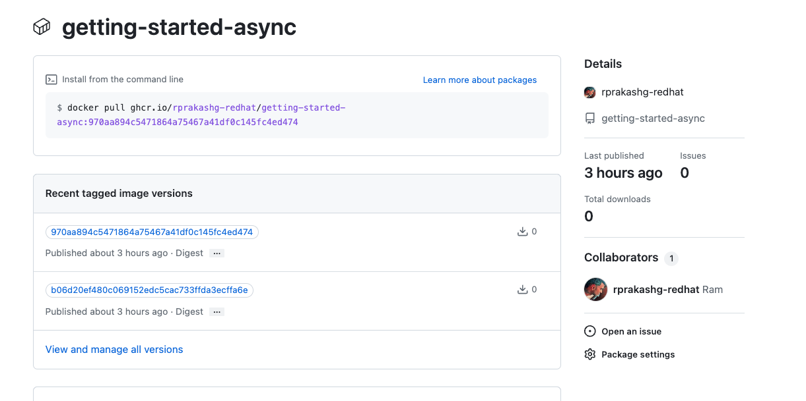
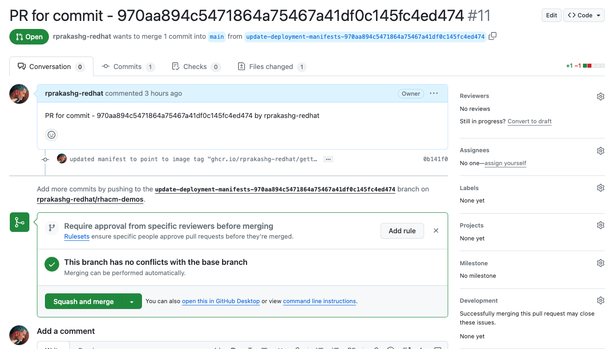
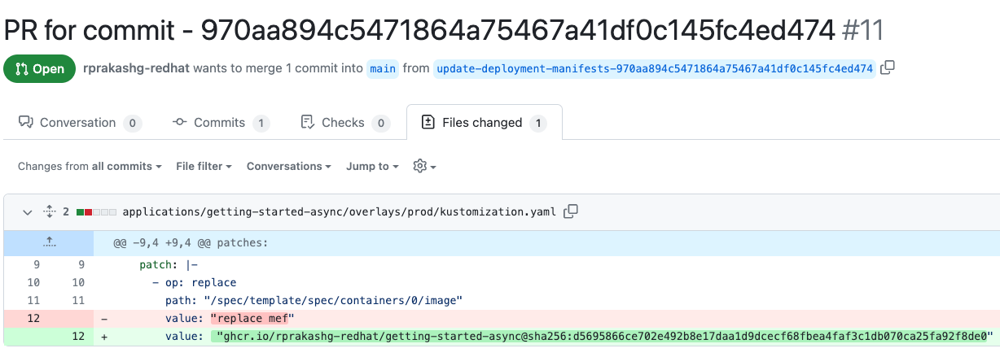
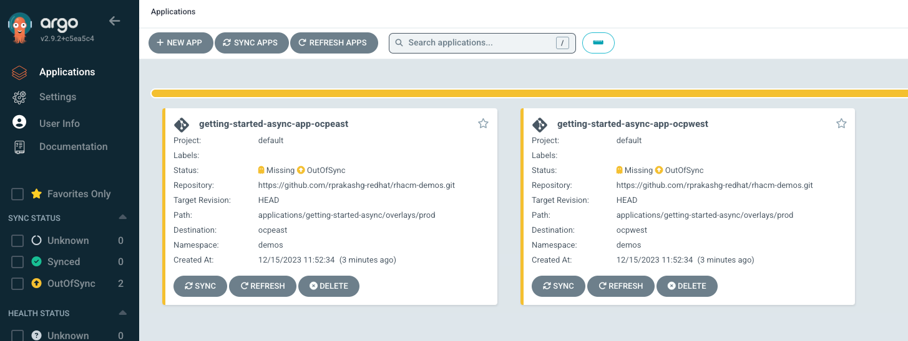
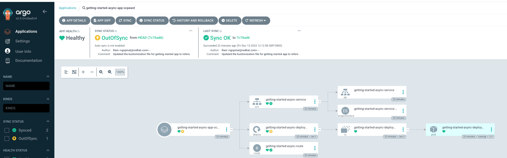
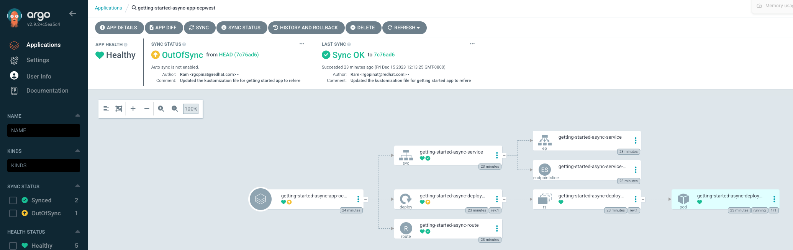
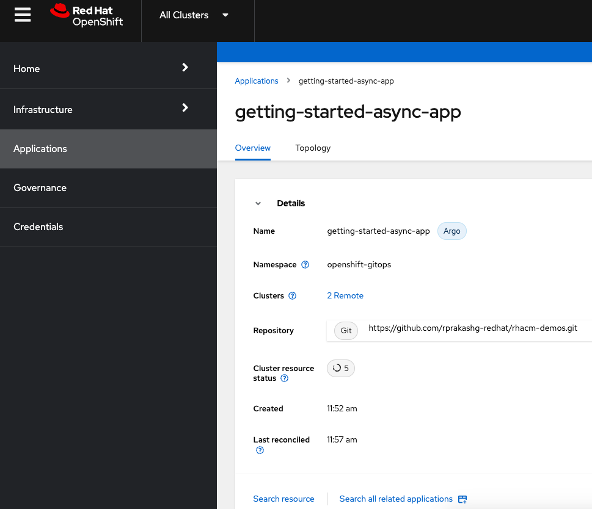
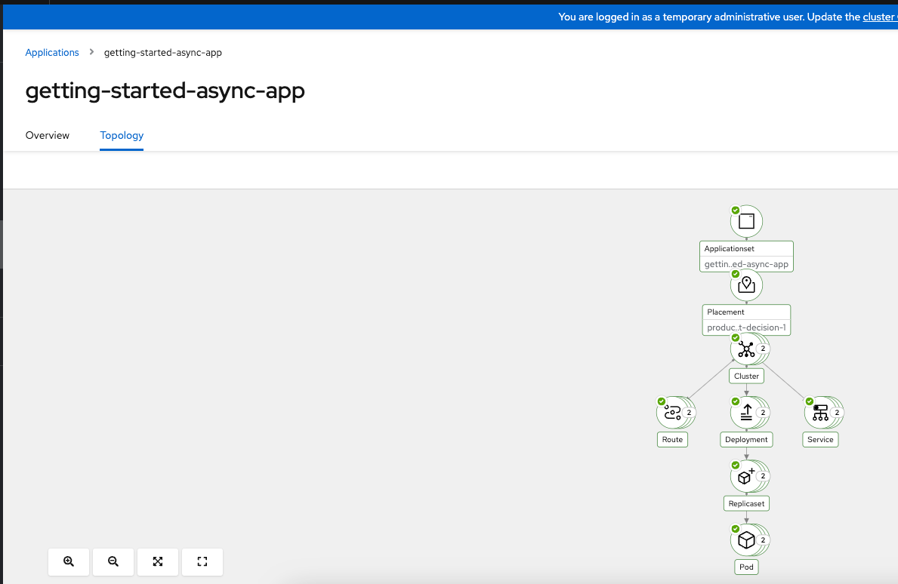
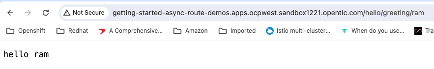
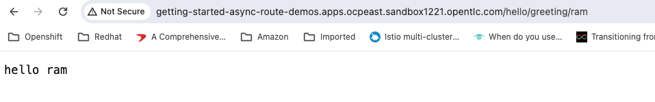

One of the problems I've seen with most customers making a move from monolith to microservices is around deployment. Typically all of the logic of deploying to kubernetes clusters are baked into CICD pipelines for respective microservices. When your number of clusters and microservices grows there are few potential issues that you need to keep in mind. 

* CICD Pipelines managed by developers will need credentials to authenticate with the clusters and necessary permissions to deploy the workload. You will need to ensure that these credentials are read from a secure key vault when pipeline runs. 

* There are many tools such as kubectl, helm, kustomize, etc. that developers can use to deploy workloads on kubernetes clusters. Developers in your organization will need to learn these tools. Hard to keep track of what tools and the versions are being used

* Even a small change such as rotating deployment credentials, deploying to a newer cluster can be costly change when you broadly look across entire org since we now have 100s of microservices instead of a few monolithic apps deployed across clusters running in multiple public clouds, on-premises sites and also in the edge.

* Lastly deploying workloads on kubernetes clusters is something everyone is going to need to do so instead of pushing that concern to individual development teams and their pipelines its a good idea to build a common consistent mechanism that every team leverages. You can implement best practices such as GitOps, etc. here and doesn't require every developer in your organization to be experts and can free them to focus on business logic. Additionally this can provide visibility into what's running where as well as one place to make changes/improvements

If you are a start-up or small development shop the issues I mentioned above are not that hard to manage but at scale when you have lots of development teams deploying 100s of microservices to kubernetes clusters across multiple clouds, on-premsises and even on the edge, this can get pretty messy.

So in this post I will cover how Red Hat Advanced Cluster Management for kubernetes can help with this. for the purposes of this article I'm using a sample getting started app from quarkus quickstarts and I've provisioned two clusters "ocpeast" and "ocpwest" from ACM hub cluster in AWS east and west regions to simulate a production environment deployment scenario. We are also going to use GitOps to automate deployments to production clusters ocpeast and ocpwest.

I've added a very simple github actions pipleline to this quarkus getting started app which does three things
* 1) Maven build 
* 2) Build container image and push that image to github's internal container registry 
* 3) Update kustimization file to inject the new version of image that was built to promote to production clusters in [this](https://github.com/rprakashg-redhat/rhacm-demos/tree/main/applications/getting-started-async) repository. 
* 4) Open a Pull Request (Trigger a GitOps deployment process upon merge)

Here is the pipeline code below. You can also find the source [here](https://github.com/rprakashg-redhat/getting-started-async/blob/main/.github/workflows/ci.yaml) in this Github repository
```
name: ci
on:
  push:
    branches:
    - main
env:
  IMAGE_TAGS: ${{ github.sha }}
  IMAGE_REGISTRY: ghcr.io/${{ github.repository_owner }}
  REGISTRY_USER: ${{ github.actor }}
  REGISTRY_PASSWORD: ${{ github.token }}

jobs:
  build:
    runs-on: ubuntu-latest
    steps:
      - uses: actions/checkout@v3
      - name: setup java
        uses: actions/setup-java@v3
        with:
          java-version: '17'
          distribution: 'temurin'
          cache: 'maven'
      - name: build
        run: ./mvnw clean install
      - name: upload artifact
        uses: actions/upload-artifact@v3
        with:
          name: quarkus-app
          path: target/quarkus-app/

  containerize:
    runs-on: ubuntu-latest
    steps:
      - uses: actions/checkout@v3
      - name: download artifact
        uses: actions/download-artifact@v3
        with:
          name: quarkus-app
          path: target/quarkus-app/
      - name: build image
        uses: redhat-actions/buildah-build@v2
        with:
          image: getting-started-async
          tags: ${{ env.IMAGE_TAGS }}
          containerfiles: |
            src/main/docker/Dockerfile.jvm
      - name: push to registry
        id: push-to-registry
        uses: redhat-actions/push-to-registry@v2
        with:
          image: getting-started-async
          tags: ${{ env.IMAGE_TAGS }}
          registry: ${{ env.IMAGE_REGISTRY }}
          username: ${{ env.REGISTRY_USER }}
          password: ${{ env.REGISTRY_PASSWORD }}
          extra-args: |
            --disable-content-trust
    outputs:
      digest: ${{ steps.push-to-registry.outputs.digest }}
    needs: build

  update-deployment-manifests:
    runs-on: ubuntu-latest
    steps:
    - uses: actions/checkout@v3
      with:
        repository: rprakashg-redhat/rhacm-demos
        ref: refs/heads/main
        token: ${{ secrets.GH_TOKEN }}
    - name: setup git
      run: |
        # Setting up the git config.
        git config --global user.email "rgopinat@redhat.com" # HARD CODING FOR NOW, NEED TO DETERMINE HOW TO RETRIEVE THIS FROM CURRENT USER CONTEXT
        git config --global user.name ${{ github.actor }}
    - name: update manifest
      run: |
        IMAGE=\"${{ env.IMAGE_REGISTRY }}/getting-started-async@${{ needs.containerize.outputs.digest }}\"
        git checkout -b "${{ github.job }}-${{ github.sha }}"
        sed -i "s#\(.*value:\s*\).*#\1 ${IMAGE}#" applications/getting-started-async/overlays/prod/kustomization.yaml

        git add .
        git commit -m "updated manifest to point to image tag $IMAGE"
        git push origin "${{ github.job }}-${{ github.sha }}"
    needs: containerize

  open-pr:
    runs-on: ubuntu-latest
    steps:
    - uses: actions/checkout@v3
    - name: open pr
      uses: ./.github/actions/open-pr
      with:
        repo: rprakashg-redhat/rhacm-demos
        token: ${{ secrets.GH_TOKEN }}
        title: "PR for commit - ${{ github.sha }}"
        body: "PR for commit - ${{ github.sha }} by ${{ github.actor }}"
        base: main
        head: "update-deployment-manifests-${{ github.sha }}"
    - uses: actions/checkout@v3
    needs: update-deployment-manifests
```

The CI pipeline above completed successfully on push and you can see the container image is already built and pushed to github container registry as show in the screen capture below



Additionally you can see that the pipeline created a new branch in the the github repo that contains the deployment artifacts for this getting started app and updated the kustomization file to inject new version of the container that needs to be deployed. Additionally it creates a pull request to merge those changes to main as shown in the screen capture below



Screen capture below shows the updates to the kustomization file made by the CI pipeline for getting started app



Now we could have notified the ops to approve the changes or auto approve from pipeline but for the purposes of this article I'm just going to manually approve the changes and delete the branch. Also notice in the pipeline above that I do not have single kubectl command or helm command to deploy the application to cluster also I don't have to be concerned about credentials to connect to cluster etc.

Steps below are one time tasks that you will need to do on the ACM hub cluster. You can pretty much do this one time for every service and remove how workloads get deployed to clusters from pipelines. I think this is huge productivity win for developers.

* Step 1: Define a placement resource in openshift-gitops namespace to discover production clusters to deploy this getting started application. For the purposes of this article I've labelled both "ocpeast" and "ocpwest" clsuters with environment=production and I'm going to use that when defining the placement resource as shown in yaml snippet below

```
apiVersion: cluster.open-cluster-management.io/v1beta1
kind: Placement
metadata:
  name: production-clusters-placement
  namespace: openshift-gitops
spec:
  predicates:
    - requiredClusterSelector:
        labelSelector:
          matchExpressions:
            - key: environment
              operator: In
              values:
                - production
```

* Step 2: Create the placement resource by running the command below
```
oc apply -f https://raw.githubusercontent.com/rprakashg-redhat/rhacm-demos/main/gitops/config/prod-placement.yaml
```

* Step 3: Define ArgoCD ApplicationSet resource for this getting started app to be created on the ACM hub cluster.
```
apiVersion: argoproj.io/v1alpha1
kind: ApplicationSet
metadata:
  name: "getting-started-async-app"
  namespace: openshift-gitops
spec:
  generators:      
  - clusterDecisionResource:
      configMapRef: acm-placement
      labelSelector:
        matchLabels:
          cluster.open-cluster-management.io/placement: production-clusters-placement
      requeueAfterSeconds: 180

  template:
    metadata:
      name: 'getting-started-async-app-{{name}}'
    spec:
      source:
        repoURL: "https://github.com/rprakashg-redhat/rhacm-demos.git"
        path: "applications/getting-started-async/overlays/prod"
        targetRevision: "HEAD"

      destination:
        namespace: "demos"
        server:  "{{server}}"

      project: default 

  syncPolicy:
    PreserveResourcesOnDeletion: false    
    applicationsSync: sync
```

Key thing to understand from the above ApplicationSet resource definition is that we are using cluster decision resource generator which will read the "production-clusters-placement" placement resource that we created earlier and attempt to extract list of clusters from the key decisions. ClusterDecisionResource generator will then pass name, server and any other key/value pairs in the duck-type resource status list as parameters into the applicationset template. You can see from the above yaml that we are using name to generate a unique name for app and server as value for destination server. 

* Step 4: Lastly we need to create the ArgoCD ApplicationSet resource on the hub cluster. Assuming we are logged in to hub cluster we can run the command below to do just that.

```
oc apply -f https://raw.githubusercontent.com/rprakashg-redhat/rhacm-demos/main/gitops/getting-started-async/prod.yaml
```

We can log into ArgoCD console on the hub cluster and see that the ApplicationSet was successfully created as shown in the screen capture below



We can perform a sync for each application to ensure all the application resources are successfully synchronized with target clusters. Clicking on each application tile in ArgoCD console we can visualize all the resources and their status as shown in screen captures below





We can also look at the getting started application details in ACM hub cluster console and see an overview of the application as well as visualize the topology as shown in the screen captures below





Lastly we can verify the the getting started application is successfully deployed to both "ocpeast" and "ocpwest" clusters by accessing the exposed routes from a browser as shown below

Screen capture below shows instance running on the "ocpwest" cluster


and the instance of the getting started app running on east cluster 


Hope this was helpful. As always please reach out to me if you have questions about this post or want to learn more about managing application deployments to clusters using Red Hat Advanced Cluster Management for Kubernetes and GitOps

Thanks,
Ram
