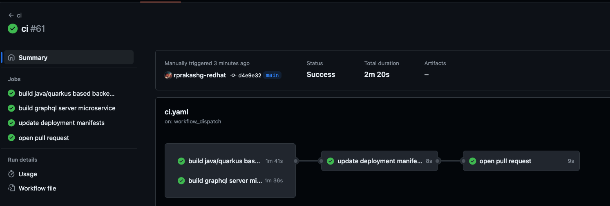

In kubernetes by default all ingress and egress traffic are allowed on all pods running in a cluster. From a zero trust security standpoint this is a bad thing because once a POD within a cluster is compromised attacker could gain foothold on other application pods running on the cluster causing more damage to company.

In Kubernetes network policy resource allows us to define how pods running on a cluster should communicate with each other and other network endpoints. One of the common challenges that most customers face is that even after creating the required network policies it is often hard to identify whether the applied network policies achieve the desire network topology. Red Hat Advanced Cluster security for kubernetes provides a set of tools to help with this. 

* Network graph (Helps you visualize network flows within your environment)
* Network policy generator (Generate required network policies based on established baseline network flows)
* Network policy simulator (Quickly preview the policies in environment before it is applied)
* Build time network policy generator (Shift left, create and apply policies from a CICD pipeline)
Much indepth explanation of these capabilities can be found here in RHACS documentation [here](https://docs.openshift.com/acs/4.3/operating/manage-network-policies.html)

I got a chance to dive a bit deeper into this last week and my goal with this article is to share what I have done with the community. I wanted to experience these capabilities like any kubernetes developer would go through so instead of leveraging some of our internal pre-built demos I decided to build off of set of demo applications I had already built over last year. Everything I'm covering here can be found in this github [repo](https://github.com/rprakashg-redhat/rhacs-policy-management) 

## Overview of Demo Applications
There are two demo applications that I'm going to use to demonstrate the network segmentation capabilities.
* Eventscheduler
This is microservice which provides 3 REST Apis for Event, Session, Speaker resources. It uses hibernate/panache ORM capabilities to persist data into a PostgreSQL database.
* Graph
This is a GraphQL server that mobile and web apps can use to read data and present it to users. GraphQL server queries all Event, Session and Speaker data by invoking the REST endpoints exposed by the eventscheduler microservice. GraphQL server also leverages Prisma ORM to query session reviews from a MongoDB database. Key goal here is to abstract away all of the complexities of data read and write from underlying sources from the front end developers and provide a consistent and standard mechanism. 

## Overview of Demo Environment
For the purposes of this exercise I decided to use AWS cloud. Containerized applications are deployed to an EKS cluster and for Postgresql I'm using RDS managed database service. Provisioning of EKS and RDS instance was done using set of terraform scripts which you can find [here](https://github.com/rprakashg-redhat/rhacs-policy-management/tree/main/deploy/infra)

To provision the infrastructure resources required on AWS follow steps below

Clone the repository by running `git clone git@github.com:rprakashg-redhat/rhacs-policy-management.git`. 

Next switch the current directory to directory where terraform scripts are by running this command `cd rhacs-policy-management/deploy/infra`

Run commands below to provision the required infrastructure in AWS
```
terraform init
terraform plan
terraform apply
```

For Red Hat Advanced Cluster Security I'm using hosted ACS instances which is a fully managed offerring. We have lot of customers that are leveraging that because they don't want to worry about managing the infrastructure needed to run RHACS workload. 

Next I installed RHACS secure cluster components on the EKS cluster to see how RHACS can help implement network segmentation in my EKS cluster with kubernetes network policies. Instructions for installing secure cluster services on other kubernetes distributions can be found [here](https://docs.openshift.com/acs/4.3/installing/installing_other/install-secured-cluster-other.html)

Screen capture below shows all secure cluster service running healthy on the EKS cluster and cluster successfully joined to hosted ACS instance


## Deploying the demo applications
I automated all the steps for building and deploying the demo apps to EKS cluster using a github actions workflow which can be found [here](https://github.com/rprakashg-redhat/rhacs-policy-management/tree/main/.github/workflows). You will find two workflow files here **1)** ci.yaml and **2)** cd.yaml

* ci work flow automates all aspects of going from application source code to container images. Application container images are pushed to container registry. For the purposes of this post I'm using github container registry and also leveraging buildah to build the container images. This workflow is automatically triggered on push when any files under apps directory are updated. All of the source code for the demo applications are stored under this directory. last step of the workflow I'm updating deployment manifests to inject new version of container image to deploy to EKS cluster. 

* cd work flow automates all aspects of deploying container images to EKS cluster. I'm using kustomize and kubectl to deploy and configure application components on the EKS cluster. This workflow is automatically triggered when any files under deploy/apps directory are modified. This is where the deployment manifests are stored which is why I've set it up that way. Workflow also has a on dispatch trigger where I can turn on build time network policy generation using roxctl which is a cli tool provided with Red Hat Advanced Cluster Security that we can use to generate network policies during build time by inspecting the kubernetes manifests for demo applications.

I'm going to manually trigger the ci pipeline for the purposes of this post so we can build the container images for applications to be deployed to cluster. Pipleline completed without failures as you can see from screen capture below.



We can also see that a new pull request was created to deploy new versions of the application as shown in the screen capture below


and the container images for both apps are successfully built and pushed to github container registry as shown below


Next I'll just merge the PR which will trigger the cd pipeline and deploy the new version of demo applications to EKS cluster. Screen capture below shows cd pipeline running


Pipeline completed without failures as shown in screen capture below. 


You can see that the steps to generate build time network policies and deploy them to EKS cluster was not run because its driven off a workflow dispatch input flag. Reason for this is that first we want to see the experience of an application with no network polcies within RHACS. The other thing you will see in the pipeline is that I'm generating a diagram of all the networkflows using the roxctl tool provided by RHACS. This command `roxctl netpol connectivity map` is used to generate a dot file which is then converted into png format using Graphviz. Both the dot file and the png files are saved as pipeline artifacts which can be downloaded anytime.
Screen capture blow shows a connectivity diagram that was generated from the previous pipeline run without any network policies


You can see pretty much everything is wide open. Later in the article I'm going to trigger the workflow manually and check the flag to generate and deploy network policies and we will come back to RHACS and see how the experience looks like and also take a look at the connectivity diagram that was generated with build time network policies in place.

I'm going to login to my hosted ACS instance and we will examine the network graph which is one of the capabilities within RHACS which helps you visualize network flows. I've selected the ekscluster and namespace where the demo applications are deployed so we can see traffic flows for the demo apps. You can select multiple clusters and namespaces depending on your environment and how you want to visualize network flows.


One of the first things you will notice is that RHACS is showing the two deployments in the namespace have no policies and is allowing all traffic. We can click on the network policy generator button on the top right cornor of the screen which will allow us to 1) Automatically generate and simulate a set of recommended network policies based on a cluster baseline which is an aggregation of the baselines of all the deployments in the cluster. Network policies generated can be downloaded and applied to target cluster using kubectl. You can also compare side by side with existing network policies that might be on the cluster as well and 2) If you have created network policies on your own you can upload the yaml and preview how it might look like in the environment before you actually apply them.


Screen capture below shows automatic network policy generation capability.


Wouldn't it be nice to automatically generate policies and apply them to cluster during build time in a CICD pipeline rather than doing this after application is already deployed to clusters? Who doesn't want to practice Shift Left right? :)

I'm going to manually trigger the cd pipeline and check **generate network policies** option to automatically generate network policies during build time in pipeline and deploy them to cluster as shown in screen capture below


Screen capture below shows pipeline running


Pipeline completed without any failure as shown in screen capture below and you can see this time network policies are generated and applied to cluster.


We can also see the artifacts created by the pipeline which include the generated network policies, connectivity diagrams (dot file, png file) as shown in the screen capture below


Here is the new connectivity diagram looks like with network policies in place.


You can see from the above diagram now we only have connections allowed from graphql server pod going into eventscheduler microservice pod and on specific port protocol.

Lets also now switch to my ACS instance and see what the differences are when we did not have any network policies. From the screen capture below we can see that now ACS is showing that the deployments now have network policies in place


and the generate network policies now show no policies need to be generated. 


Hope this helps

As always reach out to me if you have any questions about this post or want to learn how Red Hat Advanced Cluster Security can help you in your organization.

Thanks,
Ram


