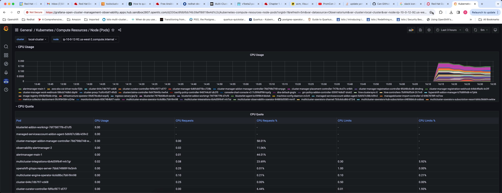

# Observability service in Red Hat Advanced Cluster Management for Kubernetes
This is one of the capabilities provided by Red Hat Advanced Cluster Management for Kubernetes that helps platform engineering teams monitor and observe the health and capacity of clusters across entire kubernetes fleet.

## Purpose
Kubernetes cluster sprawl is real, we see customers deploying clusters on-premises, multi cloud and even on edge locations to run workloads. With this comes a set of management challenges for platform engineering teams. Being able to monitor the health and utilization of clusters across the entire k8s fleet is one of the challenges platform engineering teams have to solve. Typically this involves deploying a central monitoring infrastructure, select a monitoring solution (Prometheus is most common) and ensure provisioned clusters and configured to send telemetry data to this central infrastructure so they can monitor the health and utilization of clusters across the entire k8s fleet in one place. Observability service in RHACM solves this problem so our customers don't have to. We also understand that not all customers use Openshift for running workloads also some have multiple k8s distributions and as long as those clusters are imported into hub, this feature should work well as long as they are complaint with upstream k8s 

## Summary of what's configured when you enable observability service 
When you enable the observability service, a Prometheus/Thanos stack is deployed on the hub cluster and data collector components are deployed on every managed cluster for collecting and aggregating telemetry information. 
All required k8s resources are provisioned for persistent storage for various components of thanos. Object store is provisioned for metrics storage. 
Additionally a Grafana instance is provisioned with a set of useful dashboards that platform teams can use to monitor the health and utilization. A Grafana dashboard loader sidecar is also deployed with Grafana instance to load dashboards into Grafana. Platform teams can create additional dashboards and add them to a configmap and these dashboards will be automatically loaded into Grafana instance by the Grafana dashboard loader sidecar. Prometheus alertmanager can also be configured to send monitoring alerts to slack, pagerduty etc.

Diagram below shows various components configured when observability service is configured on hub cluster

## Enabling the observability service
Observability service is not enabled by default, steps to enable this feature is documented very well in RHACM product documentation [here](https://access.redhat.com/documentation/en-us/red_hat_advanced_cluster_management_for_kubernetes/2.10/html/observability/enabling-observability-service). I recommend reading that. I wrote an ansible playbook that automates this. You can check out the ansible playbook [here](https://github.com/rprakashg-redhat/rhacm-demos/blob/main/observability/configure-multiclusterobservability.yaml)

We should now be able to log back into hub cluster and see link to Grafana instance in the clusters view under infrastructure section as shown in screen capture below

Clicking on the link will bring up the Grafana instance that is configured with set of dashboards. Grafana instance is configured to be able to login with the same credentials you use to login to Openshift/Hub cluster. To illustrate that this works with other k8s distributions I've provisioned an EKS cluster called `toolscluster` in `us-east-2` region and have imported that cluster into ACM hub

Including screen captures for few of the observability dashboards that we ship

Dashboard below shows compute resources by cluster. You can select cluster from the dropdown selection at the top and report will be refreshed

Dashboard below shows compute resources by node

and Dashboard below shows a clusters overview. 

Hope this helps,

As always feel free to reach out to me if you have any questions about this post or how Red Hat Advanced Cluster Management for Kubernetes can help with managing your k8s fleet

Thanks,
Ram
