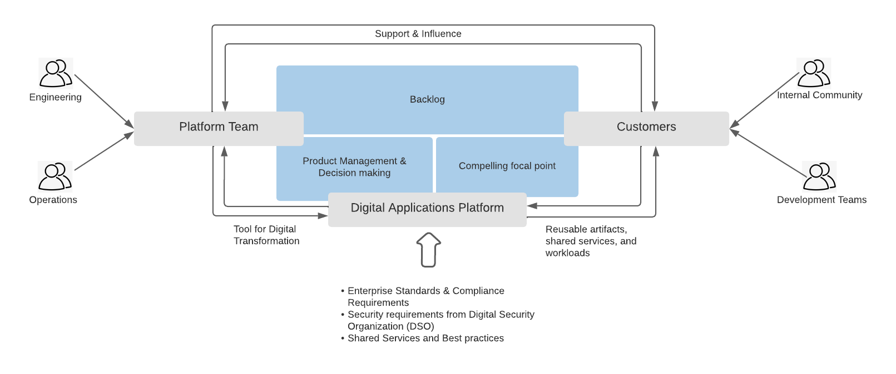

A good solid digital applications platform is the foundation of any successful Digital Transformation and Application Modernization initiatives. Large enterprises often invest in this area as they embark on these initiatives. In this post, I want to cover why a product mindset is required and critical to the success of enterprise application platform initiatives.

## Why platform as a product
Product approach takes the experience of the customers who are consumers of the platform into consideration. Platform services must be provided as a shared service within the enterprise but unfortunately in my experience, they tend to be very infrastructure and operations focused. The use of the platform gets pushed down to development teams without giving any consideration to their needs. This approach can lead to unhappy customers and can often lead to lower adoption and eventually detrimental to overall success. 

## How to be successful and avoid common pitfalls

Develop platform strategy, roadmap, and, desired functionality jointly in a way that makes existing customers happy while attracting new ones. Ensure platform strategy, roadmap, and, desired functionality is managed by a Product Manager. Develop a culture of measurements and data-driven decision-making. 

Develop and foster an internal community of platform enthusiasts who can collaborate and work together with the platform team to continuously enhance the value of the platform for the entire enterprise. 

Be open and transparent and share all details about the platform with everyone in the enterprise. Ensure architecture diagrams and necessary documentation about the platform are created and kept up to date. Carefully make decisions on build v/s buy. There is so much opensource innovation out there and quite honestly might look cheaper to build it yourself rather than buying a vendor solution but when you start to look from a day 2 perspective and everything that goes into supporting an enterprise platform, having the support and backing of a vendor is always better to reduce risks for the enterprise. Remember, critical workloads that run the company's core businesses will be running on this platform, so there is a lot at stake.

Hire and retain experts that can help and teach customers how to leverage and implement the capabilities of the platform correctly in a way that the platform is intended to be used. For OpenShift based platform we are talking about Kubernetes and OpenShift experts that can work closely with customers on how to design/build and deploy distributed applications correctly on the platform in a way that best leverages the capabilities of OpenShift and Kubernetes. For an Ansible based automation platform, it could be Ansible experts that can work with customers to get everything automated in a way that leverages platform capabilities to the best. 

Finally, whether the platform is put together with open source projects or with a vendor solution, build necessary abstractions in the right places, especially if it's around capabilities leveraged by platform customers. I refer to this as an easy button to eject. This is super critical for the enterprise as it will protect your enterprise from being locked into a specific vendor or open source projects and also makes it easy to swap out parts of the platform without impacting customers. [Open Telemetry](https://opentelemetry.io/) is an excellent example as its vendor neutral and avoids vendor lockin.

### Common pitfalls

Here are some of the common pitfalls that must be avoided to achieve success.

* DIY in other words do it yourselves, build instead of buy. Building it yourself with Opensource projects without the support and backing of a vendor is risky for enterprises who are betting their business on an enterprise application platform because critical workloads that run the business are going to be deployed and running on the platform. What happens when a developer checks in a piece of code that has security issues or breaks one of your workloads? Who is responsible for fixing it, and how do you minimize the impact on your business. Even if you have a super skilled team who are active contributors to these open source projects, is that the right focus for your company? Wouldn't you have been better off spending that time and effort on the products that your customers use? The point I'm making here is it can take away a lot of time that otherwise could have been used to make sure the product meets the needs of your customers and you are continuously adding value faster. It takes a lot of investment to match what vendors who specialize in these areas do, we are talking engineering, support, training, documentation, etc.  

* Lack of vision on how the platform is going to be used by customers. Don't just deploy something and expect customers will come. You have to take time to understand the pain points of your customers and have a vision of how customers will leverage the platform and gain value/benefit because when you are proactively seeking new customers to come on the platform you have to be able to articulate this to them otherwise they are not going to use the platform.

* Not focusing on finding, engaging, and, educating potential customers, in other words platform evangelism. Azure, AWS, and, Google all do this. So be sure to focus some efforts on this area, seek, engage and educate potential customers through platform evangelism efforts

* No feedback cycles. Collecting feedback from customers who are using the platform and acting on that feedback is super critical to the success of the platform. This is an opportunity to hear from them directly what they like and don't like and use this as a way to enhance the value of the platform for your customers.

* Not Moving at the pace of customers. Finally, if you are not able to move at the pace of customers, they will go with alternate solutions no matter how awesome the platform is. 

## What does a platform ecosystem looks like

Both platform team and customers support and influence each other, customers support and influence the platform offerings, and the platform team support and influences how workloads are designed and developed to run well on the platform.

* Platform engineering role is responsible for the overall design of the platform, evaluates vendor solutions, and decides on build v/s buy and also Managed v/s Self-managed. 

* Platform Operations role is responsible for all operational aspects of the platform. Applicable only in a self-managed platform scenario.

* Product Manager within Platform team manages product backlog for platform product, conducts grooming sessions with customers, and ensures there is a prioritized set of backlog with items that can be worked on by platform engineering.

Customers: Users or consumers of the enterprise application platform in the enterprise. 

* Community: Having an internal community of platform enthusiasts is great for the platform and its customers. The community can build and enhance platform services. For large companies, this can be a way to scale platform engineering efforts to meet the needs of all the customers within the enterprise.

* Development Team: Teams that are responsible for building and deploying workloads on the platform.

Some companies use the platform to deliver other platforms. An example of this is data services which provide databases for teams who are developing stateful workloads. They support a set of databases which should be described in their service offerings. 

Digital Application Platform

Enterprise standards and compliance requirements as well as security requirements baked into the platform. This is one of the key values/benefits of being on the platform. Development teams can focus on workloads and not have to be concerned about meeting compliance and security requirements related to managing and operating a platform. Additionally platform also has all the shared tools and services that are beneficial for development teams. 
An enterprise application platform is like a paved road that is proven, tested, and validated. Don't force the use of platforms on development teams, it should be a choice. If a development team decides to not use the platform and decides to build a platform on their own for their workloads be sure to document and educate security and compliance requirements for building and operating a platform.

These are just my thoughts from my own experiences. Share with me your thoughts via email or Twitter. Hope this was helpful

Thanks,
Ram
