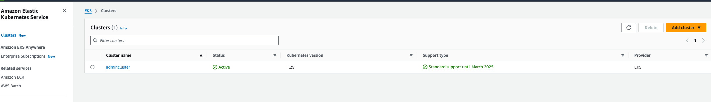
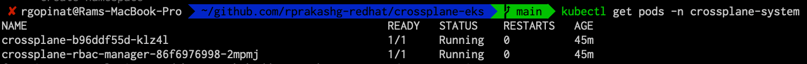
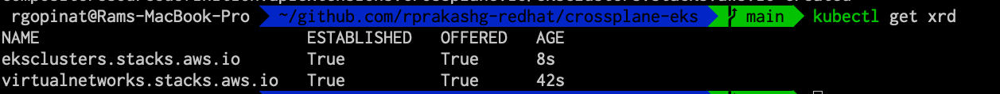
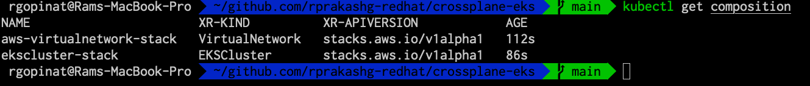
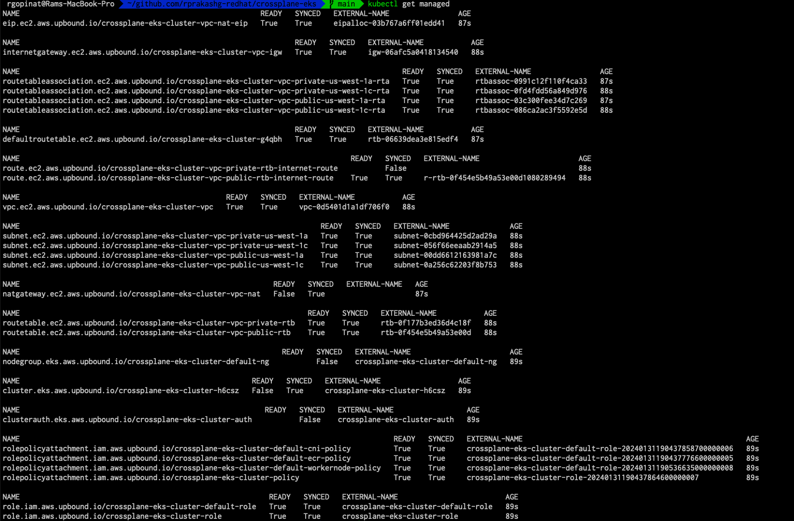
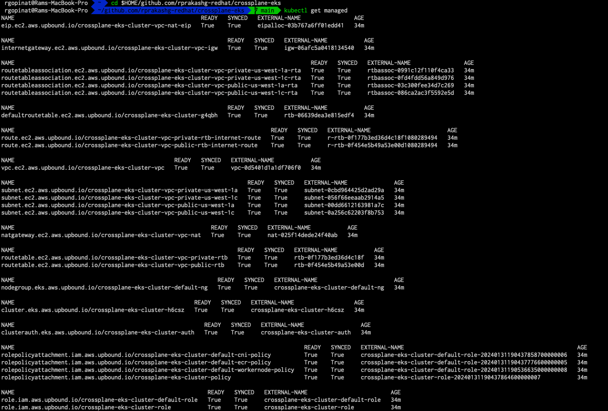
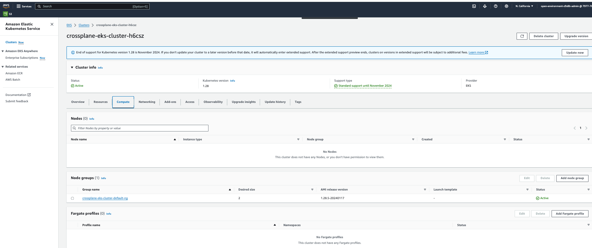
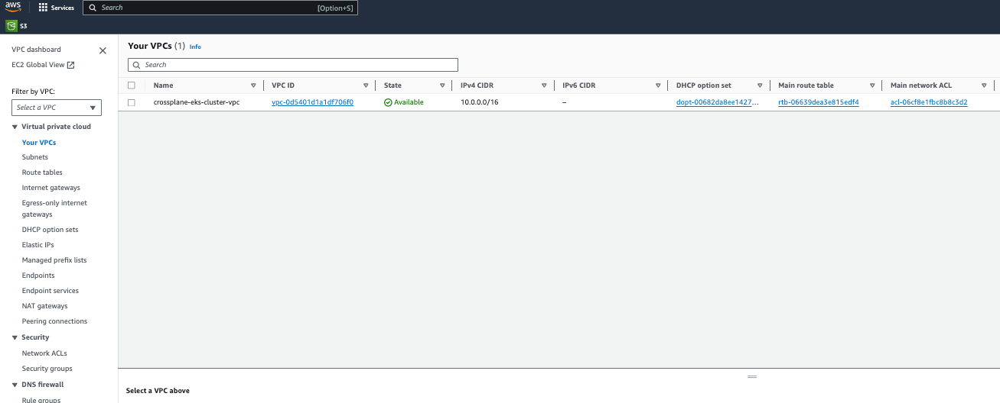

I've been hearing a lot about Crossplane for over a year now and recently I got a chance to try it out, specifically resource composition capabilities. In this post I'll go over how I used these capabilities to build a system that automates provisioning of EKS clusters in AWS. I hope you are just as excited as I am. What I liked the most is that crossplane allows us to extend kubernetes without really writing single line of go code or having to be expert in kubernetes operators. Everything I'm going to cover here is in [this](https://github.com/rprakashg-redhat/crossplane-eks) github repo. Lets jump right into it.

Provision an EKS cluster by running terraform scripts included in the infra directory in the github repo, this cluster is going to act as a tools cluster where I will be installing crossplane.  

Create the tools cluster by running terraform commands below

```yaml
cd infra

terraform init
terraform plan
terraform apply
```

After terraform commands are completed successfully we can see that the cluster was provisioned and is active from the screen capture below.



Install crossplane using helm chart. This is pretty well documented [here](https://docs.crossplane.io/v1.14/software/install/)

```yaml
helm repo update

helm install crossplane \
    crossplane-stable/crossplane \
    --namespace crossplane-system \
    --create-namespace
```

Lets verify that the crossplane pods are running and healthy

```yaml
kubectl get pods -n crossplane-system
```

and we can see that all crossplane system pods are up and running



Install following crossplane AWS providers shown below. Providers enable crossplane to provision infrastructure on an external service. For more info on other providers including the AWS ones listed below checkout https://marketplace.upbound.io/providers

* [ec2](https://marketplace.upbound.io/providers/upbound/provider-aws-ec2/v0.47.1)
* [kms](https://marketplace.upbound.io/providers/upbound/provider-aws-kms/v0.47.1)
* [iam](https://marketplace.upbound.io/providers/upbound/provider-aws-iam/v0.47.1)
* [eks](https://marketplace.upbound.io/providers/upbound/provider-aws-eks/v0.47.1)

Install a go templating composition function which I'll use when defining resource composition for the composite API we will define later in this post. For more information about this function check out the upbound marketplace https://marketplace.upbound.io/functions/crossplane-contrib/function-go-templating/v0.4.1

```yaml
cat <<EOF | kubectl apply -f -
apiVersion: pkg.crossplane.io/v1beta1
kind: Function
metadata:
  name: function-go-templating
spec:
  package: xpkg.upbound.io/upbound/function-go-templating:v0.4.1
EOF
```

verify that the function was installed successfully and running healthy.

```yaml
kubectl get function
```

Setup cloud provider credentials. Run command below to create a credentials file. Be sure to create an IAM account with required privileges and set the environment variables referenced in the below command with respective values that match your environment.

```
echo "[default] \naws_access_key_id = ${AWS_ACCESS_KEY_ID}\naws_secret_access_key = ${AWS_SECRET_ACCESS_KEY}" > aws-credentials.txt
```

**_Be sure to not checkin the `aws-credentials.txt` file to github by including an entry in your `.gitignore` file to ignore it_**

Create a kubernetes secret from `aws-credentials.txt` file by running command below

```
kubectl create secret \
    generic aws-secret \
    -n crossplane-system \
    --from-file=creds=./aws-credentials.txt
```

Create a provider config resource to customize the settings of the AWS provider. Basically this is how we tell the crossplane AWS provider how to authenticate with AWS.

```yaml
cat <<EOF | kubectl apply -f -
apiVersion: aws.upbound.io/v1beta1
kind: ProviderConfig
metadata:
  name: aws-config
spec:
  credentials:
    source: Secret
    secretRef:
      namespace: crossplane-system
      name: aws-secret
      key: creds
EOF
```

## Create Composite Resource Definitions
Composite resource definitions (XRDs) allows us to define the schema for custom APIs. All schemas follow kubernetes custom resource definition [OpenAPIv3 structural schema](https://kubernetes.io/docs/tasks/extend-kubernetes/custom-resources/custom-resource-definitions/#specifying-a-structural-schema). Since I want the cluster to be provisioned within its own VPC with public and private subnets and route tables I decided to create 2 custom APIs. 1) Virtualnetwork (Creates VPC with subnets and route tables, Internet Gateway, NAT Gateway, Routing rules). 2) EKSCluster (Creates EKS Clusters with managed nodegroups and virtual network). Both APIs can be found [here](https://github.com/rprakashg-redhat/crossplane-eks/tree/main/apis)

Create the XRDs by running the command below.

```
kubectl apply -f apis/virtualnetwork.yaml

kubectl apply -f apis/ekscluster.yaml
```

We can verify that the XRD's are created by running `kubectl get xrd`



## Create Compositions
Compositions are like a deployment template for provisioning a group of resources as single object. I've defined the composition logic for both virtualnetwork and ekscluster XRDs and will go ahead and create them. In summary all required steps for provisioning VPC with subnets and route tables are defined in the composition for virtualnetwork and all resources that need to be created to have a fully functional eks cluster are defined in the composition for ekscluster XRD. You can see in the composition file I'm basically defining all the managed resources defined in the providers and crossplane takes care of provisioning them in my AWS account. You'll also notice each managed resource has a `providerConfigRef` property that we are using to tell crossplane system how to authenticate with the AWS account which we configured earlier.

You can also see in the composition for `ekscluster` XRD that I'm nesting the `VirtualNetwork` XRD instead of duplicating all the logic of provisioning VPC, Subnets, route tables etc. By moving that into a seperate XRD allows us to reuse it for other usecases as well

```
kubectl apply -f composition/virtualnetwork.yaml
kubectl apply -f composition/ekscluster.yaml
```

We can see that composition resources are created successfully for our XRDs



## Creating an EKS cluster
We can now create an EKS cluster by simply running command below

```
cat <<EOF | kubectl apply -f -
apiVersion: stacks.aws.io/v1alpha1
kind: EKSCluster
metadata:
  name: crossplane-eks-cluster
spec:
  region: "us-west-1"
  version: "1.27"
  compute:
    nodeGroups:
    - name: default
      instanceType: t3.medium
      scaling:
        minSize: 2
        maxSize: 3
        desiredSize: 2
  availabilityZones:
  - us-west-1a
  - us-west-1c
  networking:
    name: crossplane-eks-cluster-vpc
    cidr: 10.0.0.0/16
    publicSubnet:
      cidr:
      - 10.0.3.0/24
      - 10.0.4.0/24
    privateSubnet:
      cidr:
      - 10.0.1.0/24
      - 10.0.2.0/24
EOF
```

To see a list of managed resources that are created and their status we can run `kubectl get managed`



When `READY` and `SYNCED` for all managed resources show value 'True' this means that everything was provisioned successfully in AWS. If you see it stuck in False we can run `kubectl describe {replace with managed resource}` to see more details about why its stuck. 



Additionally you can login to AWS console and verify all resources are successfully provisioned. Screen capture below shows EKS cluster provisioned with default managed node group



Browse to VPC in console and verify all resource provisioned. Screen capture below shows VPC that was created by crossplane



So far I'm really liking what I've been able to do with Crossplane, I plan to extend this to be able to define cluster recipes (Small/Medium, Large as an example) so folks requesting cluster don't even have to know anything about networking, compute etc. Also I could have defined XRDs more provider agnostic and not use `EKS`, `Availability Zone` etc in the api spec.

Hope this post helped spawn new ideas if you are a platform builder or building tools for enterprise.

As always feel free to reach out if you have any questions about this post

Thanks,
Ram

