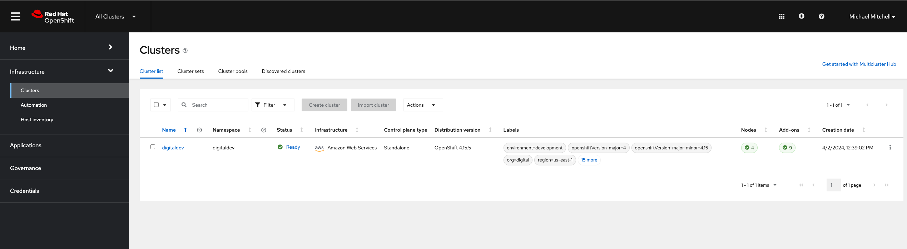

In this post I'm going to walk through how you can use role base access control to segregate cluster life cycle management responsibilities between dedicated teams. Few reasons you might want to do that are:

* Operating at scale, you have operational responsibilites for lots of clusters
* You might have different SLAs with internal groups who are your customers running workloads on platform
* Reducing the blast radius. For ex. accidently upgrading a cluster that you shoudln't have etc... 

Sample scenario I have set up is as follows. I've defined two cluster sets to group clusters provisioned for respective teams as shown in the table below

| ClusterSet Name           | Purpose                                       |
| -----------------         | ------------------------                      |
| digital                   | Group all k8s clusters owned by digital group |
| telco                     | Group all k8s clusters owned by telco group   |

I've also setup some test users in my OKTA tenant and RHACM roles they are mapped to on the HUB cluster as shown in the table below

| User Name                                       | Member Of      | Role                                            |  RHACM Role |
| --------------------------                      | -------------- | -----------------------                         | ---------- |
| Mark Smith(msmith@acme.org)                     | cluster-admins | Hub Cluster Admin                               | cluster-admin, open-cluster-management:cluster-manager-admin |
| Scott Adams (scott.adams@somecompany.com)       | digital-ops    | Admin for spoke clusters owned by digital group | open-cluster-management:managedclusterset:admin:digital |
| Michael Mitchell (mmitch@somecompany.com)       | digital-dev    | View all spoke clusters owned by digital group | open-cluster-management:managedclusterset:view:digital |
| Nick Jonas (nick.jonas@somecompany.com)   | telco-ops | Admin for spoke clusters owned by telco group | open-cluster-management:managedclusterset:admin:telco |
| Joe Jonas (joe.jonas@somecompany.com) | telco-devs | View all clusters owned by telco group | open-cluster-management:managedclusterset:view:telco |

As you can see from the above table Mark smith is the super user. Scott has operational responsibilities for managing clusters owned by digital group and Nick has operational responsibilities for clusters owned by telco group.

We are going to first login to RHACM hub as a super user in this scenario Mark Smith. We can see that Mark can pretty much do everything on hub

When Scott logs in we can see that he can only see a list of clusters that are part of clusterset digital. For demonstration purposes I've created an OpenShift cluster called `digitaldev` 

Scott whose role as mentioned earlier is an admin for clusters owned by digital group he is allowed to create new cluster or import existing clusters into `digital` cluster set as shown in the screen capture above. Switching to `cluster sets` tab we can see that Scott is not allowed to create a new `ClusterSet` and its disabled as shown in screen capture below.

Now lets login as Michael Mitchell who is a developer in digital group. As you can see from the screen capture below, Michael is only allowed to view clusters that are part of `digital` cluster set but he cannot create a new cluster or import an existing cluster.

Switching to cluster sets tab we can see that Michael can only view the clusterset but cannot create a new cluster set. This is similar to experience for Scott since he is only an admin for digital group and doesn't have permission to create new cluster set.

I've created another cluster called `telcodev` for telco group. This cluster is part of telco cluster set. 

We can login to RHACM hub using as Nick Jonas and can see that Nick can only see clusters that are part of telco cluster set. In this scenario `telcodev` cluster deployed on AWS. Nick can also create new clusters or import clusters into the `telco` cluster set 

Switching to the cluster set tab we can see that Nick cannot create or delete cluster set as shown in screen capture below

Lets now login as Joe Jonas who is a developer in the telco group, As you can see from the screen capture below Joe is only allowed to view clusters that are part of `telco` group and cannot create new clusters or import existing clusters into the hub

In the next post I will cover how you can use RBAC to control who can create publish governance policies. 

Hope that helps,
Ram
