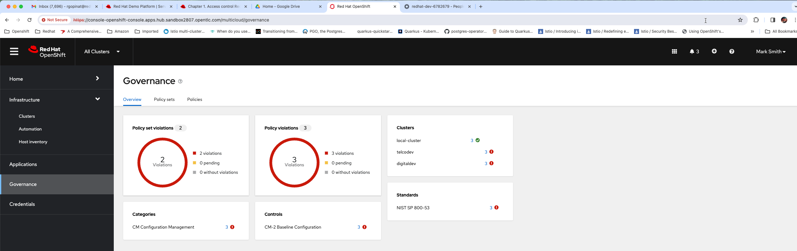

This is post is a follow up to another post I wrote which talks about how to use RBAC and 
segregate cluster life cycle management responsibilities between different teams within 
platform engineering org, if you haven't read that post I recommend reading [that](/rbac-cluster-lifecycle-rhacm) first. 

Looking back at my journey last 8 years with T-Mobile and now at Red Hat working with some large customers, I'm fairly convinced now that in large organizations seperation of concerns is a good thing. Ecosystem has definitely gotten so large and complex that everyone cannot be an expert in everything and trying to get everyone to be an expert in everything is also extremely difficult to achieve. Even if you think you achieved there is no guarantee that state will stay like that for long. So with those principles in mind as a part of deployment and rollout of Red Hat Advanced Cluster management for Kubernetes its a good idea to have a small team/group of people be responsible for governance policy lifecycle management. 

I'm going to create an Argo application that will create some policies. I use the same to illustrate governance policy capabilities of Red Hat Advanced Cluster Management for Kubernetes. I've also written an article about this, if you have not read it I recommend reading it. You can find the article [here](/config-management-with-acm)

We are going to be using some of the same test user account I've listed in the previous post on using RBAC for segregating cluster life cycle management to different teams. I'm not gonna list them here again so feel free to read that post if you need to to understand test users and roles.  

I've logged into the hub as super user `Mark Smith` and you can see in the screen capture below that the policies are created on the hub and hub has propagated them to target clusters and some compliance violations are reported.

When I login as Joe Jonas who is a developer