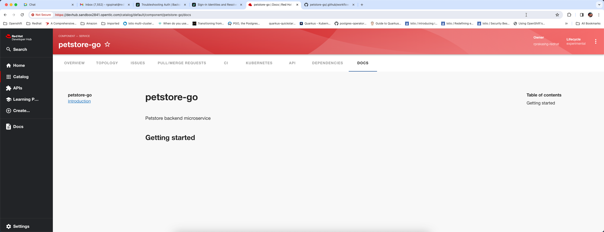

I thought I'll do this post to document some of the things I ran into when working with RedHat Developer Hub. I'm planning to keep this post updated as I learn more from my own research as well as from customer implementations. My hope is that others will find this useful.

**First** thing I want to cover here is when you uninstall RedHat Developer Hub using helm uninstall both the PV and PVC used by Postgresql chart will still be on the cluster, because of this when you attempt to re-install the developer hub using Helm chart you will find that the Postgresql pod will not come up. Init container that configures volume permissions will fail. You are going to see this error **`chmod: changing permissions of '/var/lib/pgsql/data/userdata': Operation not permitted`** when you look at the logs for Postgresql pod. If you ran into this issue you can just simply delete the pvc first by running this command *`kubectl delete pvc data-developer-hub-postgresql-0 -n tools`* also make sure the associated pv is also deleted by running *`kubectl get pv`* and then re-install developer hub. Unfortunately we do not have much control over this as we embed the bitnami postgresql chart into the helm chart for installing developer hub 

**Second** When you configure Redhat Developer Hub instance to use OKTA auth after successfully logging in you will see an error **`User not found`** this is mainly because the backstage will check to ensure a matching user entity exists in the catalog using signin resolvers. Many auth provider plugins automatically will create user entities in the catalog unfortunately Okta and Bitbucket plugins do not do this yet. One of my coworkers wrote this [post](https://github.com/redhat-na-ssa/rhdh-bitbucket-auth/blob/main/Readme.Md) that might be helpful if you are working with bitbucket or okta plugins for auth, although the article is for bitbucket, it should also work for okta.

**Third** Backstage can automatically build and publish your technical documentation and best practice is to build publish externally in a CICD pipeline. See an example of this [here](https://github.com/rprakashg-redhat/petstore-go/blob/main/.github/workflows/techdocs.yaml) backstage can serve static HTML files directly as you can see from the screen capture below



When I was first trying out the techdocs capability configuring backstage to do a build and publish locally worked fine and could see the static HTML files directly from backstage but when I switch the configuration to external docs did not render in backstage. I was getting HTTP 404 errors and the reason for this was when you publish using techdocs CLI as shown in the snippet below 

```
- name: Publish docs site
  run: | 
  techdocs-cli publish --publisher-type awsS3 \
      --storage-name $TECHDOCS_S3_BUCKET_NAME \
      --entity $NAMESPACE/$KIND/$REPO_NAME
```

I was using k8s namespace as $NAMESPACE value. S3 router expects this to be default and also Kind should be Component matching the entity in catalog. After I fixed the pipeline I'm now able to view the static HTML files built in a CICD pipeline from backstage as you can see from the screen capture above.


Hope this helps,
Ram
