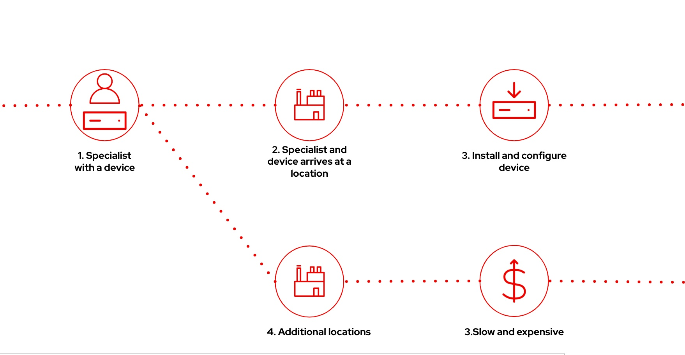
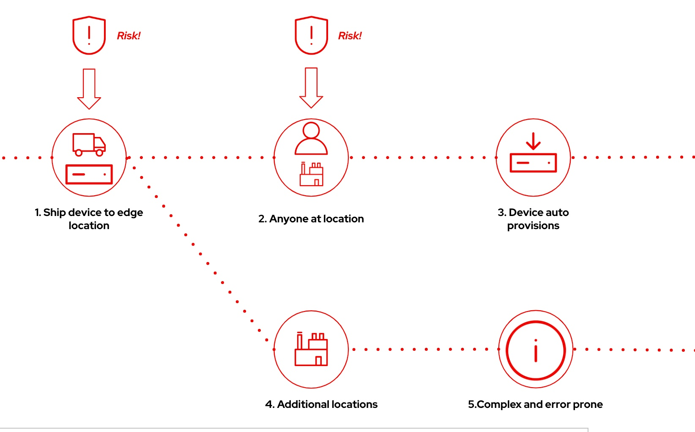
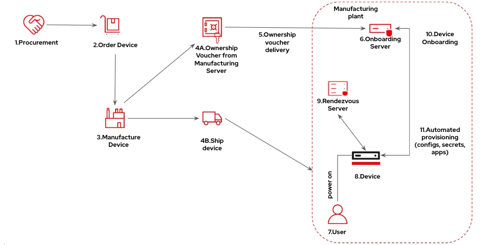

date: "2024-07-19"
author: "Ram Gopinathan"
published: true
title: "Secure device onboarding with FDO"
categories: ["rhel", "fdo", "security"]
tags: ["RHEL", "FDO", "Device", "Security"]
archived: false
---
One of the things I've been focusing on in my new role with the industrial edge team is device onboarding, and FDO is a key enabling technology that we are super excited about since it solves a lot of the device onboarding challenges. When I first started learning about FDO, what I got was a link to the FIDO Alliance website and also the FDO specification for device onboarding. This was like jumping straight into the weeds. I had to understand some of the challenges with device onboarding and also needed to get a big picture view of the components in FDO and their key roles and functions within the entire lifecycle of an edge/IoT device, starting from manufacturing to the supply chain to when the device arrives at the owner's location and is powered on. This post is meant to provide just that. I would also like to give a huge shout out to my teammate [Luis](https://github.com/luisarizmendi); some of his work has definitely been a huge influence in writing this article and also helping me approach this with the right perspective. Please check out his GitHub, as he is always creating awesome content. With that, let's get right into it.

**Defining what device onboarding is:**
Device onboarding is the process of connecting and integrating a device into a network or system so it can start operating and communicating with other devices and services. Typically, this involves configuring the device's settings, establishing secure connections, and ensuring it can be managed and monitored within the device management infrastructure.

## Device onboarding mechanisms without FDO
Here are some approaches that we see today on how new devices are onboarded.

### Traditional device onboarding
The diagram below shows the traditional device onboarding approach. Here, a device manufacturer sends the device and a specialist to the device owner's location. The specialist then installs and configures the device. This process is slow and expensive when you have to install and configure devices in many locations. 
 

### Automatic/Hands-off device onboarding
The diagram below shows an automatic/hands-off device onboarding approach where the device manufacturer ships the device to the device owner's location. Once the device arrives at the location, anyone at the location can connect the device to the network and power it on, after which the device will auto-install and configure itself. With this approach, there is really no secure way to verify the authenticity of the device and where it came from. Also, the person connecting the device to the internal network has no way of knowing if the device is compromised or being tampered with. This approach can also get complex and error-prone when you have to install and configure devices in other locations.

## What we need?
What we need is an onboarding process that can scale to thousands of devices across many edge locations and is secure to ensure the integrity and authenticity of the device from manufacturing to the supply chain to when the device finally arrives at the owner's location and is powered on. FDO is an automatic onboarding protocol that can be leveraged to solve some of the device onboarding challenges. The protocol and specifications are part of the FIDO Alliance, an open industry group. You can read more about the protocol and standards related to device onboarding [here](https://fidoalliance.org/device-onboarding-overview/).

The diagram below shows a device onboarding flow with FDO from manufacturing to the supply chain to when the device finally arrives at the owner's location and is powered on.

## Breaking down the key FDO components
In this section, I will try to break down the key FDO components so you can get an overall big picture view of how FDO solves a lot of the device onboarding challenges.

### Manufacturing Server
The Manufacturing server plays a crucial role in ensuring a seamless transition of devices from the manufacturing phase to the final end-user environment where the device is going to live during its lifecycle.

Below are some of the key functions of a manufacturing server:
* Ownership voucher creation
* Management of ownership transfer
* May store additional provisioning information that can be used to connect to the intended network or device management platform upon deployment of the device. This can include things like additional configuration settings, network credentials, or links to other services that will be used during the onboarding process.
* Ensure security and integrity of the ownership voucher. The Manufacturing server uses robust cryptographic methods to sign and verify data, preventing any tampering and unauthorized access.
* Authorized entities can query device information and validate ownership vouchers.

### Ownership Voucher (OV)
The Ownership Voucher (OV) is a digital document that is used to securely transfer the ownership of the device from the device manufacturer or a trusted intermediary like resellers, distributors, etc. to the final owner or the operator.

What's in an ownership voucher:
* Header which includes information about the voucher such as version and protocol
* Device manufacturer's public key (MfgPubKey) which is used to verify the device's authenticity and integrity
* Public key of the device (DevPubKey) which is embedded into the device at the time of manufacturing
* Public key of the owner (OwnerPubKey) which is used to establish a trust relationship between the device and the owner
* Signature signed with the device manufacturer's private key to ensure that the ownership voucher has not been tampered with and can be verified using the device manufacturer's public key

The Ownership Voucher acts as a proof of ownership. As the device moves through the supply chain from the device manufacturer to distributor, reseller, and finally to the device owner, the Ownership Voucher is updated with the new owner's public key to reflect the current owner. A signature from the previous owner is also added to ensure a secure and verifiable chain of custody.

### Rendezvous Server
The Rendezvous server plays a crucial role during the device onboarding process. Its key function is to act as a trusted intermediary that coordinates the initial communication between the new device that is being onboarded and the device owner's management platform. 

Below are some of the key functions of the Rendezvous server:
* Trusted intermediary during device onboarding: Ensures devices can securely find and connect to the service for provisioning without having any prior knowledge about it.
* Facilitates a secure connection: Devices securely receive information needed to connect to the owner's management infrastructure and ensures only authorized devices can access the provisioning details, protecting against unauthorized access.

What's stored on the Rendezvous Server?
* Network credentials, endpoints to connect to the device management platform, and any other configuration details that are required during the onboarding process.

### Owner Onboarding Server
The Owner Onboarding server is a crucial component in FDO, responsible for the secure and efficient provisioning and configuration of the device once it is ready to be integrated into the device owner's operational environment.

Below are some of the key functions of the Owner Onboarding server:
* Responsible for the final steps in the device onboarding process.
* Ensures the device receives all necessary settings, credentials, and instructions to function as intended.
* Establishes a secure channel with the device to transfer all provisioning data and uses cryptographic methods to ensure the integrity and confidentiality of the data that is being transmitted to the device.
* Verifies device identity and ownership using the Ownership Voucher (OV) and ensures that the device matches the information provided in the Ownership Voucher (OV).
* Completion of onboarding may include additional steps to ensure the device is fully operational and integrated into its operational environment.

### Service Info API
The Service Info API facilitates the exchange of service information between the device that is being onboarded and the device owner's device onboarding/management infrastructure. It enables dynamic provisioning and configuration of devices by allowing them to request and receive additional information and services needed for their operation.

Below are some of the key functions of the Service Info API:
* Dynamic provisioning: Devices can request and receive additional provisioning data and configuration settings during the onboarding process.
* Extensible to support use cases specific to service providers.
* Establishes a secure channel with the device to transmit provisioning information to prevent unauthorized access and tampering. It leverages encryption and authentication mechanisms to protect the integrity and confidentiality of the provisioning data that is transmitted to the device.

### Onboarding process
When the device is manufactured, the manufacturer generates a unique public-private key pair for the device and embeds it into the device. The device's private key is securely stored on the device as well. Once the device arrives at the owner's location, any user can connect the device to the OT network and power it on.

During device onboarding, the Ownership Voucher's authenticity is verified using the device manufacturer's public key. After the verification process and the transfer of ownership, the device can accept commands from the new owner, who can now securely manage and provision the device.

## What's Red Hat doing with FDO?
We have developed an FDO implementation using RUST. Additionally, we are also developing an Operator for Kubernetes, which you can use to deploy FDO components on OpenShift or other Kubernetes distributions of your choice. You can find the links to upstream projects under the resources section.

RHEL for Edge, which is our edge-optimized OS for edge devices, includes a native FDO client, which is a key component in initiative onboarding flows from the device.

## Resources
Below are some helpful resources on FDO:
* FDO Product Information on [Ecosystem Catalog](https://catalog.redhat.com/software/container-stacks/detail/633dce4e3affb9ec4165933a)
* [Product Page](https://docs.redhat.com/en/documentation/red_hat_enterprise_linux/9/html/composing_installing_and_managing_rhel_for_edge_images/assembly_automatically-provisioning-and-onboarding-rhel-for-edge-devices_composing-installing-managing-rhel-for-edge-images#assembly_automatically-provisioning-and-onboarding-rhel-for-edge-devices_composing-installing-managing-rhel-for-edge-images)
* Red Hat's FDO implementation written in RUST (https://github.com/fdo-rs/fido-device-onboard-rs)
* Red Hat's FDO Operator if you are deploying on OpenShift/Kubernetes (https://github.com/fdo-rs/fdo-operator)

Hope this was helpful. Please reach out with any questions about this post.

Thanks,  
Ram
