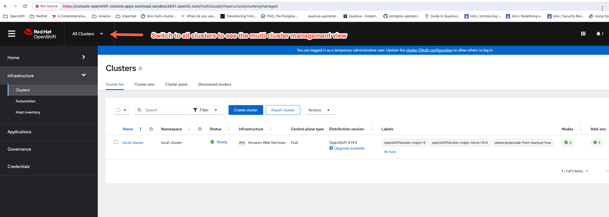

In my current role I'm always having a ton of conversations with customers regarding Kubernetes fleet management and managing clusters at scale in hybrid cloud environments. While we have a lot of pre-built demos at [demo.redhat.com](https://demo.redhat.com) I usually end up my building a lot of it myself because I can really make something thats very specific to a particular customer I'm working and its also easier to explain and walkthrough something you built v/s what someone else built. 

The way I use to install and configure before was by logging into OpenShift console and following installation instructions in our product documentation for Red Hat Advanced Cluster Management for Kubernetes. This started to become so time consuming and inefficient over time and I decided to use Ansible to automate installing and configuring ACM. You are welcome to use it at your own risk. You can find everything I'm covering in this post here in this [directory](https://github.com/rprakashg-redhat/rhacm-demos/tree/main/install) of Github [repo](https://github.com/rprakashg-redhat/rhacm-demos)

To install and configure ACM I first login to the OpenShift cluster where I want to install ACM and then run this command *`ansible-playbook install/install-configure-acm-playbook.yaml`*. The Ansible playbook is pretty self explanatory so I wont go into too much details but at a high level what happens is as follows
* Load static variable values defined in yaml file.
* Extract pull secret that was used when cluster was installed.
* Write the data into a dynamic vars yaml file (I use .gitignore to exclude everything in dynamic vars directory so it doesn't get accidently checked in to Github).
* Load the dynamic variable values.
* Create open cluster management namespace.
* Create the operator group.
* Install ACM operator and wait for operator to be ready.
* With the pull secret that was extracted and saved into dynamic variable values file create a pull secret in open cluster management namespace for multi cluster hub.
* Create an instance of multi cluster hub and wait for the hub to be ready
* Install OpenShift GitOps Operator (ArgoCD) and wait for operator to be ready

Now we can switch back to Openshift console and refresh the console to check the status of ACM install and configuration. From the screen capture below you can see we now have RHACM all installed and configured

If you have any questions please feel free to reach out.

Hope that was helpful

Thanks,
Ram
