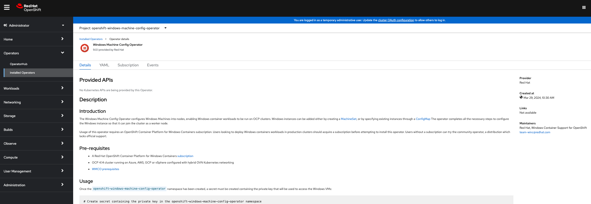
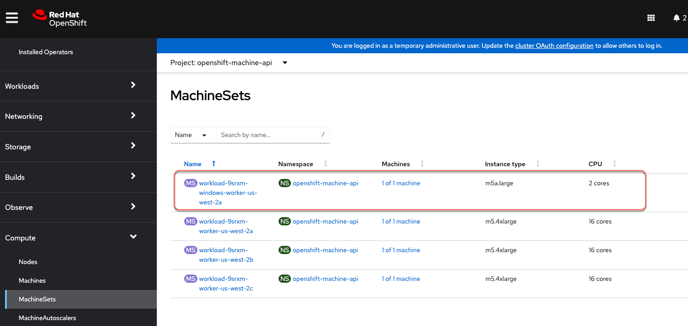
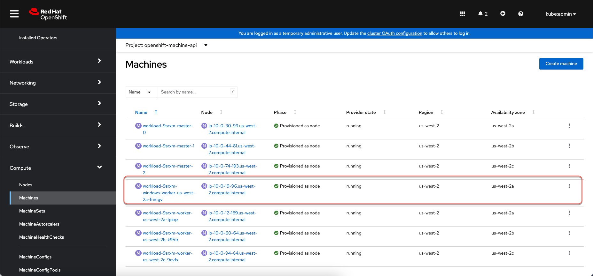
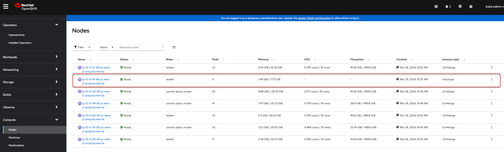

I've done quite a bit of work on windows containers on openshift and decided to write a 4 part series to deep dive into this. So here is the break down of what will be covered. 

* [Part 1](/windows-container-support-in-ocp-1) which is this post, we are going to cover how to enable windows container support and add windows nodes onto cluster. We are also going to deploy a sample application to test 

* [Part 2](/windows-container-support-in-ocp-2) we are going to cover using persistent storage and go over some of the usecases and scenarios that you might run into in real world

* [Part 3](/windows-container-support-in-ocp-3) we are going to cover autoscaling windows workloads specifically custom metrics autoscaler as HPA and VPA is still not supported for windows containers yet. We are also going to cover scaling windows machineset

* [Part 4](/windows-container-support-in-ocp-4) we are going to cover monitoring and observability options for windows workloads. We will examine some of the gaps that exist today for windows workloads and some approaches to address these gaps

### Prerequisites
Before we can enable windows container support on the cluster we need to configure Hybrid networking. Run command below. Read more about this [here](https://docs.openshift.com/container-platform/4.13/networking/ovn_kubernetes_network_provider/configuring-hybrid-networking.html)

```
oc patch networks.operator.openshift.io cluster --type=merge \
  -p '{
    "spec":{
      "defaultNetwork":{
        "ovnKubernetesConfig":{
          "hybridOverlayConfig":{
            "hybridClusterNetwork":[
              {
                "cidr": "10.132.0.0/14",
                "hostPrefix": 23
              }
            ]
          }
        }
      }
    }
  }'
```

### Adding windows workers to Openshift cluster
I have automated the steps to enable windows container support and add windows worker nodes to the cluster using an Ansible playbook. Check out the full playbook [here](https://github.com/rprakashg-redhat/windemos/tree/main/install)

There are two parts to the paybook

* Install and configure Windows Machine Config Operator (WMCO)
All the steps to install and configure WMCO are automated in this script [here](https://github.com/rprakashg-redhat/windemos/blob/main/install/tasks/enable-wmco.yaml). Script is pretty self explanatory. One thing to call out is that when we create the namespace where windows machine config operator is installed, we are setting a label named `openshift.io/cluster-monitoring` to 'true', see the jinja2 template snippet below. This will tell WMCO to also install and configure prometheus windows exporter on the nodes and perform all necessary configurations to ensure openshift cluster monitoring prometheus server scrapes metrics exposed by the windows exporter.

```
---
apiVersion: v1
kind: Namespace
metadata:
  name: {{ namespace }} 
  labels:
    openshift.io/cluster-monitoring: 'true'
...
```

* Add windows worker nodes by creating a `Machineset` resource.
All of the windows machineset creation steps are automated in this [script](https://github.com/rprakashg-redhat/windemos/blob/main/install/tasks/add-windows-workers.yaml). Script is pretty self explanatory so I won't go into too much detail here.

Before running the Ansible playbook we need to generate an ssh key for WMCO which is used to authenticate with windows nodes and perform actions like installing and configuring prometheus windows exporter etc. We can generate the ssh key by running command below

```
ssh-keygen  -t ed25519 -C "$USER@aws-win" -f ~/.ssh/aws-win -N ""
```

Next we will base64 encode the private key and store it in an environment variable by running command below

```
export PRIVATE_KEY=$(cat $HOME/.ssh/aws-win | base64)
```
When we run the playbook we are going to pass specify `PRIVATE_KEY' environment variable as value for variable key which is used to create the kubernetes secret 

I've kicked off the playbook and it completed successfully

[](https://asciinema.org/a/TZpbfk56sqG23U5XDOettN74U)

We can login to Openshift web console and see that windows machine config operator was installed and configured successfully as shown in screen capture below



Expand `compute` option on sidebar and select `machineset` and from the screen capture below we can see the new windows machineset created. 



Select `Machines` option from the sidebar navigation and we can see that a new Machine provisioned as node



Select `Nodes` option from the sidebar navigation and we can see that a new windows node is provisioned and joined to the cluster. We are only seeing one node here because in my machineset resource I specified replicas = 1 as this is just for demonstration purposes. In real world scenarios you might set it to a desired number that meets your requirements.



At this point cluster is ready to run windows workloads.

### Deploying Windows Workloads
Runtime class simplifies use of scheduling mechanisms like taints and tolerations so your developers don't have to. I cannot tell you how many times I have had someone complain to me saying my app is not starting up and ofcourse it got scheduled to run on linux node because developer failed to set node selector labels and tolerations.

We are going to create a runtime class using the yaml snippet below 

```yaml
apiVersion: node.k8s.io/v1
kind: RuntimeClass
metadata:
  name: legacywindows 
handler: 'runhcs-wcow-process'
scheduling:
  nodeSelector: 
    kubernetes.io/os: 'windows'
    kubernetes.io/arch: 'amd64'
    node.kubernetes.io/windows-build: '10.0.20348'
  tolerations: 
  - effect: NoSchedule
    key: os
    operator: Equal
    value: "Windows"
```

next we are going to deploy a simple webserver using the yaml snippet below. Note the *`runtimeClassName: legacywindows`* this is all a developer needs to know to ensure workload always gets scheduled on windows nodes available on the cluster.

```yaml
apiVersion: apps/v1
kind: Deployment
metadata:
  labels:
    app: win-webserver
  name: win-webserver
spec:
  selector:
    matchLabels:
      app: win-webserver
  replicas: 1
  template:
    metadata:
      labels:
        app: win-webserver
      name: win-webserver
    spec:
      runtimeClassName: legacywindows
      containers:
      - name: windowswebserver
        image: mcr.microsoft.com/windows/servercore:ltsc2022
        imagePullPolicy: IfNotPresent
        command:
        - powershell.exe
        - -command
        - $listener = New-Object System.Net.HttpListener; $listener.Prefixes.Add('http://*:80/'); $listener.Start();Write-Host('Listening at http://*:80/'); while ($listener.IsListening) { $context = $listener.GetContext(); $response = $context.Response; $content='<html><body><H1>Red Hat OpenShift + Windows Container Workloads</H1></body></html>'; $buffer = [System.Text.Encoding]::UTF8.GetBytes($content); $response.ContentLength64 = $buffer.Length; $response.OutputStream.Write($buffer, 0, $buffer.Length); $response.Close(); };
        securityContext:
          runAsNonRoot: false
          windowsOptions:
            runAsUserName: "ContainerAdministrator"
```
Next we are going to create a service type `Loadbalancer` and expose this service to external access as shown in command below.

```
kubectl apply -f apps/service.yaml
```

Next we are going to get the URL for this application by running command below.

```
export SERVICE_URL=$(oc get services win-webserver -o jsonpath="{.status.loadBalancer.ingress[0].hostname}")
```

Lastly we can run a simple curl command to verify the sample windows app is successfully deploy on the cluster.

```
<html><body><H1>Red Hat OpenShift + Windows Container Workloads</H1></body></html>
```

We can also see the sample app running from a browser as shown in screen capture below.


Hope this helps,

Ram
